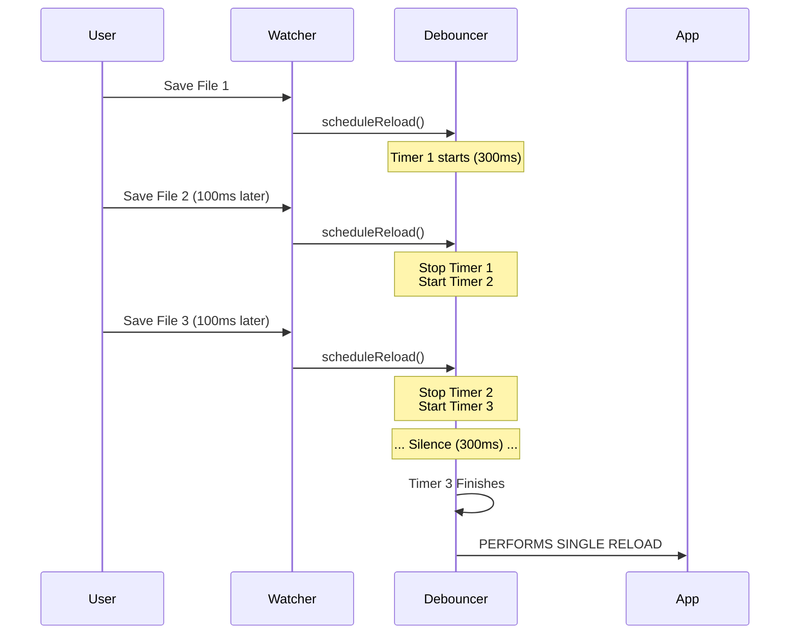

# Chapter 4: Reload Debouncing

Welcome back! In [Chapter 3: File System Watching](03_file_system_watching.md), we successfully built a surveillance system that watches our folders for changes. We solved the problem of detecting *when* a file changes.

However, we created a new problem: **Sensitivity**.

Computers are incredibly fast. When you switch a branch in Git or run a script to update your skills, the operating system might report that 50 files changed in the span of 100 milliseconds.

If we weren't careful, our application would try to reload itself 50 times in a fraction of a second. This would freeze the computer and waste resources.

In this chapter, we will implement **Reload Debouncing**: a strategy to stay calm in the chaos.

## Motivation: The Bus Driver

To understand Debouncing, imagine a bus driver at a stop.

**Without Debouncing:**
The driver closes the doors and starts driving the *second* a passenger steps on board. If another passenger is running just 5 feet behind, the driver has to stop, open the doors, let them in, and start again. If 10 people arrive one by one, the bus starts and stops 10 times. It's a bumpy, slow ride.

**With Debouncing:**
When a passenger steps on, the driver waits. They set a mental timer: "I will wait 3 seconds."
*   If no one else comes in 3 seconds, they leave.
*   If another passenger runs up after 1 second, the driver resets the mental timer: "Okay, I'll wait another 3 seconds starting *now*."

This ensures the bus only leaves once everyone has arrived and the "dust has settled."

In our code, we want to wait for the "file system dust" to settle before we trigger a reload.

## Core Concepts

We achieve this stability using three simple software tools:

1.  **The Timer (`setTimeout`):** A countdown clock.
2.  **The Cancellation (`clearTimeout`):** The ability to stop the clock if a new event happens.
3.  **The Delay (`300ms`):** The amount of silence we require before we act.

## How It Works

We don't want the user to interact with this directly. This logic sits between the **Watcher** (from Chapter 3) and the **Reloader**.

### The Logic Flow

Whenever a file changes, instead of saying "Reload Now!", we say "Schedule a Reload."

1.  **File A changes:** Start a 300ms timer.
2.  **100ms later, File B changes:** *Cancel* the previous timer. Start a *new* 300ms timer.
3.  **Timer finishes:** No new files changed? Okay, *now* we reload.

### Example Code

Here is the simplified logic of how a debounce function works.

```typescript
let reloadTimer = null
const DELAY = 300 // milliseconds

function scheduleReload() {
  // 1. If a timer is already counting down, kill it!
  if (reloadTimer) {
    clearTimeout(reloadTimer)
  }

  // 2. Start a brand new timer
  reloadTimer = setTimeout(() => {
    console.log("Reloading System Now!")
  }, DELAY)
}
```

**Scenario:**
*   You call `scheduleReload()`
*   You call `scheduleReload()` again immediately.
*   **Result:** The console logs "Reloading System Now!" only **once**.

## Under the Hood: The Implementation

Let's look at how this is implemented inside `skillChangeDetector.ts`.

### Visualizing the Timeline

We use a sequence diagram to visualize how the system handles a "burst" of changes (like pasting 3 files at once).



### 1. The Setup
We define our constants at the top of the file. We chose `300ms` as our "Bus Driver Wait Time." It's short enough to feel instant to humans, but long enough for a computer to finish writing a batch of files.

```typescript
// skillChangeDetector.ts

// Time to wait for silence before reloading
const RELOAD_DEBOUNCE_MS = 300

// Variable to hold the active timer ID
let reloadTimer: ReturnType<typeof setTimeout> | null = null

// A list to track which files changed during the wait
const pendingChangedPaths = new Set<string>()
```

### 2. collecting Changes
When `scheduleReload` is called, we don't just reset the timer; we also make a note of *which* file caused the event.

```typescript
function scheduleReload(changedPath: string): void {
  // Add the file path to our "To-Do" list
  pendingChangedPaths.add(changedPath)

  // Cancel the previous timer if it exists
  if (reloadTimer) clearTimeout(reloadTimer)
  
  // ... continue to step 3
```
*Explanation:* We use a `Set` so that if the same file changes twice in the burst, it's only listed once.

### 3. Starting the Countdown
Now we start the timer. If this timer actually completes (meaning no one interrupted it), we run the reload logic.

```typescript
  // Start the new timer
  reloadTimer = setTimeout(async () => {
    reloadTimer = null // Clear the reference
    
    // Take a snapshot of what changed
    const paths = [...pendingChangedPaths]
    pendingChangedPaths.clear()
    
    performActualReload(paths)
  }, RELOAD_DEBOUNCE_MS)
}
```
*Explanation:* The code inside `setTimeout` only runs if `RELOAD_DEBOUNCE_MS` passes without `scheduleReload` being called again.

### 4. Performing the Reload
When the timer finally fires, we perform the heavy lifting. This is where we notify the rest of the application.

```typescript
// Inside the setTimeout callback from above...

// 1. Check if hooks block the reload (advanced topic)
const results = await executeConfigChangeHooks('skills', paths[0])
if (hasBlockingResult(results)) return

// 2. Clear the old data
clearSkillCaches()
clearCommandsCache()

// 3. Notify the world!
skillsChanged.emit()
```

*   `clearSkillCaches`: We will learn how this works in [Chapter 5: Cache Invalidation](05_cache_invalidation.md).
*   `skillsChanged.emit()`: We will learn how this works in [Chapter 6: Reactive Signaling](06_reactive_signaling.md).

## Summary

In this chapter, we added a **Stability Layer** to our application.

1.  We recognized that file systems are noisy and events often come in bursts.
2.  We used the **Bus Driver Analogy** to understand why waiting is better than reacting immediately.
3.  We implemented **Debouncing** using `setTimeout` to group multiple events into a single action.

Now our system is smart. It watches for files, but it doesn't panic. It waits for the right moment to update.

But when that moment comes, we have to wipe the application's memory of the *old* files so it can load the *new* ones. How do we ensure we don't leave any stale data behind?

[Next Chapter: Cache Invalidation](05_cache_invalidation.md)

---

Generated by [Code IQ](https://github.com/adityasoni99/Code-IQ)