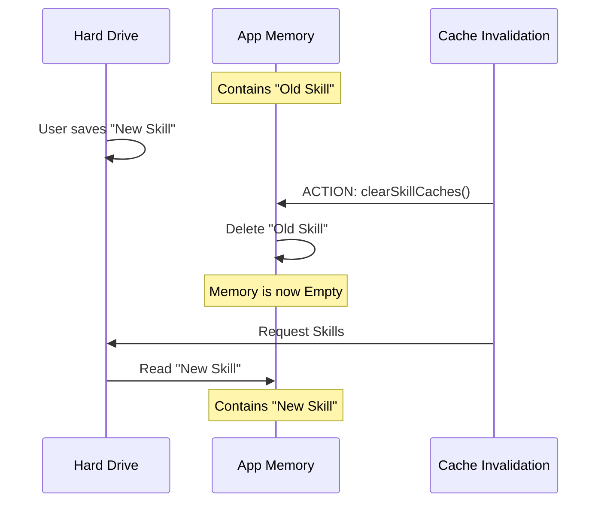

# Chapter 5: Cache Invalidation

Welcome back! In [Chapter 4: Reload Debouncing](04_reload_debouncing.md), we learned how to make our application patient. We built a system that waits for the "dust to settle" after you save a file, ensuring we don't crash the computer by trying to reload 50 times in one second.

But once the waiting is over and we decide it's time to reload, what do we actually *do*?

If you simply tell the application, "Read the files again," it might refuse. Why? Because of **Caching**.

In this chapter, we will explore **Cache Invalidation**: the art of forcing the application to forget what it knows so it can learn something new.

## Motivation: The Restaurant Menu

Imagine you are a waiter at a restaurant. To be efficient, you memorize the menu at the start of the day.

**The Scenario:**
1.  **Morning:** The chef tells you the soup of the day is "Tomato." You memorize this.
2.  **Lunch:** A customer asks for soup. You say "Tomato" instantly (because it's in your memory/cache). You don't run to the kitchen to check.
3.  **Afternoon:** The chef changes the soup to "Pumpkin."
4.  **Dinner:** A customer asks for soup.

**The Problem:**
Because you are efficient, you rely on your memory. You tell the customer "Tomato," even though the reality in the kitchen has changed to "Pumpkin." Your internal memory (cache) is now **stale**.

**The Solution:**
The chef needs a way to tap you on the shoulder and say, **"Forget everything you memorized."** This forces you to go back to the kitchen and read the new status.

In our application, parsing skills (reading text files and turning them into code) is "expensive"—it takes time and energy. So, we do it once and save the result in memory (the Cache). When a user changes a file, we must wipe that memory (Invalidation) so the app is forced to re-read the file.

## Key Concepts

To understand this, we need to look at two opposing forces:

1.  **Memoization (The Cache):** A fancy word for "Remembering the result of a function so we don't have to do the math again."
2.  **Invalidation (The Wipe):** The act of deleting that saved result.

## How to Use It

In the **Skills** project, you rarely call these functions manually during normal operation. They are triggered automatically by the logic we wrote in the previous chapter.

However, understanding the sequence is vital. When the "Debounce Timer" from [Chapter 4: Reload Debouncing](04_reload_debouncing.md) finishes, it executes a specific set of cleanup commands.

### The Cleanup Sequence

We need to clear three distinct areas of memory.

```typescript
// Inside the reload logic (simplified)

// 1. Clear the raw skill definitions (the text files)
clearSkillCaches()

// 2. Clear the compiled commands (the executable code)
clearCommandsCache()

// 3. Reset the tracking of what we've told the AI
resetSentSkillNames()
```

*Explanation:*
1.  **Skills:** The descriptions of what the tools do.
2.  **Commands:** The actual logic that runs when a tool is used.
3.  **Tracking:** To save bandwidth, we usually only tell the AI about *new* tools. By resetting this, we force a full update.

## Under the Hood: The Flow of Forgetting

Let's visualize exactly what happens when the timer fires.



### Implementation Details

Let's look at the actual implementation inside `skillChangeDetector.ts`. This code runs inside the `setTimeout` callback we created in the previous chapter.

### 1. The Trigger
This is the moment the timer finishes and decides to act.

```typescript
// Inside scheduleReload's timer callback:

reloadTimer = setTimeout(async () => {
  // ... (Debounce logic) ...

  // TRIGGER THE WIPE
  performCacheInvalidation()
  
  // ... (Signal logic) ...
}, RELOAD_DEBOUNCE_MS)
```

### 2. Clearing the Skills
We import `clearSkillCaches` from another module. While we won't dig into the deep code of `loadSkillsDir.ts` here, it essentially empties a Javascript `Map` or `Object`.

```typescript
import { clearSkillCaches } from '../../skills/loadSkillsDir.js'

// This function empties the dictionary where we store 
// parsed Markdown files.
clearSkillCaches()
```
*Explanation:* After this line runs, if the app asks "What skills do I have?", the system sees the dictionary is empty and is forced to scan the hard drive again.

### 3. Clearing the Commands
Skills are often just descriptions. "Commands" are the code behind them. We must clear this cache too, or the AI might try to run a command that no longer exists, or run an old version of code.

```typescript
import { clearCommandsCache } from '../../commands.js'

// Wipes the executable command definitions
clearCommandsCache()
```

### 4. Resetting AI Awareness
Finally, this application keeps track of which tools the AI already knows about to avoid sending the same list over and over. When we reload, we want to force a fresh announcement.

```typescript
import { resetSentSkillNames } from '../attachments.js'

// Makes the app act like it has never spoken to the AI before
// regarding these tools.
resetSentSkillNames()
```

## Summary

In this chapter, we learned about **Cache Invalidation**.

1.  We learned that **Caching** makes apps fast but causes them to hold onto old data.
2.  We used the **Restaurant Menu Analogy** to understand why we need to force the app to "forget."
3.  We implemented the cleanup logic that runs right after our **Debounce** timer finishes.

At this point in our tutorial series, the file has changed, the system has waited for the save to finish, and the memory has been wiped clean.

But the rest of the application (the UI, the AI connection) is still sitting there, totally unaware that anything happened. We have cleaned the kitchen, but we haven't rung the dinner bell yet.

In the next chapter, we will learn how to notify the entire system that updates are ready.

[Next Chapter: Reactive Signaling](06_reactive_signaling.md)

---

Generated by [Code IQ](https://github.com/adityasoni99/Code-IQ)