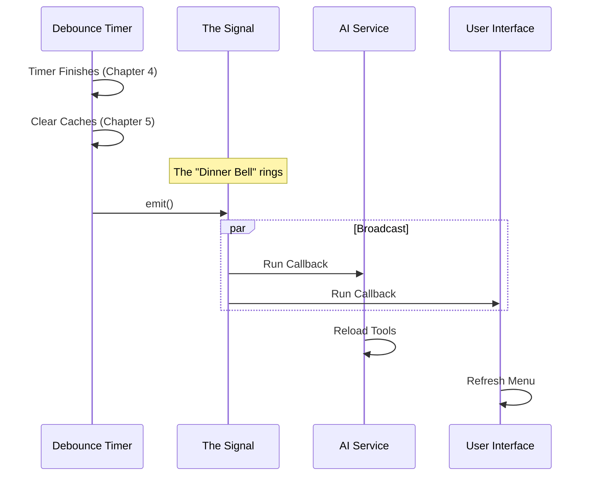

# Chapter 6: Reactive Signaling

Welcome back! In [Chapter 5: Cache Invalidation](05_cache_invalidation.md), we performed a "brain wipe" on our application. We forced it to forget the old versions of our skill files.

But we have a problem. The application's memory is now empty, but **nobody knows about it**.

The User Interface (UI) is still showing the old list of skills. The AI is still thinking about the old tools. They are all sitting quietly, waiting for instructions.

In this chapter, we will implement **Reactive Signaling**. We will build the "dinner bell" that tells the entire system: *"Updates are ready! Come and get them!"*

## Motivation: The Town Crier

To understand why we need Signaling, imagine a town (your application) with a Baker (the file watcher) and many Villagers (the UI, the AI, the Logs).

**The "Bad" Way (Direct Calling):**
When the bread is ready, the Baker has to personally run to the Mayor's house, then run to the School, then run to the Blacksmith to tell them individually.
*   *Problem:* The Baker needs to know everyone's address. If a new villager moves in, the Baker has to update their list. This is **Coupling** (dependencies are tangled).

**The "Reactive" Way (Signaling):**
The Baker simply rings a giant bell in the town square.
*   *Solution:* The Baker doesn't know who is listening. The Villagers simply "tune in" to the sound of the bell. If they hear it, they come to get bread.

In our code, we don't want the `skillChangeDetector` to import the UI or the AI code. That would create a messy web of dependencies. Instead, it just emits a **Signal**.

## Key Concepts

We rely on a pattern often called "Publish/Subscribe" or "Observer". It has three parts:

1.  **The Signal (The Bell):** An object that manages the list of listeners.
2.  **The Emitter (The Baker):** The code that triggers the event (`emit`).
3.  **The Subscriber (The Villager):** The code that listens for the event (`subscribe`).

## How to Use It

As a consumer of this module (e.g., if you are writing the code for the UI), you want to listen to the signal.

### Subscribing to Updates
You don't need to know *how* the files changed or *which* file changed. You just need to know that *something* happened.

```typescript
import { skillChangeDetector } from './skillChangeDetector'

// Tune in to the broadcast
skillChangeDetector.subscribe(() => {
  console.log("Received signal: Skills have changed!")
  // Logic to refresh the UI goes here
})
```
*Explanation:* You pass a function (a callback) to `subscribe`. This function sits dormant until the bell rings.

## Under the Hood: The Broadcast System

Let's visualize the flow of information. The `skillChangeDetector` sits in the middle, decoupling the file system from the rest of the app.



### Implementation Details

Let's look at how this is built inside `skillChangeDetector.ts`. We use a helper utility called `createSignal`.

### 1. Creating the Signal
First, we create a private signal instance inside the module. This is our "Bell".

```typescript
import { createSignal } from '../signal.js'

// Create the signal object
// It holds a list of listeners internally
const skillsChanged = createSignal()
```

### 2. Exposing the Subscriber
We don't want external modules to be able to *ring* the bell (emit), only to *listen* (subscribe). So, we export the `subscribe` function separately.

```typescript
// Export ONLY the subscribe function
export const subscribe = skillsChanged.subscribe

// Now outside files can do:
// skillChangeDetector.subscribe(...)
```

### 3. Emitting the Signal
Finally, we connect this to the logic we built in [Chapter 4: Reload Debouncing](04_reload_debouncing.md). When the timer finishes and the caches are cleared, we ring the bell.

```typescript
// Inside the scheduleReload timer...

// 1. Clean up old data
clearSkillCaches()
clearCommandsCache()
resetSentSkillNames()

// 2. Ring the bell!
skillsChanged.emit()
```
*Explanation:* The `emit()` function loops through every function that was passed to `subscribe` and runs them one by one.

### 4. Handling New Logic (Dynamic Skills)
There is a special case. Sometimes skills aren't loaded from files, but added dynamically by code. We need to signal for that too.

```typescript
// Inside initialize()

onDynamicSkillsLoaded(() => {
  // Clear specific memory for dynamic commands
  clearCommandMemoizationCaches()
  
  // Ring the bell here too!
  skillsChanged.emit()
})
```
*Explanation:* Whether the change comes from a file save or a dynamic loader, the result is the same: `skillsChanged.emit()`. The listeners don't care about the source; they just know to update.

## Summary

In this chapter, we implemented **Reactive Signaling**.

1.  We solved the **Coupling Problem** using the "Town Crier" analogy.
2.  We created a `signal` object to manage listeners.
3.  We triggered the signal (`emit`) only after the file changes were safely debounced and caches were cleared.

We now have a complete loop!
1.  **User saves file** ->
2.  **Watcher sees it** ([Chapter 3](03_file_system_watching.md)) ->
3.  **Debouncer waits** ([Chapter 4](04_reload_debouncing.md)) ->
4.  **Cache wipes memory** ([Chapter 5](05_cache_invalidation.md)) ->
5.  **Signal notifies app** ([Chapter 6](06_reactive_signaling.md)) ->
6.  **App Reloads.**

However, there is one final piece of the puzzle. What happens when the user closes the application? If we leave our watchers and signals running, we create "memory leaks"—ghost processes that eat up RAM.

In the final chapter, we will learn how to shut everything down cleanly.

[Next Chapter: Lifecycle Management](07_lifecycle_management.md)

---

Generated by [Code IQ](https://github.com/adityasoni99/Code-IQ)