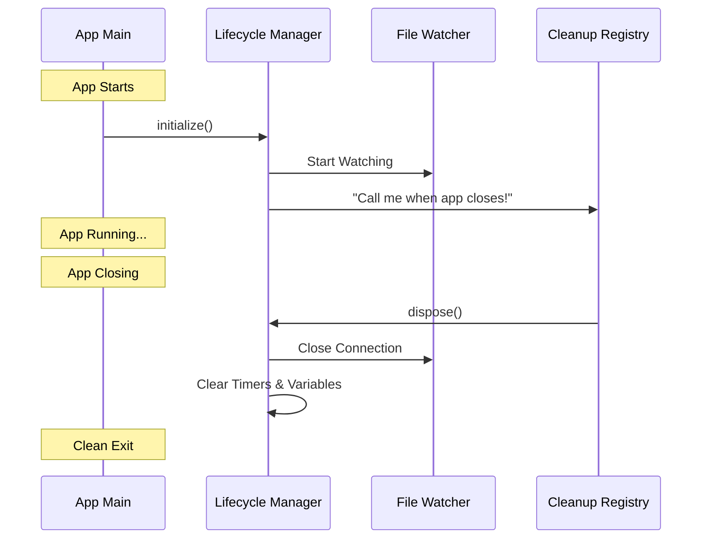

# Chapter 7: Lifecycle Management

Welcome to the final chapter of the **Skills** project tutorial!

In [Chapter 6: Reactive Signaling](06_reactive_signaling.md), we completed the "Hot Reload" loop. We built a system that detects changes, waits for them to settle, wipes the memory, and alerts the application.

But there is one final, critical question: **How do we turn it off?**

When you close an application, you assume it stops working. But in the world of code, if you open a connection to the file system (like a Watcher) and don't explicitly close it, it stays open. It becomes a "Zombie" process—eating up memory and CPU in the background even though the window is closed.

This chapter covers **Lifecycle Management**: the janitorial services that ensure our application starts safely and cleans up after itself.

## Motivation: The "Party Host" Analogy

Think of your application as hosting a party.

1.  **Initialization (Setup):** You unlock the front door, turn on the music, and put out snacks.
2.  **Running:** Guests arrive, eat, and dance.
3.  **Disposal (Cleanup):** The party ends. You *must* lock the door, turn off the music, and clean the room.

**If you fail the Cleanup step:** The music keeps playing all night (CPU usage), the door stays unlocked (security risk), and the mess remains (memory leak).

In software, **Lifecycle Management** ensures that when we say "Stop," we actually stop everything:
*   Disconnect the file watchers.
*   Cancel any pending timers.
*   Clear any stored data.

## Core Concepts

To manage the life of our module, we focus on three states:

1.  **Idempotent Initialization:** "Idempotent" is a fancy word meaning "Doing it twice doesn't change the result." If you press the "Start" button 5 times, the machine should only start once.
2.  **Graceful Shutdown:** Stopping proactively rather than crashing.
3.  **Resource Release:** Nullifying variables so the computer's "Garbage Collector" can reclaim the memory.

## How to Use It

As a consumer, your job is easy. You start the machine, and the machine handles its own shutdown registration.

### Starting the System
You simply call `initialize`.

```typescript
import { skillChangeDetector } from './skillChangeDetector'

// Start the watchers and listeners
await skillChangeDetector.initialize()
```
*Explanation:* This sets up the file watchers we built in [Chapter 3: File System Watching](03_file_system_watching.md).

### Stopping the System
Usually, this happens automatically when the app closes (we'll see how below). But if you need to manually stop it:

```typescript
// Stop watchers and clear memory
await skillChangeDetector.dispose()
```

## Under the Hood: The Lifecycle Flow

Let's visualize the life of the `skillChangeDetector`.



## Implementation Details

The logic is contained within `skillChangeDetector.ts`. Let's break down the two main phases: Starting Up and Shutting Down.

### 1. Safe Initialization
We need to ensure that we don't accidentally start two watchers for the same files.

```typescript
let initialized = false
let disposed = false

export async function initialize(): Promise<void> {
  // 1. The Guard Clause
  // If we are already running or already closed, do nothing.
  if (initialized || disposed) return
  
  initialized = true

  // ... (Setup logic from previous chapters) ...
}
```
*Explanation:* This prevents "Double Starting." If `initialize()` is called ten times, the code inside only runs once.

### 2. Registering for Cleanup
We don't want to rely on the user remembering to call `dispose()`. We hook into a global `cleanupRegistry` (a utility that runs when the app quits).

```typescript
import { registerCleanup } from '../cleanupRegistry.js'

// Inside initialize()...

// Tell the app: "Run this function when you shut down"
unregisterCleanup = registerCleanup(async () => {
  await dispose()
})
```
*Explanation:* We automate the shutdown process. `unregisterCleanup` allows us to cancel this contract if we dispose manually earlier.

### 3. The Cleanup Logic (Dispose)
This is the most important function for preventing memory leaks. We must methodically go through everything we created and destroy it.

**Step A: Stop the Watcher**
We close the connection to the file system.

```typescript
export async function dispose(): Promise<void> {
  disposed = true

  if (watcher) {
    // Tell Chokidar to stop watching
    await watcher.close()
    // Remove the reference so memory is freed
    watcher = null
  }
  
  // ... continued below
```

**Step B: Kill the Timer**
Remember the debounce timer from [Chapter 4: Reload Debouncing](04_reload_debouncing.md)? If the app closes while that timer is counting down (e.g., during the 300ms wait), we must stop it. If we don't, the timer will try to fire after the app is dead, causing an error.

```typescript
  // If a reload is scheduled, CANCEL IT.
  if (reloadTimer) {
    clearTimeout(reloadTimer)
    reloadTimer = null
  }
```

**Step C: Clear Data Structures**
Finally, we empty our lists and signals.

```typescript
  // Forget pending files
  pendingChangedPaths.clear()
  
  // Remove all listeners from the signal
  skillsChanged.clear()
}
```
*Explanation:* By setting variables to `null` and clearing sets, we allow the JavaScript engine to recycle that computer memory.

### 4. Resetting for Tests
Automated testing creates a unique challenge. Tests run hundreds of times in a row. We need a way to do a "Hard Reset" between tests to ensure Test B isn't affected by Test A.

```typescript
export async function resetForTesting(overrides?: any): Promise<void> {
  // 1. Force a disposal
  if (watcher) {
    await watcher.close()
    watcher = null
  }
  
  // 2. Reset the state flags so we can initialize again
  initialized = false
  disposed = false
  
  // 3. Apply test settings
  testOverrides = overrides ?? null
}
```
*Explanation:* Unlike `dispose()` which marks the module as dead (`disposed = true`), `resetForTesting` prepares it to be born again.

## Conclusion

Congratulations! You have completed the **Skills** tutorial series.

In this final chapter, we learned about **Lifecycle Management**. We learned that starting an application is easy, but shutting it down cleanly requires discipline. By tracking our initialization state and registering cleanup hooks, we ensured our application is a "good citizen" that doesn't leave messes behind.

### Series Recap

Let's look back at the journey of a single file change:

1.  **[Skill Change Detection](01_skill_change_detection.md):** The overview of our "Hot Reload" engine.
2.  **[Path Discovery](02_path_discovery.md):** Finding *where* the skills are located.
3.  **[File System Watching](03_file_system_watching.md):** Staring at those folders to detect updates.
4.  **[Reload Debouncing](04_reload_debouncing.md):** Waiting for the updates to stabilize.
5.  **[Cache Invalidation](05_cache_invalidation.md):** Wiping the old memory.
6.  **[Reactive Signaling](06_reactive_signaling.md):** Ringing the bell to notify the UI.
7.  **Lifecycle Management:** Cleaning up when the party is over.

You now understand the complete architecture of a robust, reactive file-watching system. Happy coding!

---

Generated by [Code IQ](https://github.com/adityasoni99/Code-IQ)