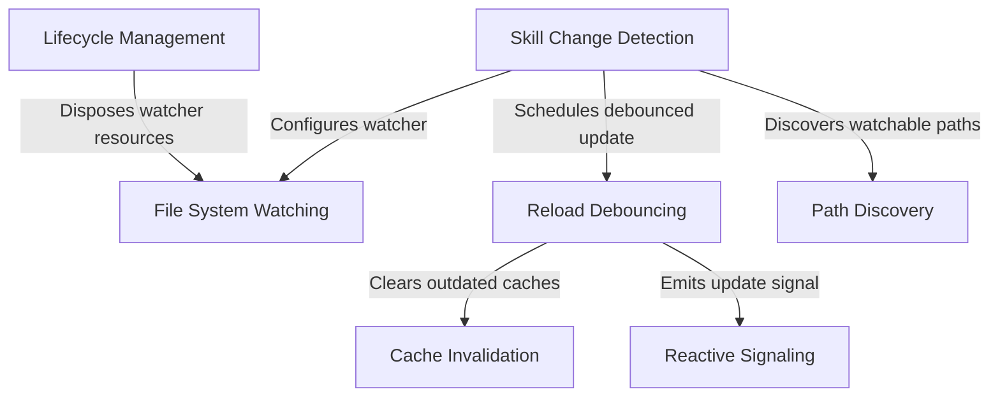

# Tutorial: skills

This project implements a **hot-reloading engine** for user skills and commands, enabling the application to update capabilities at runtime without restarting. It orchestrates **file system watching** with *stability debouncing* to efficiently handle batch file changes, ensuring that internal **caches are invalidated** and the system is notified via **reactive signals** only after file operations have settled.

## Chapters

1. [Skill Change Detection](01_skill_change_detection.md)
2. [Path Discovery](02_path_discovery.md)
3. [File System Watching](03_file_system_watching.md)
4. [Reload Debouncing](04_reload_debouncing.md)
5. [Cache Invalidation](05_cache_invalidation.md)
6. [Reactive Signaling](06_reactive_signaling.md)
7. [Lifecycle Management](07_lifecycle_management.md)

---

Generated by [Code IQ](https://github.com/adityasoni99/Code-IQ)