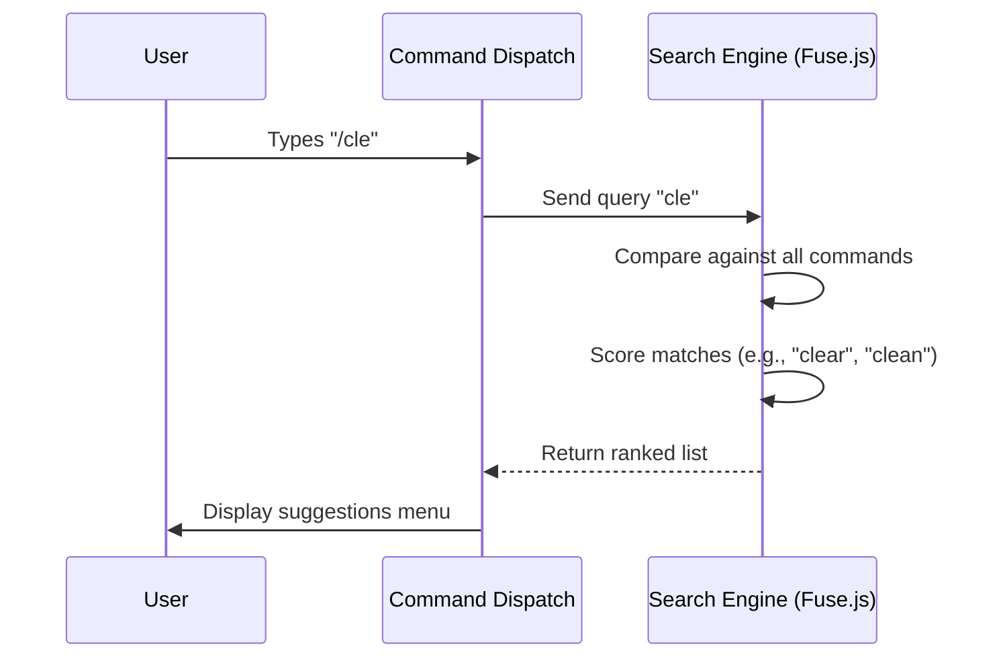

# Chapter 1: Fuzzy Command Dispatch

Welcome to the **Suggestions** project! In this first chapter, we are going to look at the "brain" of our slash command system.

## The "Smart Concierge" Problem

Imagine you walk into a fancy hotel and you want your room cleaned. You might walk up to the concierge and say:
*   "Housekeeping, please."
*   "Clean my room."
*   "Tidy up."

A **bad** computer system would only respond if you said the exact, official term: `"INITIATE_HOUSEKEEPING_PROTOCOL"`. If you made a typo like `"Houskeeping"`, it would say "Command Not Found."

A **smart** system understands your *intent*. It knows that "room clean" maps to the **Housekeeping** service. It understands that "hlp" probably means **Help**.

This is **Fuzzy Command Dispatch**. It is the engine that allows users to type imperfectly but still find exactly what they need.

## Core Concept: Fuzzy Search

To achieve this, we use a technique called **Fuzzy Search**. Unlike a strict equality check (`input === command`), fuzzy search looks for approximate matches.

We utilize a library called **Fuse.js**. It assigns a "score" to how well a user's input matches our list of available commands.

### The Priorities
When a user types something, we don't treat all matches equally. We prioritize them in this order:
1.  **Exact Name:** The user typed `/help`.
2.  **Alias:** The user typed `/?` (which is an alias for help).
3.  **Partial Name:** The user typed `/hel`.
4.  **Description:** The user typed `/support` (which appears in the description of the help command).

## How It Works: The Flow

Here is what happens the moment a user types a character after a slash `/`:



## Step-by-Step Implementation

Let's look at how we build this in `commandSuggestions.ts`.

### 1. Preparing the Data (The Index)
Before we can search, we need to transform our raw commands into a format that the search engine understands. We create a `CommandSearchItem`.

We strip out special characters to make matching easier.

```typescript
// We map our commands to a searchable format
const commandData = commands
  .filter(cmd => !cmd.isHidden) // Only show visible commands
  .map(cmd => ({
    commandName: getCommandName(cmd),
    // Split description into searchable words
    descriptionKey: (cmd.description ?? '').split(' '), 
    aliasKey: cmd.aliases,
    command: cmd,
  }))
```

### 2. Configuring the "Concierge" (The Weights)
This is the most critical part. We need to tell the search engine which parts of a command are most important. We don't want a match in a long description to rank higher than a match in the command's actual name.

```typescript
const fuse = new Fuse(commandData, {
  threshold: 0.3, // 0.0 is perfect match, 1.0 is match anything
  keys: [
    { name: 'commandName', weight: 3 }, // Highest priority!
    { name: 'aliasKey', weight: 2 },    // High priority
    { name: 'descriptionKey', weight: 0.5 }, // Low priority
  ],
})
```

*   **Threshold:** Controls how "fuzzy" we are. A lower number means we are stricter. 0.3 allows for small typos but prevents completely random results.
*   **Weights:** Note how `commandName` is weighted significantly higher (3) than `descriptionKey` (0.5).

### 3. Executing the Search
When the user types, we run the search. However, simply getting results isn't enough. We perform a custom sort to ensure the "Smart Concierge" logic holds up (e.g., favoring exact matches over fuzzy ones).

```typescript
// 1. Get raw fuzzy results
const searchResults = fuse.search(query)

// 2. Custom sorting logic (Simplified)
const sortedResults = searchResults.sort((a, b) => {
  // If 'a' is an exact name match, it always wins
  if (a.name === query) return -1
  
  // If 'a' starts with the query (prefix), it beats fuzzy matches
  if (a.name.startsWith(query)) return -1

  // Otherwise, trust the fuzzy score
  return a.score - b.score
})
```

### 4. Handling Mid-Input Commands
Sometimes, a user doesn't start a line with a command. They might be writing a sentence and decide to insert a command, like:
> "I need to /check the logs."

The system needs to detect that slash even if it's not at the very beginning.

```typescript
export function findMidInputSlashCommand(
  input: string, 
  cursorOffset: number
): MidInputSlashCommand | null {
  // Look backwards from cursor for a space followed by a slash
  // e.g., " " + "/"
  const beforeCursor = input.slice(0, cursorOffset)
  const match = beforeCursor.match(/\s\/([a-zA-Z0-9_:-]*)$/)
  
  if (!match) return null

  // Return the token found, e.g., "/check"
  return {
    token: '/' + match[1],
    startPos: match.index + 1, // Adjust for the space
    partialCommand: match[1] // "check"
  }
}
```

## Optimizing Performance

You might wonder: "If we have hundreds of commands, doesn't rebuilding this search index every time I type a letter slow things down?"

Yes, it would! To solve this, we use **Caching**. We only build the expensive Fuse index once. We save it in a variable called `fuseCache` and reuse it until the list of commands actually changes (like if a plugin is loaded).

```typescript
// Simple caching mechanism
let fuseCache = null

function getCommandFuse(commands) {
  // If we have a cache and commands haven't changed, return it
  if (fuseCache?.commands === commands) {
    return fuseCache.fuse
  }
  
  // Otherwise, build a new index...
}
```
*Note: We will dive deeper into performance strategies in [Performance Caching Layer](06_performance_caching_layer.md).*

## Summary

In this chapter, we built the front door of our command system. 
1.  We learned that users need **intent recognition**, not just strict matching.
2.  We configured **Fuse.js** to prioritize Command Names over Descriptions.
3.  We implemented logic to handle commands typed **mid-sentence**.

Now that the system knows *what* command the user wants, the next challenge is helping the user find files and resources to use *with* that command.

[Next Chapter: Filesystem Navigation & Discovery](02_filesystem_navigation___discovery.md)

---

Generated by [Code IQ](https://github.com/adityasoni99/Code-IQ)