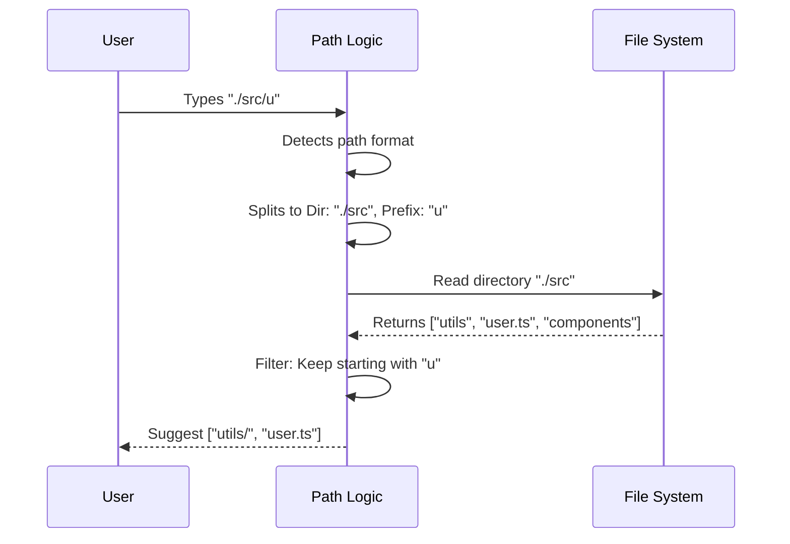

# Chapter 2: Filesystem Navigation & Discovery

Welcome back! In [Chapter 1: Fuzzy Command Dispatch](01_fuzzy_command_dispatch.md), we built the "brain" that figures out *what* command a user wants to run (like `/clean` or `/help`).

But commands often need targets. If you want to delete a file or move a folder, you need to tell the system *which* file or folder.

## The "Dark Library" Problem

Imagine your computer's hard drive is a massive, dark library with thousands of aisles (folders) and millions of books (files).

If you want a specific book, a bad system forces you to memorize the exact aisle number and shelf position:
> "Go to aisle `src`, shelf `components`, book `Button.tsx`."

If you make one typo, you are lost in the dark.

**Filesystem Navigation & Discovery** is like a flashlight. As you walk down an aisle (type a path), it lights up only the items immediately in front of you. You don't need to memorize the whole library; you just need to recognize the next step.

## The Goal: Path Autocompletion

Our goal is to build a utility that transforms a partial string into a list of valid files.

**Input:** `./src/co`
**Output:** `['./src/components/', './src/context/', './src/config.json']`

## Key Concepts

To make this work, we need three distinct steps:
1.  **Detection:** Is the user actually typing a path?
2.  **Parsing:** Split the input into "Where we are" vs. "What we are looking for."
3.  **Scanning:** Ask the Operating System what exists in that location.

Let's break them down.

### 1. Detection (Is this a path?)

We don't want to scan the hard drive if the user is just typing a sentence like "Hello world." We only activate our flashlight if the input looks like a file path.

We look for specific "tokens" that signify a path, like `./` (current directory), `../` (parent directory), or `/` (root).

```typescript
// Helper to check if a string looks like a path
export function isPathLikeToken(token: string): boolean {
  return (
    token.startsWith('./') ||  // Relative path
    token.startsWith('/') ||   // Absolute path
    token === '.' ||           // Current folder
    token === '..'             // Parent folder
  )
}
```

### 2. Parsing (The Split)

This is the logic puzzle. If a user types `./src/co`, they are effectively saying:
> "Look inside the folder `./src/` for files that start with `co`."

We need to split the input string into two parts:
1.  **Directory:** The folder to scan (`./src/`).
2.  **Prefix:** The filter to apply (`co`).

```typescript
export function parsePartialPath(partialPath: string) {
  // If input ends with '/', the prefix is empty
  // e.g., "src/" -> dir: "src", prefix: ""
  if (partialPath.endsWith('/')) {
    return { directory: partialPath, prefix: '' }
  }

  // Otherwise, split at the last separator
  // e.g., "src/co" -> dir: "src", prefix: "co"
  return { 
    directory: dirname(partialPath), 
    prefix: basename(partialPath) 
  }
}
```
*Note: We use Node.js built-ins `dirname` and `basename` to handle this robustly.*

### 3. Scanning (The OS Interaction)

Now that we know the directory, we need to ask the computer what's inside. We use the Node.js filesystem module (`fs`).

```typescript
// Read the directory contents
export async function scanDirectory(dirPath: string) {
  const fs = getFsImplementation() // Wrapper for node's fs
  const entries = await fs.readdir(dirPath)

  // Transform raw names into useful objects
  return entries.map(entry => ({
    name: entry.name,
    path: join(dirPath, entry.name),
    type: entry.isDirectory() ? 'directory' : 'file'
  }))
}
```

## How It Works: The Flow

Here is the sequence of events when a user presses `Tab` or waits for suggestions while typing a path.



## Performance: The Caching Layer

Filesystem operations (reading from the hard drive) are slow compared to memory operations. If the user types `./src/a`, then backspaces and types `./src/b`, we don't want to re-read the hard drive every single millisecond.

We use a simple **LRU (Least Recently Used) Cache**.

Think of this like taking a photograph of the bookshelf. If you ask about the bookshelf again 2 seconds later, we look at the photo instead of walking back to the shelf.

```typescript
// We store the last 500 directory scans
const directoryCache = new LRUCache<string, PathEntry[]>({
  max: 500,
  ttl: 5 * 60 * 1000, // Keep "photos" for 5 minutes
})

export async function scanDirectoryWithCache(dirPath: string) {
  // 1. Check if we have a photo of this folder
  if (directoryCache.has(dirPath)) {
    return directoryCache.get(dirPath)
  }

  // 2. If not, scan it for real (as seen in step 3)
  // ... (scan logic) ...

  // 3. Save the photo for next time
  directoryCache.set(dirPath, results)
}
```
*We will explore advanced caching strategies in [Chapter 6: Performance Caching Layer](06_performance_caching_layer.md).*

## Putting It Together

Let's look at the main function `getPathCompletions` found in `directoryCompletion.ts`. This combines parsing, scanning, and filtering.

```typescript
export async function getPathCompletions(partialPath: string) {
  // 1. Figure out where to look
  const { directory, prefix } = parsePartialPath(partialPath)

  // 2. Get all files (using our cached scanner)
  const entries = await scanDirectoryForPaths(directory)

  // 3. Filter the list using the prefix
  const matches = entries.filter(entry => 
    entry.name.toLowerCase().startsWith(prefix.toLowerCase())
  )

  // 4. Format for the UI
  return matches.map(entry => ({
    displayText: entry.name,
    id: entry.path
  }))
}
```

### Example Usage

If you were to run this code in a console:

```typescript
// Scenario: User is looking for the 'utils' folder
const suggestions = await getPathCompletions('./src/uti');

console.log(suggestions);
```

**Result:**
```json
[
  {
    "id": "src/utils",
    "displayText": "utils/",
    "metadata": { "type": "directory" }
  }
]
```

## Summary

In this chapter, we gave our tool a flashlight.
1.  We learned to **detect** when a user is typing a path.
2.  We **parsed** the input to separate the folder from the search term.
3.  We **scanned** the OS filesystem to find real files.
4.  We added **caching** to make it feel instant.

Currently, we can only see files on our *local* computer. But what if we want our AI assistant to interact with external tools, databases, or APIs?

[Next Chapter: Remote Tool Integration (MCP)](03_remote_tool_integration__mcp_.md)

---

Generated by [Code IQ](https://github.com/adityasoni99/Code-IQ)