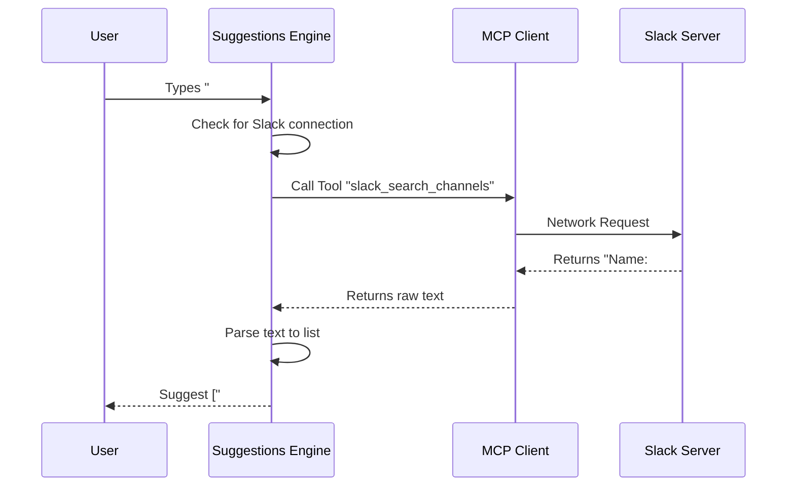

# Chapter 3: Remote Tool Integration (MCP)

Welcome back! In [Chapter 2: Filesystem Navigation & Discovery](02_filesystem_navigation___discovery.md), we gave our CLI a "flashlight" to see files on your local hard drive.

But modern development doesn't just happen on your hard drive. It happens in the cloud. It happens on Slack, GitHub, and Jira.

## The "Universal Remote" Problem

Imagine you want to send a message to a Slack channel via your CLI.
> "Send update to #general"

A **bad** system forces you to know exactly what channels exist. If you type `#gen`, it shrugs. It doesn't know what's inside your Slack workspace because that data lives on a server far away.

We need a way to ask Slack: *"Hey, do you have any channels starting with 'gen'?"*

This is **Remote Tool Integration** using the **Model Context Protocol (MCP)**.

Think of it like a **Universal Remote Control**. The remote (our CLI) doesn't know how to play a movie itself. But it knows exactly which signal to send to the DVD player (Slack) to make it happen, and it interprets the blinking light on the player to tell you it worked.

## The Goal: Network Autocomplete

**Input:** User types `#gen`
**Action:** CLI talks to Slack via MCP.
**Output:** Suggestions: `['#general', '#genesis-project', '#gentle-reminders']`

## Key Concepts

To achieve this, we rely on three steps:
1.  **Negotiation:** Checking if the "DVD Player" (Slack) is plugged in.
2.  **Translation:** Formatting our query into a signal the remote tool understands.
3.  **Unwrapping:** Parsing the messy response into a clean list.

### 1. Negotiation (Is the tool there?)

Before we try to search, we check our connections. In our system, we maintain a list of `clients` (active connections). We look for one named "slack".

```typescript
// Do we have a connection to a Slack MCP server?
function findSlackClient(clients) {
  return clients.find(client => 
    client.type === 'connected' && 
    client.name.includes('slack')
  )
}
```

### 2. Translation (Calling the Tool)

If we are connected, we use `callTool`. This is the standard way to send a command via MCP. We don't need to know *how* Slack searches; we just need to know the tool name (`slack_search_channels`) and the arguments (`query`).

```typescript
const result = await slackClient.client.callTool(
  {
    name: 'slack_search_channels',
    arguments: {
      query: 'gen', // The user's input
      limit: 20,
    },
  },
)
```

### 3. Unwrapping (Parsing the Response)

Here is the tricky part. Remote tools often return data in formats designed for humans or LLMs to read, not strict JSON arrays.

Slack might return a string like this:
```text
{"results": "Found 2 channels:\nName: #general\nName: #random"}
```
Or sometimes just Markdown:
```text
Name: #general
Name: #random
```

We need a parser to strip away the wrapper and extract just the names.

```typescript
// Regex to find lines starting with "Name: "
function parseChannels(text: string): string[] {
  const channels = []
  // Split by new line
  for (const line of text.split('\n')) {
    // Look for "Name: #some-channel"
    const match = line.match(/^Name:\s*#?([a-z0-9_-]+)/)
    
    if (match) {
      channels.push(match[1]) // Add "some-channel" to list
    }
  }
  return channels
}
```

## How It Works: The Flow

Let's visualize the journey of a keystroke.



## Handling Implementation Details

Let's look at `slackChannelSuggestions.ts` to see how we handle the messy reality of network requests.

### 1. Optimization: In-Flight Deduplication
Network requests are slow. If the user types `#g`, then `#ge`, then `#gen` very quickly, we might fire three requests. If the first one is still loading, we don't want to start a new one if we don't have to.

We use a variable `inflightPromise` to track an ongoing request.

```typescript
let inflightQuery = null
let inflightPromise = null

// Inside the suggestion function...
if (inflightQuery === currentQuery) {
    // If we are already asking about this query, wait for that same promise
    return await inflightPromise
}
```

### 2. Query Formatting
Slack's search engine is strict. If you search for a partial word with a hyphen like `team-en`, it might return nothing. It prefers whole words.

We add logic to strip the partial last segment to ensure we get results.

```typescript
function mcpQueryFor(token: string) {
  // If input is "team-en", slice it to "team"
  const lastSep = token.lastIndexOf('-')
  
  if (lastSep > 0) {
    return token.slice(0, lastSep)
  }
  return token
}
```

### 3. Caching
Just like we cached filesystem results in [Chapter 2: Filesystem Navigation & Discovery](02_filesystem_navigation___discovery.md), we cache network results to avoid hitting API rate limits.

```typescript
const cache = new Map<string, string[]>()

// After getting results from MCP:
cache.set(query, channels)

// Next time, check cache first:
if (cache.has(query)) {
    return cache.get(query)
}
```
*Note: We will explore advanced caching strategies in [Chapter 6: Performance Caching Layer](06_performance_caching_layer.md).*

## Summary

In this chapter, we learned how to bridge the gap between our local tool and the outside world.

1.  We used **MCP** (Model Context Protocol) as our universal remote.
2.  We learned that remote tools often return **unstructured text** (Markdown/JSON-strings) that requires **parsing**.
3.  We implemented **In-flight deduplication** to handle slow networks gracefully.

Now our system can find commands (Chapter 1), find local files (Chapter 2), and find remote resources (Chapter 3).

But what if the user doesn't know *what* they are looking for yet? What if we could guess what they want based on what they did yesterday?

[Next Chapter: History-Based Prediction](04_history_based_prediction.md)

---

Generated by [Code IQ](https://github.com/adityasoni99/Code-IQ)