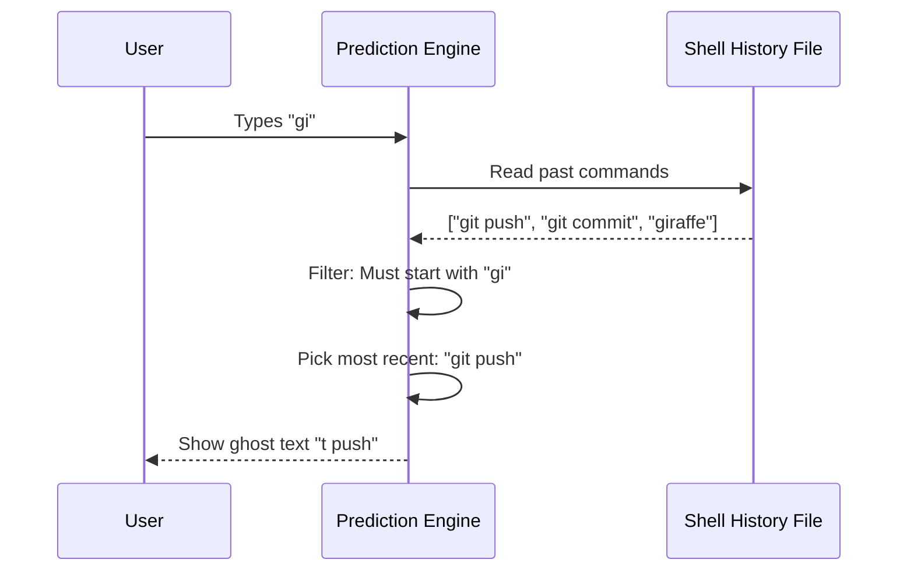

# Chapter 4: History-Based Prediction

Welcome back! In [Chapter 3: Remote Tool Integration (MCP)](03_remote_tool_integration__mcp_.md), we turned our CLI into a "Universal Remote" that can talk to external tools like Slack or GitHub.

But sometimes, the most useful data isn't on a server halfway around the world. It's right on your own computer, hidden in your past actions.

## The "Regular Regular" Problem

Imagine you go to your favorite coffee shop every morning. You walk up to the counter and say, **"Large Iced..."**

A **bad** barista waits for you to finish the sentence every single time.
A **smart** barista knows you. They immediately smile and say, **"...Latte with oat milk?"**

This is **History-Based Prediction**.

As developers, we are creatures of habit. We type the same commands thousands of times:
*   `git commit -m "update"`
*   `npm run dev`
*   `docker compose up`

It is tedious to type these out fully every time. We want a system that acts like the smart barista: it sees what you started typing, remembers what you usually say next, and offers to finish it for you.

## Core Concept: Ghost Text

In previous chapters, we displayed suggestions in a **list** (a menu you navigate with arrow keys).

History-based prediction works differently. It usually powers **Ghost Text**. This is faint, gray text that appears *inline* right after your cursor.

*   **User types:** `npm r`
*   **Ghost text shows:** `un dev`
*   **Full visual:** `npm r`**`un dev`**

If the user presses `Tab` or the right arrow key, the ghost text becomes real text.

## How It Works: The Flow

The logic here is surprisingly simple compared to our previous chapters. We don't need fuzzy search or network requests. We just need to answer: **"What is the most recent command that starts with these letters?"**



## Step-by-Step Implementation

Let's explore how we build this in `shellHistoryCompletion.ts`.

### 1. Reading the Past

First, we need to access the user's history. Terminals (like Bash or Zsh) store every command you run in a hidden file.

We use a helper function `getHistory()` (from our project's core) to stream these lines one by one.

```typescript
// inside getShellHistoryCommands()
const commands: string[] = []
const seen = new Set<string>() // To avoid duplicates

// Loop through history entries
for await (const entry of getHistory()) {
  // Logic to clean and add commands...
}
```

**Why a Set?**
If you typed `ls -a` 50 times in a row, we don't want to store "ls -a" 50 times. We only care that you use it. The `Set` ensures we keep a unique list.

### 2. The Logic: Strict Prefix Matching

In [Chapter 1: Fuzzy Command Dispatch](01_fuzzy_command_dispatch.md), we used "Fuzzy" search (allowing typos). For history ghost text, we usually want **Strict** matching.

If I type `rm`, I want the system to suggest `rm -rf node_modules`. I do *not* want it to suggest `random_command`, even if the letters are similar.

```typescript
// We look for a command that starts EXACTLY with what you typed
for (const command of commands) {
  // e.g., input: "npm r", command: "npm run dev"
  if (command.startsWith(input) && command !== input) {
    return {
      fullCommand: command,
      // The part to show in gray: "un dev"
      suffix: command.slice(input.length),
    }
  }
}
```

### 3. Performance: The Cache

Reading a file from the hard drive is slow. If we re-read the entire history file every time you type a single letter, your terminal would lag.

We use a memory cache. We read the file once, save it in a variable, and reuse it for 60 seconds.

```typescript
// Simple caching variables
let shellHistoryCache: string[] | null = null
let shellHistoryCacheTimestamp = 0
const CACHE_TTL_MS = 60000 // 60 seconds

// Inside the function...
if (shellHistoryCache && now - shellHistoryCacheTimestamp < CACHE_TTL_MS) {
  // If data is fresh, use it immediately!
  return shellHistoryCache
}
```

*Note: We will dive deeper into advanced caching strategies in [Chapter 6: Performance Caching Layer](06_performance_caching_layer.md).*

### 4. Updating the Cache Live

There is one edge case: What if I run a *new* command right now?
> I type `echo "Hello World"`, hit Enter.

My history file on disk has changed. The cache in memory is now old. We need to update our cache immediately so `echo` appears in suggestions next time.

```typescript
export function prependToShellHistoryCache(command: string): void {
  if (!shellHistoryCache) return

  // Remove existing instance to avoid duplicates
  const idx = shellHistoryCache.indexOf(command)
  if (idx !== -1) {
    shellHistoryCache.splice(idx, 1)
  }
  
  // Add new command to the VERY FRONT of the list
  shellHistoryCache.unshift(command)
}
```

## Putting It Together

Here is the main function `getShellHistoryCompletion` that ties it all together. It handles the edge cases (like empty input) and performs the search.

```typescript
export async function getShellHistoryCompletion(
  input: string,
): Promise<ShellHistoryMatch | null> {
  // 1. Safety check: Don't predict on empty strings
  if (!input || input.length < 2) return null

  // 2. Get the list (either from cache or disk)
  const commands = await getShellHistoryCommands()

  // 3. Find the match
  for (const command of commands) {
    if (command.startsWith(input)) {
        // Return the prediction
        return { fullCommand: command, suffix: command.slice(input.length) }
    }
  }
  
  return null
}
```

### Example Scenario

Let's trace what happens when you type `gi`.

1.  **Input:** `gi`
2.  **Cache:** Contains `['git push origin main', 'git status', 'npm install']` (Sorted by most recent).
3.  **Loop:**
    *   Does `git push origin main` start with `gi`? **Yes.**
4.  **Result:**
    *   Full Command: `git push origin main`
    *   Suffix (Ghost Text): `t push origin main`

The user sees: `gi`**`t push origin main`**

## Summary

In this chapter, we implemented the "Smart Barista" of our CLI.

1.  We learned that **Ghost Text** is different from list-based suggestions.
2.  We used **Strict Prefix Matching** (`startsWith`) instead of Fuzzy search to ensure accuracy.
3.  We implemented a **Time-Based Cache** to keep the interface snappy while reading heavy history files.

We have now covered finding commands, files, remote tools, and history. But as the user types, we are generating *a lot* of different suggestions from different sources. How do we decide which one is the "best" one to show at the top?

[Next Chapter: Adaptive Usage Ranking](05_adaptive_usage_ranking.md)

---

Generated by [Code IQ](https://github.com/adityasoni99/Code-IQ)