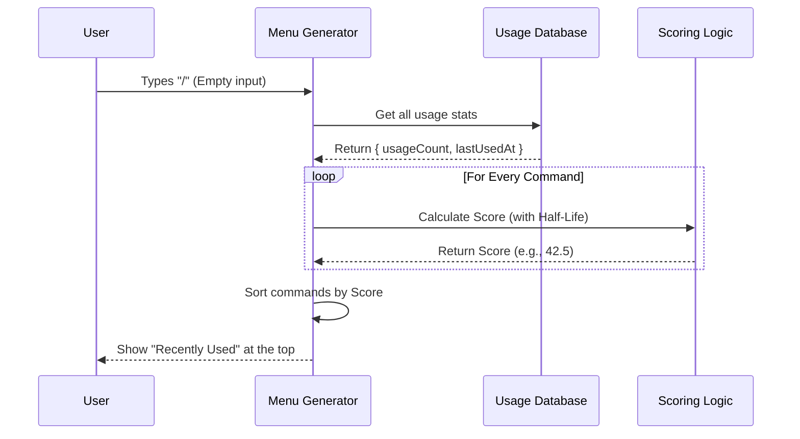

# Chapter 5: Adaptive Usage Ranking

Welcome back! In [Chapter 4: History-Based Prediction](04_history_based_prediction.md), we built a "Ghost Text" feature that predicts the *exact* command you are typing based on your past history.

However, sometimes you aren't repeating an exact command. You are browsing the menu of available tools. You might have 50 different tools installed. Which ones should appear at the top?

## The "On Repeat" Playlist Problem

Imagine a music app.
*   Last year, you listened to "Song A" **1,000 times**. You haven't listened to it since.
*   This week, you listened to "Song B" **20 times**.

If the app only counts **Total Plays**, "Song A" will be at the top of your list forever, even though you are tired of it.
A **smart** app knows that you are currently obsessed with "Song B". It ranks based on what is relevant *now*.

This is **Adaptive Usage Ranking**. We want our CLI to learn your current habits. If you stop using a tool, it should gradually drift down the list to make room for your new favorites.

## Key Concept: The Half-Life

To solve this, we don't just count clicks. We use a concept from physics called **Half-Life**.

In our system, the half-life is **7 days**.
*   A command used **today** gets full points.
*   A command used **7 days ago** is worth 50% of its points.
*   A command used **14 days ago** is worth 25% of its points.

This ensures that a tool you used heavily last month doesn't clutter your view today if you've stopped using it.

## Step-by-Step Implementation

Let's look at how we implement this math in `skillUsageTracking.ts`.

### 1. Recording Usage
Every time a user successfully runs a specific "skill" or command, we need to save two things:
1.  **Count:** How many times total?
2.  **Timestamp:** When was the last time?

```typescript
// skillUsageTracking.ts
export function recordSkillUsage(skillName: string): void {
  const now = Date.now()
  
  // We update the configuration file
  saveGlobalConfig(current => {
    const existing = current.skillUsage?.[skillName]
    return {
      ...current,
      skillUsage: {
        ...current.skillUsage,
        [skillName]: {
          usageCount: (existing?.usageCount ?? 0) + 1, // Add 1
          lastUsedAt: now,                             // Update time
        },
      },
    }
  })
}
```

### 2. Calculating the Score (The Math)
When we need to sort the list, we calculate a "Score" for every command. This is where the decay happens.

We use the formula: $Score = Count \times 0.5^{(\frac{DaysSinceUse}{7})}$

```typescript
// skillUsageTracking.ts
export function getSkillUsageScore(skillName: string): number {
  const usage = config.skillUsage?.[skillName]
  if (!usage) return 0

  // Calculate how many days have passed
  const daysSinceUse = (Date.now() - usage.lastUsedAt) / (1000 * 60 * 60 * 24)
  
  // Calculate decay: 0.5 to the power of (weeks passed)
  const recencyFactor = Math.pow(0.5, daysSinceUse / 7)

  // Score = Total Count * Decay
  // We keep at least 10% (0.1) so old favorites don't disappear entirely
  return usage.usageCount * Math.max(recencyFactor, 0.1)
}
```
*   If `daysSinceUse` is 0, `recencyFactor` is 1. Score = Count.
*   If `daysSinceUse` is 7, `recencyFactor` is 0.5. Score = Half the Count.

### 3. Sorting the Menu
Now we move to `commandSuggestions.ts`. When generating the list of suggestions, we use this score to break ties.

If the user types `/deploy`, and we have two matching commands, the one with the higher score wins.

```typescript
// commandSuggestions.ts (inside the sort function)
const sortedResults = withMeta.sort((a, b) => {
  // ... (Previous logic checks for Exact Matches first) ...

  // If the search match quality is roughly the same...
  // Sort by our calculated usage score!
  return b.usage - a.usage
})
```

## How It Works: The Flow

Here is what happens when you open the menu (press `/`).



## A Concrete Example

Let's see the math in action.

| Command | Total Uses | Last Used | Calculation | Final Score |
| :--- | :--- | :--- | :--- | :--- |
| **`/deploy`** | 20 | **Today** | $20 \times 1.0$ | **20.0** |
| **`/help`** | 100 | **3 weeks ago** | $100 \times 0.125$ | **12.5** |

Even though `/help` has been used 5 times more often in total, `/deploy` ranks higher because it is relevant **now**.

## Performance: Debouncing Writes

Writing to a configuration file on the hard drive is slow. If a computer script runs a command 100 times in 1 second, we don't want to save the file 100 times.

We use a **Debounce** timer. We only write the usage to disk once every 60 seconds per command.

```typescript
// skillUsageTracking.ts
const SKILL_USAGE_DEBOUNCE_MS = 60_000 // 1 Minute

export function recordSkillUsage(skillName: string): void {
  const now = Date.now()
  const lastWrite = lastWriteBySkill.get(skillName)

  // If we saved this less than a minute ago, skip saving!
  if (lastWrite !== undefined && now - lastWrite < SKILL_USAGE_DEBOUNCE_MS) {
    return
  }
  
  // ... proceed to save ...
}
```

## Summary

In this chapter, we made our suggestion system "smart" and adaptive.
1.  We learned about the **"On Repeat" problem**: old habits shouldn't obscure current needs.
2.  We implemented a **Half-Life Decay** algorithm to value recent usage over old usage.
3.  We used this score to **sort** our command menu.

We have built a powerful system: Fuzzy matching (Ch 1), File navigation (Ch 2), Remote tools (Ch 3), Ghost text (Ch 4), and now Adaptive Ranking (Ch 5).

However, calculating these scores and scanning filesystems takes time. If the user types fast, our system might feel "laggy." To fix this, we need to master the art of doing nothing.

[Next Chapter: Performance Caching Layer](06_performance_caching_layer.md)

---

Generated by [Code IQ](https://github.com/adityasoni99/Code-IQ)