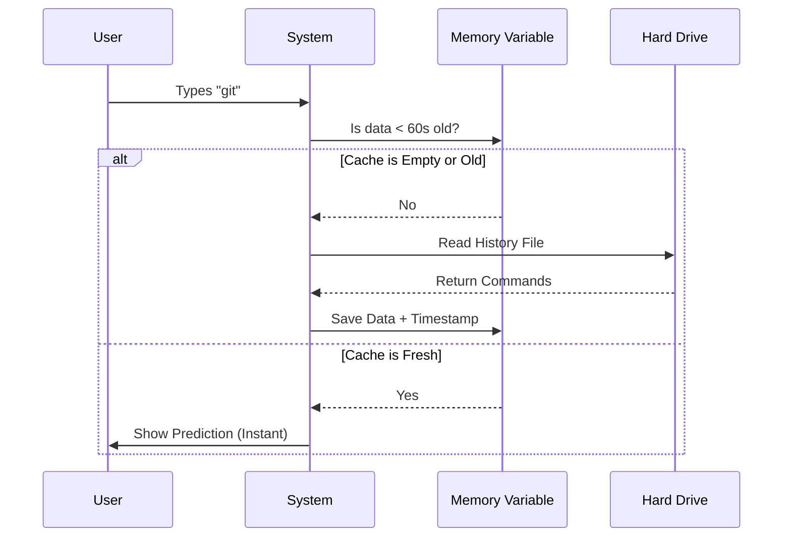

# Chapter 6: Performance Caching Layer

Welcome to the final chapter! In [Chapter 5: Adaptive Usage Ranking](05_adaptive_usage_ranking.md), we added complex math to rank commands based on your habits. In previous chapters, we added filesystem scanning and network requests.

We have built a very smart system. But there is a risk: **Smart systems are often slow.**

If every time you press a key, the computer has to:
1.  Read the hard drive.
2.  Connect to the internet (Slack).
3.  Calculate complex math equations.

...your interface will freeze. It will feel "laggy."

This chapter is about the **Performance Caching Layer**. It is the secret sauce that makes the system feel "instant" even when it is doing heavy lifting in the background.

## The "Hyperactive Waiter" Problem

Imagine you are at a restaurant. You ask the waiter, "Do you have Coke?"

**The Slow Way (No Cache):**
The waiter walks all the way to the kitchen, checks the fridge, walks back, and says "Yes."
Two seconds later, your friend asks, "Do you have Coke?"
The waiter walks *all the way back to the kitchen* again to check.

**The Fast Way (Caching):**
The waiter checks the fridge once. They **remember** (cache) that Coke is in stock. When your friend asks, they answer instantly without moving.

In our CLI, if you type `./src`, we scan your hard drive. If you backspace and type `./src` again, we should **not** scan the hard drive again. We should remember the result from a second ago.

## Core Strategies

We use three different caching strategies across the codebase to ensure speed.

### 1. The Short-Term Memory (Variable Cache)
Used for: **Shell History** ([Chapter 4](04_history_based_prediction.md)).

This is the simplest form of caching. We store the data in a global variable. We also store a timestamp. If the data is "fresh" (e.g., less than 60 seconds old), we use it.



### 2. The Smart Archive (LRU Cache)
Used for: **Filesystem Navigation** ([Chapter 2](02_filesystem_navigation___discovery.md)).

We can't store *every* folder on your computer in memory; we would run out of RAM. An **LRU (Least Recently Used)** cache is a fixed-size container (e.g., 500 items).

When the container is full and we add a new item, the cache automatically deletes the item that hasn't been asked for in the longest time.

### 3. The "Wait For It" (Debouncing)
Used for: **Adaptive Ranking** ([Chapter 5](05_adaptive_usage_ranking.md)).

When we write data *to* the disk (like saving usage statistics), it is very slow. If a script runs a command 100 times in 1 second, we don't want to save the file 100 times. We wait for the activity to settle down before saving.

## Implementation Details

Let's look at how these are implemented in the code.

### Strategy 1: Simple Time-Based Cache
*File: `shellHistoryCompletion.ts`*

Here, we use a simple variable and a timestamp.

```typescript
// 1. The container
let shellHistoryCache: string[] | null = null
let shellHistoryCacheTimestamp = 0
const CACHE_TTL_MS = 60000 // 60 Seconds

async function getShellHistoryCommands() {
  const now = Date.now()

  // 2. The Check: Is it fresh?
  if (shellHistoryCache && now - shellHistoryCacheTimestamp < CACHE_TTL_MS) {
    return shellHistoryCache
  }

  // 3. If not, do the hard work...
  // ... reading file logic ...
}
```
**Explanation:**
This is perfect for data that doesn't change often. Your shell history usually only changes when *you* hit enter, so reading it once per minute is plenty.

### Strategy 2: The LRU Cache
*File: `directoryCompletion.ts`*

For directories, we use a library called `lru-cache`.

```typescript
import { LRUCache } from 'lru-cache'

// Configure the bucket
const directoryCache = new LRUCache<string, DirectoryEntry[]>({
  max: 500,           // Only keep 500 folders in memory
  ttl: 5 * 60 * 1000, // Forget them after 5 minutes
})

export async function scanDirectory(dirPath: string) {
  // 1. Check the bucket
  const cached = directoryCache.get(dirPath)
  if (cached) return cached

  // 2. If missing, scan the disk
  const fs = getFsImplementation()
  const entries = await fs.readdir(dirPath)
  
  // 3. Save for next time
  directoryCache.set(dirPath, entries)
  return entries
}
```
**Explanation:**
If you browse `./src`, then `./public`, then `./node_modules`, and then go back to `./src`, the system remembers `./src`. But if you browse 600 other folders, `./src` gets pushed out of memory to save RAM.

### Strategy 3: Network In-Flight Deduplication
*File: `slackChannelSuggestions.ts`*

This is a special performance trick for network requests ([Chapter 3](03_remote_tool_integration__mcp_.md)).

If you type `#g`, `#ge`, `#gen` very quickly, you might trigger 3 network requests. If the first request (`#g`) is still traveling to the server, we don't need to start a new one. We can just wait for the first one to finish.

```typescript
let inflightQuery: string | null = null
let inflightPromise: Promise<string[]> | null = null

// Inside the suggestion function...
if (inflightQuery === currentQuery) {
    // STOP! Don't make a new request.
    // Just attach yourself to the existing one.
    return await inflightPromise
}

// Start a new request
inflightQuery = currentQuery
inflightPromise = fetchChannels(clients, currentQuery)
```
**Explanation:**
This prevents "hammering" the API. It saves battery, data, and prevents rate-limiting errors from external services.

### Strategy 4: Debounced Writes
*File: `skillUsageTracking.ts`*

This handles saving data to disk without slowing down the app.

```typescript
const lastWriteBySkill = new Map<string, number>()
const DEBOUNCE_MS = 60_000 // 1 minute

export function recordSkillUsage(skillName: string): void {
  const now = Date.now()
  const lastWrite = lastWriteBySkill.get(skillName)

  // If we just saved this < 60s ago, do nothing.
  if (lastWrite && now - lastWrite < DEBOUNCE_MS) {
    return
  }
  
  // Update the timestamp and save to disk
  lastWriteBySkill.set(skillName, now)
  saveGlobalConfig(...) 
}
```
**Explanation:**
We accept that our usage stats might be up to 60 seconds out of date on the hard drive. In exchange, the application never freezes while waiting for a file save operation.

## Summary

In this final chapter, we learned how to keep our application fast.

1.  We used **Variable Caching** for small, global data (History).
2.  We used **LRU Caching** for large, unlimited datasets (Filesystem).
3.  We used **In-Flight Promises** to prevent duplicate network calls.
4.  We used **Debouncing** to prevent writing to the disk too often.

### Series Conclusion

Congratulations! You have explored the entire architecture of the **Suggestions** project.

*   You learned how **Fuzzy Dispatch** understands user intent ([Chapter 1](01_fuzzy_command_dispatch.md)).
*   You built a **Filesystem Navigator** to find files ([Chapter 2](02_filesystem_navigation___discovery.md)).
*   You connected **Remote Tools** via MCP ([Chapter 3](03_remote_tool_integration__mcp_.md)).
*   You predicted the future with **History Ghost Text** ([Chapter 4](04_history_based_prediction.md)).
*   You ranked results using **Adaptive Algorithms** ([Chapter 5](05_adaptive_usage_ranking.md)).
*   And finally, you optimized it all with **Performance Caching** (Chapter 6).

You now possess the knowledge to build, maintain, or extend a modern, intelligent command-line interface. Happy coding!

---

Generated by [Code IQ](https://github.com/adityasoni99/Code-IQ)