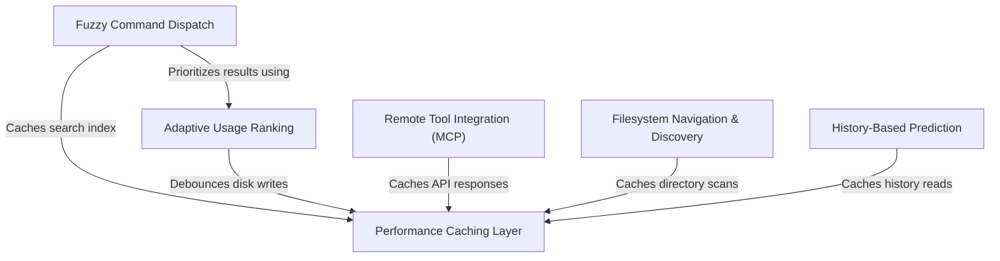

# Tutorial: suggestions

This project is an intelligent **autocomplete and suggestion engine** for a command-line interface. It helps users quickly find commands, navigate the *filesystem*, and access external tools like Slack by predicting intent. To ensure a smooth, lag-free experience, it heavily utilizes **caching** and prioritizes suggestions based on your **historical usage patterns**.

## Chapters

1. [Fuzzy Command Dispatch](01_fuzzy_command_dispatch.md)
2. [Filesystem Navigation & Discovery](02_filesystem_navigation___discovery.md)
3. [Remote Tool Integration (MCP)](03_remote_tool_integration__mcp_.md)
4. [History-Based Prediction](04_history_based_prediction.md)
5. [Adaptive Usage Ranking](05_adaptive_usage_ranking.md)
6. [Performance Caching Layer](06_performance_caching_layer.md)

---

Generated by [Code IQ](https://github.com/adityasoni99/Code-IQ)