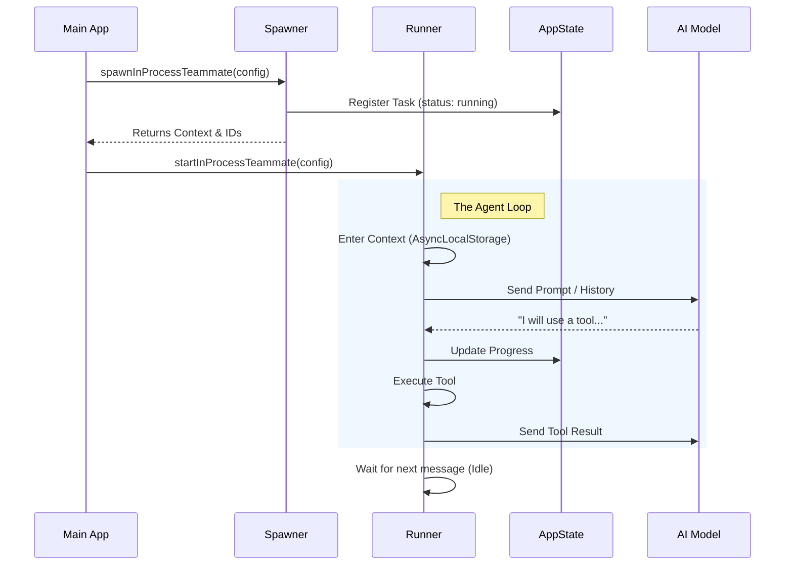

# Chapter 1: In-Process Teammate Runtime

Welcome to the **Swarm** project! In this first chapter, we are going to explore the foundation of how our AI agents live and work together.

## Motivation: The "Office" Analogy

Imagine you are running a company (your application). You need employees (agents) to do specific tasks, like researching a topic or writing code.

You have two ways to organize this office:

1.  **The Remote Way (Process-based):** You hire freelancers who work in completely different buildings. To talk to them, you have to pick up the phone. This is robust, but setting up a new office building for every single task is expensive and slow.
2.  **The In-House Way (In-Process):** You hire staff who sit in cubicles right next to you. They share the same electricity and coffee machine (memory and resources). It's fast and efficient.

The **In-Process Teammate Runtime** is the "In-House" approach. Instead of spawning heavy, separate operating system processes (like opening a new Terminal window) for every agent, we run them inside the main Node.js application.

**The Use Case:**
We want to spawn a "Researcher" agent that stays alive in the background, remembers its context, and waits for instructions, without consuming the heavy resources of a separate terminal window.

---

## Key Concepts

To make this work without agents crashing into each other, we need three main components:

### 1. The Context (The Cubicle)
Even though agents share the same "office" (process), they need their own private space. We call this **Context Isolation**. We use a Node.js feature called `AsyncLocalStorage` to ensure that when Agent A asks "Who am I?", it doesn't accidentally get Agent B's name.

### 2. The Spawner (Hiring)
This is the setup phase. We create the agent's identity, assign them a unique ID, and register them in the company directory (AppState).

### 3. The Runner (The Work Loop)
This is the "brain" of the agent. It runs a continuous loop:
1.  **Wait** for a message (Mailbox).
2.  **Think** and use tools (Execution).
3.  **Sleep** until the next task.

---

## How to Use It

Let's look at how we create and start an in-process teammate.

### Step 1: Spawning the Teammate

First, we define who the agent is and register them. This doesn't start the AI yet; it just prepares the desk.

```typescript
import { spawnInProcessTeammate } from './spawnInProcess.js';

// 1. Define the teammate
const config = {
  name: "Researcher",
  teamName: "DevTeam",
  prompt: "You are a research assistant.",
  planModeRequired: false
};

// 2. Spawn (registers the task in AppState)
const result = await spawnInProcessTeammate(config, context);

if (result.success) {
  console.log(`Agent created with ID: ${result.agentId}`);
}
```

*What happens here:* The system creates a unique ID (e.g., `Researcher@DevTeam`), sets up an `AbortController` (a kill switch), and creates the `TeammateContext`.

### Step 2: Starting the Runner

Now that the agent is registered, we kick off their "brain" loop in the background.

```typescript
import { startInProcessTeammate } from './inProcessRunner.js';

// 3. Start the execution loop
startInProcessTeammate({
  identity: { agentId: result.agentId, ...config },
  taskId: result.taskId,
  teammateContext: result.teammateContext,
  // ... other context tools
});
```

*What happens here:* The function `startInProcessTeammate` triggers an asynchronous loop. It runs independently, allowing your main application to keep doing other things while the agent waits for work.

---

## Internal Implementation: The Workflow

How does the runtime manage this "virtual machine" inside a process? Let's visualize the flow.



### The "Deep Dive" Under the Hood

Let's look at the simplified code logic that makes this possible.

#### 1. Context Isolation
In `spawnInProcess.ts`, we create a specific context object. This object holds the agent's specific configuration.

```typescript
// inside spawnInProcessTeammate
const teammateContext = createTeammateContext({
  agentId,
  agentName: name,
  teamName,
  abortController, // Linked so we can kill the agent later
});
```

#### 2. The Execution Wrapper
In `inProcessRunner.ts`, we don't just run the code. We wrap it. This ensures that any log or tool usage knows *which* agent triggered it.

```typescript
// inside runInProcessTeammate
await runWithTeammateContext(teammateContext, async () => {
    // Inside here, the "current teammate" is globally accessible
    // via AsyncLocalStorage, but isolated to this async chain.
    
    await runAgent({ ... }); 
});
```

#### 3. The Idle Loop
In-process agents don't die after one task. They wait. This logic handles checking the "mailbox" (a file on disk) for new instructions.

```typescript
// inside waitForNextPromptOrShutdown
while (!abortController.signal.aborted) {
    // Check if leader sent a message
    const messages = await readMailbox(identity.agentName);
    
    if (messages.hasNew) {
        return { type: 'new_message', content: messages.newest };
    }

    // Sleep for 500ms before checking again
    await sleep(500);
}
```

This polling mechanism allows the agent to exist persistently, checking for permission requests, shutdowns, or new tasks without blocking the main CPU thread.

---

## Summary

The **In-Process Teammate Runtime** is the efficient engine room of Swarm. It allows us to:
1.  **Spawn** agents cheaply without new OS processes.
2.  **Isolate** them so they don't confuse their identities.
3.  **Run** them in a loop where they can wait for commands.

In the next chapter, we will see how we actually tell these runtimes what to do using the [Teammate Executor Adapter](02_teammate_executor_adapter.md).

---

Generated by [Code IQ](https://github.com/adityasoni99/Code-IQ)