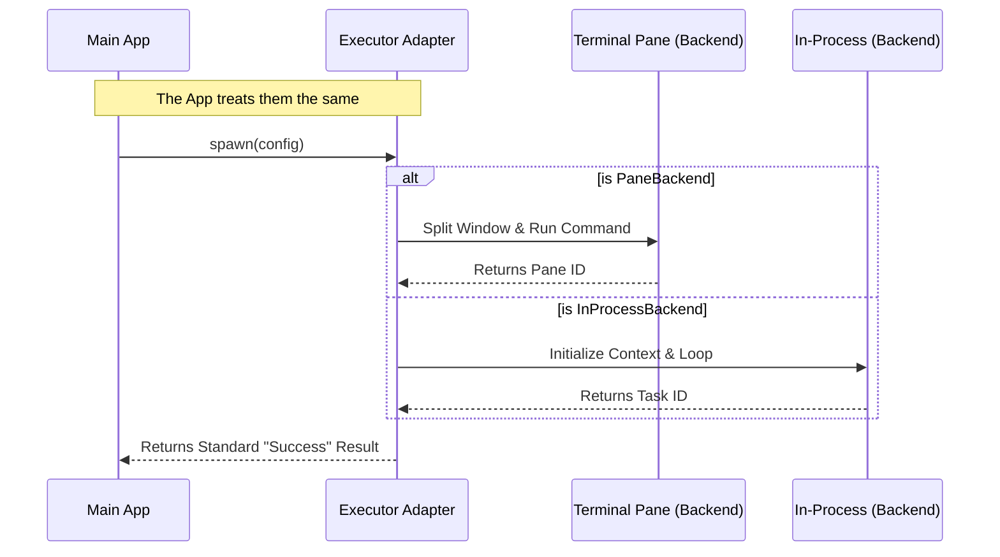

# Chapter 2: Teammate Executor Adapter

In the previous chapter, [In-Process Teammate Runtime](01_in_process_teammate_runtime.md), we learned how to run efficient agents inside our main application process.

But wait! Sometimes "efficient" isn't enough. Sometimes you need an agent to have its own full terminal window (like a `tmux` pane) so you can watch it type commands, or so it can run heavy server tasks without freezing your main app.

This creates a problem: **Complexity.**
*   To talk to an internal agent, we access memory objects.
*   To talk to a terminal agent, we might need to send shell commands or socket messages.

Do we want to write `if/else` logic every time we send a message? No.

Enter the **Teammate Executor Adapter**.

---

## Motivation: The "Universal Remote"

Imagine you have a TV, a Sound System, and a DVD Player. They all work differently, but you don't want three remotes. You want **one** remote with a simple "Power On" button. You press it, and the remote handles the specific signal for the specific device.

The **Teammate Executor Adapter** is that universal remote for your AI agents.

**The Use Case:**
Your main application wants to say: *"Spawn a helper named 'Bob'."*
It should not care if 'Bob' acts as a background thread (In-Process) or pops up in a new split-screen terminal window (Pane-based). The application code should look exactly the same.

---

## Key Concepts

To achieve this uniformity, we use a software design pattern called an **Interface**.

### 1. The Interface (`TeammateExecutor`)
This is a contract. Any system that wants to run an agent must promise to support three standard actions:
1.  **Spawn:** Create the agent.
2.  **SendMessage:** Talk to the agent.
3.  **Kill:** Stop the agent.

### 2. The Adapters
We have specific classes that fulfill this contract:
*   **InProcessBackend:** Handles the "internal office" staff (from Chapter 1).
*   **PaneBackendExecutor:** Handles the "remote freelancers" (agents in terminal panes).

---

## How to Use It

Let's see how this simplifies our code. We are going to spawn an agent without knowing *how* it runs.

### Step 1: The Standard Configuration

First, we define what the agent looks like. This config object is generic—it doesn't mention processes or windows.

```typescript
const agentConfig = {
  name: "DatabaseAdmin",
  teamName: "OpsTeam",
  prompt: "Check the system logs for errors.",
  permissions: ["read-files"]
};
```

### Step 2: Spawning via the Adapter

Here is the magic. We call `.spawn()` on our executor.

```typescript
// 'executor' could be InProcess or Pane-based. We don't care!
const result = await executor.spawn(agentConfig);

if (result.success) {
  console.log(`Agent active with ID: ${result.agentId}`);
}
```

*What happens here:* The executor takes this generic request and translates it.
*   If it's **In-Process**: It sets up the background loop and `AsyncLocalStorage`.
*   If it's **Pane-Based**: It actually runs a shell command to split your terminal window.

### Step 3: Sending a Message

Talking to the agent is equally standardized.

```typescript
await executor.sendMessage(result.agentId, {
  from: "Manager",
  text: "Did you find any errors in the logs?"
});
```

*What happens here:* The executor handles the delivery mechanism. It ensures the message lands in the agent's mailbox, regardless of where the agent lives.

---

## Internal Implementation: The Workflow

How does the Adapter translate these requests?



### The "Deep Dive" Under the Hood

Let's look at the code files that make this abstraction possible.

#### 1. The Contract (`backends/types.ts`)
This defines the rules. Every backend *must* look like this.

```typescript
export type TeammateExecutor = {
  // Can we run this on this computer?
  isAvailable(): Promise<boolean>;

  // The Big Three Actions
  spawn(config: TeammateSpawnConfig): Promise<TeammateSpawnResult>;
  sendMessage(agentId: string, message: TeammateMessage): Promise<void>;
  kill(agentId: string): Promise<boolean>;
}
```

#### 2. The Pane Adapter (`backends/PaneBackendExecutor.ts`)
This is the complex one. It acts as a translator. When you ask it to `spawn`, it has to generate a command line string to launch a new instance of the app in a new window.

```typescript
// Inside PaneBackendExecutor.ts
async spawn(config: TeammateSpawnConfig) {
    // 1. Create a physical pane in the terminal
    const { paneId } = await this.backend.createTeammatePaneInSwarmView(
          config.name, 
          config.color
    );

    // 2. Build the shell command to run inside that pane
    const cmd = `node agent-runner.js --agent-name ${config.name}`;

    // 3. Send the command to the pane
    await this.backend.sendCommandToPane(paneId, cmd);
}
```
*Beginner Note:* Notice how `spawn` here involves interacting with the UI (creating a pane) and the Shell (sending a command), completely different from the In-Process version!

#### 3. Normalized Messaging (`sendMessage`)
Ideally, we want communication to be simple. We use a **file-based mailbox** system (which we will cover in depth in [Team State Persistence](06_team_state_persistence.md)).

Because both types of agents read from a file on the disk, the `sendMessage` code is surprisingly similar for both adapters!

```typescript
// Inside InProcessBackend.ts OR PaneBackendExecutor.ts
async sendMessage(agentId, message) {
    // Both adapters simply write to a JSON file
    await writeToMailbox(agentId, {
        text: message.text,
        from: message.from,
        timestamp: new Date().toISOString()
    });
}
```

---

## Summary

The **Teammate Executor Adapter** acts as the universal language for our agents.
1.  It defines a standard **Interface** (`spawn`, `sendMessage`, `kill`).
2.  It allows the main application to be **agnostic** about where agents run.
3.  It handles the messy details of creating terminal windows or background threads.

Now that we know *how* to talk to these backends, let's explore exactly what those backends are and how `tmux` and `iTerm2` fit into the picture.

[Next Chapter: Execution Backends](03_execution_backends.md)

---

Generated by [Code IQ](https://github.com/adityasoni99/Code-IQ)