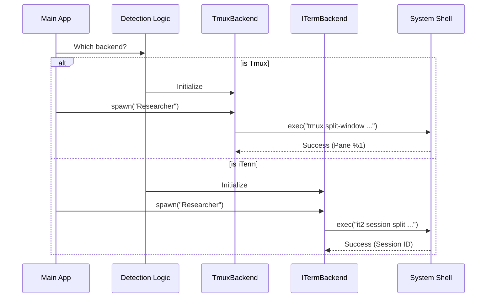

# Chapter 3: Execution Backends

In the previous chapter, the [Teammate Executor Adapter](02_teammate_executor_adapter.md), we built a "Universal Remote" that allows us to send commands like `spawn` or `sendMessage` without worrying about the details.

Now, it's time to look at the devices that remote is controlling. These are the **Execution Backends**.

## Motivation: The "Hybrid Office"

Imagine you manage a hybrid team. You have three types of workspaces available for your employees:

1.  **The Shared Desk (In-Process):** Fast and cheap, but if the employee spills coffee, it ruins your laptop too.
2.  **The Cubicle (Tmux):** A sturdy, isolated box. It's not pretty, but it's very functional and works everywhere (even on servers).
3.  **The Glass Office (iTerm2):** Only available in specific buildings (macOS). It looks native and beautiful, using the building's built-in walls (native tabs/panes).

**The Use Case:**
When you start the Swarm application, the system needs to ask: *"Where am I running?"*
*   If I am on a remote Linux server, I should probably use **Tmux**.
*   If I am on a MacBook using iTerm2, I should use **iTerm Native Panes**.
*   If I just want a background worker without UI, I should use **In-Process**.

This chapter explains how we implement these specific environments.

---

## Key Concepts

We have three specific classes that implement the interface we defined in Chapter 2.

### 1. TmuxBackend (The Cubicle)
**Tmux** is a "terminal multiplexer." It lets you split one terminal window into many small grids.
*   **Pros:** Works on Linux/Mac/Windows (WSL). Very stable.
*   **How it works:** We construct text commands (like `tmux split-window`) and send them to the shell.

### 2. ITermBackend (The Glass Office)
**iTerm2** is a popular terminal emulator for macOS. It has a feature called "Python API" that allows scripts to split windows.
*   **Pros:** Look and feels like a native part of your computer.
*   **How it works:** We use a CLI tool called `it2` to send signals to the iTerm application.

### 3. InProcessBackend (The Shared Desk)
This uses the runtime we built in the [In-Process Teammate Runtime](01_in_process_teammate_runtime.md) chapter.
*   **Pros:** Zero overhead. No visual clutter.
*   **How it works:** Runs purely in Node.js memory.

---

## The "Office Manager": Detection

Before we can use a backend, we must detect which one is available. We don't want to try opening an iTerm window on a Windows computer!

We use a `detection.ts` module to check our environment variables.

```typescript
// backends/detection.ts
export async function detectAndGetBackend() {
  // 1. Are we inside a Tmux session right now?
  if (process.env.TMUX) {
    return new TmuxBackend();
  }

  // 2. Are we running inside iTerm2?
  if (process.env.TERM_PROGRAM === 'iTerm.app') {
    return new ITermBackend();
  }

  // 3. Fallback to In-Process or Error
  throw new Error("No supported backend found!");
}
```

*What happens here:* The system checks simple flags (Environment Variables) to decide which "Class" to initialize. This happens once when the app starts.

---

## Internal Implementation: How They Work

Let's see what happens when we ask each backend to `spawn()` a new teammate.

### Visualizing the Flow



### Deep Dive: TmuxBackend

The `TmuxBackend` relies on executing shell commands. When we want to create a teammate pane, we basically tell Tmux to "cut" the current window in half.

**File:** `backends/TmuxBackend.ts`

```typescript
// Inside createTeammatePaneInSwarmView
async createTeammatePaneWithLeader(name) {
    // 1. Get the ID of the pane we are currently in
    const currentPane = await this.getCurrentPaneId();

    // 2. Run the tmux command to split it
    // -h means horizontal split, -l 70% size
    const args = ['split-window', '-t', currentPane, '-h', '-l', '70%'];
    
    // 3. Execute safely
    await execFileNoThrow('tmux', args);
}
```

*Explanation:* We aren't doing any magic here. We are just automating what a human would do if they typed `tmux split-window` manually.

### Deep Dive: ITermBackend

iTerm is trickier because it's a GUI application. We use a helper tool called `it2`.

**File:** `backends/ITermBackend.ts`

```typescript
// Inside createTeammatePaneInSwarmView
async createTeammatePaneInSwarmView(name) {
    // 1. Decide to split vertically or horizontally
    // -v means vertical split
    const args = ['session', 'split', '-v'];

    // 2. Execute the helper tool 'it2'
    const result = await execFileNoThrow('it2', args);

    // 3. The output contains the new ID
    return parseSplitOutput(result.stdout);
}
```

*Explanation:* `it2` is a bridge. Our Node.js code talks to `it2`, and `it2` talks to the iTerm2 application to draw the new pane.

### Deep Dive: InProcessBackend

This backend is unique because it doesn't create a UI element. It purely manages state in memory.

**File:** `backends/InProcessBackend.ts`

```typescript
// Inside spawn
async spawn(config) {
    // 1. Use the logic from Chapter 1
    const result = await spawnInProcessTeammate(config, this.context);

    // 2. Start the background loop
    startInProcessTeammate({
        taskId: result.taskId,
        // ... pass other config
    });

    return { success: true, agentId: result.agentId };
}
```

*Explanation:* Notice there are no shell commands here. It creates a JavaScript object (`teammateContext`) and starts a promise loop. It's invisible to the user but does the same work.

---

## Summary

In this chapter, we explored the **Execution Backends**:
1.  **TmuxBackend:** Uses command-line tools to split terminal grids.
2.  **ITermBackend:** Uses the `it2` bridge to create native macOS panes.
3.  **InProcessBackend:** Uses Node.js memory to run invisible background agents.

We also learned about **Detection**, which acts as the "Office Manager" to pick the right environment for the user.

Now that we can spawn these panes, we have a new problem: **Mess**. If we spawn 5 agents, the screen will look like a jigsaw puzzle. We need a way to organize them.

[Next Chapter: Environment Layout Management](04_environment_layout_management.md)

---

Generated by [Code IQ](https://github.com/adityasoni99/Code-IQ)