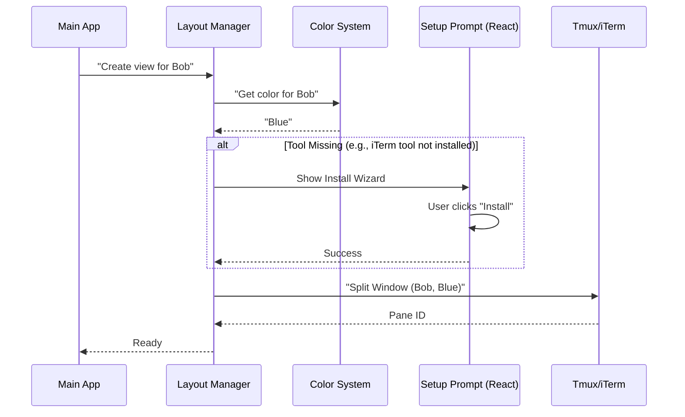

# Chapter 4: Environment Layout Management

In the previous chapter, [Execution Backends](03_execution_backends.md), we learned how to physically create terminal panes using tools like `tmux` or `iTerm2`.

However, knowing *how* to build a wall doesn't make you an architect. If we just spawned windows randomly, our screen would become a chaotic mess of overlapping text. We need a system to organize where these agents sit and what they look like.

This is the job of **Environment Layout Management**.

## Motivation: The "Seating Chart"

Imagine you are the manager of a busy newsroom. You just hired three new reporters.
1.  **The Chaos Approach:** You tell them, "Just find a seat somewhere." They might sit on top of each other or hide in a closet. You can't tell who is who.
2.  **The Layout Approach:** You have a predefined seating chart. "Editor sits on the left. Reporters sit on the right. Bob wears a blue hat, Alice wears a red hat."

**The Use Case:**
When we spawn a "Researcher" agent, we want the system to automatically:
1.  **Split the screen** so the main menu stays on the left (30%) and the agent appears on the right (70%).
2.  **Assign a color** (e.g., Magenta) to the agent so we instantly know who is talking.
3.  **Handle setup** automatically (installing necessary tools if they are missing).

---

## Key Concepts

The Layout Manager acts as the "Interior Decorator" for your terminal.

### 1. The Swarm View
We define a standard look for our application called the **Swarm View**.
*   **Left Side:** The "Leader" (You/The Menu).
*   **Right Side:** The "Teammates" (Agents).
*   **Bottom/Border:** Status bars showing the agent's name.

### 2. Visual Identity (Color assignments)
Humans rely on visual cues. Reading text labels is slow; seeing a color is fast. The Layout Manager assigns a unique color to every new agent using a "Round-Robin" system (cycling through a list of colors).

### 3. Setup Wizards (`It2SetupPrompt`)
Sometimes, achieving a layout requires external tools. For example, controlling `iTerm2` requires a Python script. If the user doesn't have it, the Layout Manager pauses and shows an interactive installation wizard right in the terminal.

---

## How to Use It

The Layout Manager wraps the raw backends we built in Chapter 3, adding intelligence to them.

### Step 1: Assigning a Visual Identity

Before spawning, we ask for a color. We don't need to pick one manually; the system handles it.

```typescript
import { assignTeammateColor } from './teammateLayoutManager.js';

// Get a color (e.g., 'blue', 'magenta', 'green')
// The system remembers that 'Researcher' = 'blue'
const myColor = assignTeammateColor("Researcher");

console.log(`Researcher will be: ${myColor}`);
```

### Step 2: Creating the Pane

Now we ask the layout manager to place the agent in the "Swarm View". We don't worry about pixels or percentages; the manager knows the 30/70 split rule.

```typescript
import { createTeammatePaneInSwarmView } from './teammateLayoutManager.js';

// This automatically detects if we are in Tmux or iTerm
const result = await createTeammatePaneInSwarmView(
  "Researcher", 
  myColor
);

console.log(`Agent created in pane: ${result.paneId}`);
```

*What happens here:*
1.  The system checks which backend is active.
2.  It calculates the correct split size.
3.  It sets the border color of the new window to match the agent's assigned color.

---

## Internal Implementation: The Workflow

How does the system decide where to put the window and how to handle installation?



### Deep Dive: Color Management

In `teammateLayoutManager.ts`, we keep a simple list of colors. We use a counter (`colorIndex`) to hand them out one by one.

```typescript
// teammateLayoutManager.ts
const teammateColorAssignments = new Map<string, AgentColorName>();
let colorIndex = 0;

export function assignTeammateColor(id: string): AgentColorName {
  // 1. If we already gave them a color, return it
  if (teammateColorAssignments.get(id)) return teammateColorAssignments.get(id)!;

  // 2. Pick next color from the list (wrapping around if needed)
  const color = AGENT_COLORS[colorIndex % AGENT_COLORS.length];
  
  // 3. Save and increment
  teammateColorAssignments.set(id, color);
  colorIndex++;
  return color;
}
```

### Deep Dive: The Interactive Setup

If you are using iTerm2, we need a special CLI tool called `it2`. If it's missing, we don't crash. We use a React component (`It2SetupPrompt.tsx`) to guide the user.

This file uses a library called `ink` to render React components inside the terminal text output!

```typescript
// It2SetupPrompt.tsx (Simplified)
export function It2SetupPrompt({ onDone }) {
  const [step, setStep] = useState('initial');

  // The UI State Machine
  switch (step) {
    case 'initial':
      return <Select options={['Install Now', 'Cancel']} />;
    case 'installing':
      return <Spinner label="Installing Python tools..." />;
    case 'success':
      return <Text color="green">Ready! Spawning window...</Text>;
  }
}
```
*Why this matters:* It makes the "Environment Layout" smart. It doesn't just place windows; it ensures the *capability* to place windows exists.

### Deep Dive: The Logic Switcher

The `createTeammatePaneInSwarmView` function acts as the bridge between the visual requirements (Color/Name) and the technical implementation (Backend).

```typescript
// teammateLayoutManager.ts
export async function createTeammatePaneInSwarmView(name, color) {
  // 1. Find out where we are running (Backend Chapter 3)
  const backend = await getBackend();
  
  // 2. Delegate the physical work to the backend
  // The backend handles the specific "split -h" or "split -v" commands
  return backend.createTeammatePaneInSwarmView(name, color);
}
```

---

## Summary

**Environment Layout Management** is the layer that makes the application feel cohesive.
1.  It maintains the **Swarm View** (User left, Agents right).
2.  It assigns **Visual Identity** (Colors) so you don't get lost.
3.  It handles **Onboarding** via interactive React components in the terminal.

Now that we have agents running in their own colorful, organized windows, we face a new challenge. The agent in the "Blue Window" might try to delete a file on your computer. How do we stop it?

We need a security guard.

[Next Chapter: Distributed Permission System](05_distributed_permission_system.md)

---

Generated by [Code IQ](https://github.com/adityasoni99/Code-IQ)