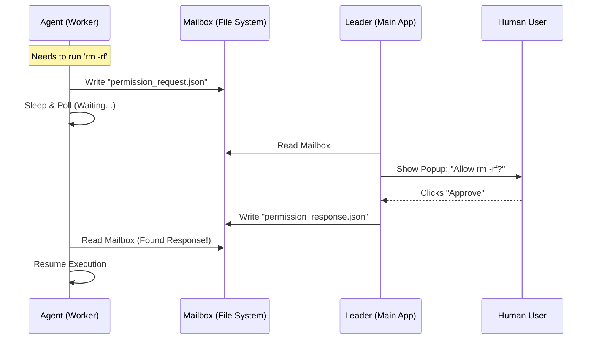

# Chapter 5: Distributed Permission System

In the previous chapter, [Environment Layout Management](04_environment_layout_management.md), we organized our agents into neat, colorful windows.

However, a pretty window doesn't make an agent safe. Imagine you spawn a "Cleanup Agent" and it decides to run `rm -rf /` (delete everything) on your computer. If the agent is running in a background process or a separate terminal window, how do you stop it?

We need a way for the **Worker** (the agent) to ask the **Leader** (you/the main app) for permission before doing something dangerous. This is the **Distributed Permission System**.

## Motivation: The "Purchase Order" Analogy

Think of your application like a corporate office.

*   **The Leader (You):** The CEO. You have the authority to sign checks.
*   **The Worker (Agent):** A junior employee. They do the work, but they can't spend money without approval.

If the Junior Employee sits in a different building (a separate process like `tmux`), they can't just tap you on the shoulder. They need a formal process:

1.  **The Request:** The employee fills out a "Purchase Order" (I want to run this command).
2.  **The Mailbox:** They put it in the company outbox.
3.  **The Waiting Game:** The employee stops working and waits.
4.  **The Approval:** You check your inbox, sign the paper, and send it back.
5.  **Resumption:** The employee gets the signed paper and buys the item.

The **Distributed Permission System** digitizes this workflow using JSON files and file watching.

---

## Key Concepts

### 1. The Permission Request
This is a data object that describes *intent*. It contains:
*   **Who:** "Researcher Agent (Blue)"
*   **What:** "Run Shell Command"
*   **Details:** `ls -la /private/logs`

### 2. The Mailbox (Transport)
Since the Leader and the Worker might be in completely different memory spaces (or even different machines in the future), they communicate via the filesystem. The Worker writes a request file to a specific folder, and the Leader watches that folder.

### 3. The Poller (The Wait Loop)
When an agent asks for permission, it effectively "freezes." It enters a loop where it checks the mailbox every 500ms: *"Did the boss reply yet? ... Did the boss reply yet?"*

---

## How to Use It

As a developer using Swarm, you rarely write the polling logic yourself. It is built into the `canUseTool` hook provided to the agents.

Here is what the flow looks like from the **Worker's perspective**.

### Step 1: Encountering a Sensitive Tool
The agent tries to use a tool, like `BashTool`. The system interrupts before the tool executes.

```typescript
// Inside the agent runner logic
const result = await canUseTool(
  toolName, 
  inputArguments
);

// The code PAUSES here until the user approves in the UI!
if (result.behavior === 'allow') {
  executeTool();
}
```

*What happens here:* The `canUseTool` function handles the entire complex dance of creating a JSON file, waiting for the user to click "Approve" in the UI, and reading the response.

---

## Internal Implementation: The Workflow

Let's visualize how a "Remote" agent gets permission from the "Local" user.



### The "Deep Dive" Under the Hood

Let's explore the code files that power this system.

#### 1. Creating the Request (`permissionSync.ts`)
When a worker needs permission, it creates a standardized object. This ensures the Leader UI knows exactly what to display.

```typescript
// permissionSync.ts
export function createPermissionRequest(params) {
  return {
    id: generateRequestId(), // e.g., "perm-12345"
    workerName: params.workerName,
    toolName: params.toolName, // e.g., "Bash"
    input: params.input,       // e.g., { command: "ls" }
    status: 'pending',
    createdAt: Date.now(),
  }
}
```

#### 2. Sending via Mailbox (`permissionSync.ts`)
Instead of direct function calls, we serialize this object to JSON and write it to the Leader's mailbox file.

```typescript
// permissionSync.ts
export async function sendPermissionRequestViaMailbox(request) {
  const leaderName = await getLeaderName(request.teamName);
  
  // Write the JSON message to the leader's folder
  await writeToMailbox(leaderName, {
      from: request.workerName,
      text: JSON.stringify(request),
      timestamp: new Date().toISOString()
  });
}
```

#### 3. The Waiting Loop (`inProcessRunner.ts`)
The worker cannot proceed until it gets an answer. It enters a polling loop.

```typescript
// inside createInProcessCanUseTool
const pollInterval = setInterval(async () => {
  // 1. Check mailbox for new messages
  const messages = await readMailbox(identity.agentName);
  
  // 2. Look for a response to OUR specific request ID
  const response = findResponse(messages, requestId);

  if (response) {
    clearInterval(pollInterval);
    resolve(response.decision); // 'approved' or 'rejected'
  }
}, 500); // Check every half second
```

*Beginner Note:* This pattern is often called "Long Polling." It's simple and robust. If the Leader crashes and restarts, the file is still there, so the request isn't lost!

#### 4. The Bridge (`leaderPermissionBridge.ts`)
If the agent happens to be running **In-Process** (inside the same app), we can sometimes skip the file system for speed. The "Bridge" connects the backend logic directly to the React Frontend.

```typescript
// leaderPermissionBridge.ts
// A global variable stores the function to update the React UI
let registeredSetter = null;

export function registerLeaderToolUseConfirmQueue(setter) {
  // The React component calls this to say "I am ready to show popups"
  registeredSetter = setter;
}
```

This acts like a direct phone line. If the phone line is connected (In-Process), the agent calls directly. If not (Remote/Tmux), the agent sends a letter (Mailbox).

---

## Summary

The **Distributed Permission System** ensures security across boundaries.
1.  **Requests** encapsulate dangerous intent into data.
2.  **Mailboxes** allow agents to communicate asynchronously, even if they are in different processes.
3.  **Polling** allows the worker to pause and wait for your approval.

This system makes your AI swarm safe to use. You can have 5 agents working in parallel, and if any of them tries to do something risky, they will politely wait for your go-ahead.

Now that our agents are running, organized, and secure, there is one big question left: *What happens if I turn off my computer?* Does the team forget everything?

In the next chapter, we will learn how we save the brain of the operation.

[Next Chapter: Team State Persistence](06_team_state_persistence.md)

---

Generated by [Code IQ](https://github.com/adityasoni99/Code-IQ)