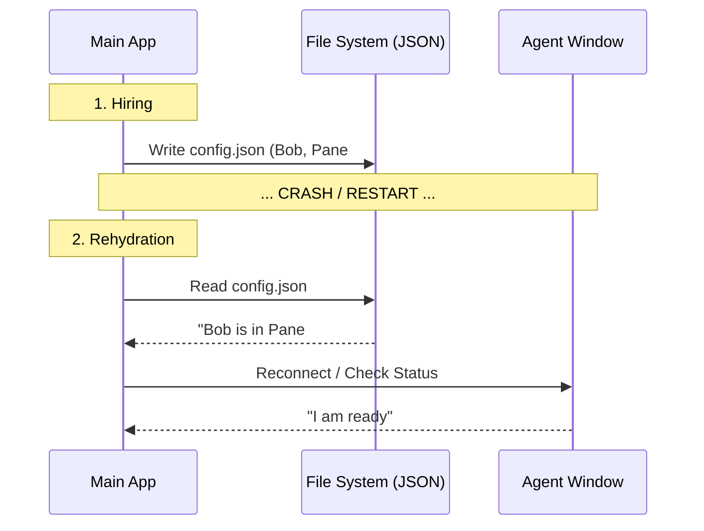

# Chapter 6: Team State Persistence

In the previous chapter, [Distributed Permission System](05_distributed_permission_system.md), we learned how to make our swarm safe by requiring permission for dangerous actions.

But safety isn't just about stopping bad commands. It's also about **memory**.

Imagine you are playing a long video game. You've spent hours building your character. Suddenly, the power goes out. If you didn't click "Save Game," you lose everything.

**Team State Persistence** is the "Save Game" feature for your AI Swarm.

## Motivation: The "HR Database"

When you run a Swarm application, you might have:
1.  A "Leader" (the main process).
2.  Three "Agents" (in separate `tmux` windows or background threads).
3.  A specific configuration (Alice is Red, Bob is Blue).

**The Use Case:**
You are running a complex coding task. Your computer freezes and you have to force-quit the terminal.
*   **Without Persistence:** When you restart, the application has no idea those other windows exist. They become "zombie" processes—running but disconnected.
*   **With Persistence:** The application restarts, reads a file from the disk, and says: *"Welcome back. I see Alice is still running in Window 2. Reconnecting now."*

This layer acts as the **HR Database**. It records who is hired, where they sit (Pane ID), and what they are doing.

---

## Key Concepts

To make the swarm "crash-proof," we rely on simple files stored on your hard drive.

### 1. The Roster (`config.json`)
Every team has a folder on your disk. Inside that folder is a `config.json` file. This is the single source of truth. It contains:
*   **Members:** Who is in the team?
*   **Metadata:** What color are they? What is their Pane ID?
*   **Status:** Are they currently working or idle?

### 2. Rehydration
This is a fancy term for "loading the save file." When the application starts, or when you switch context, the code reads this JSON file to rebuild the Javascript objects in memory.

### 3. Cleanup (The Janitor)
If an agent is fired (removed) or the session ends, we need to clean up. This involves deleting the JSON file and—crucially—killing the terminal window associated with that agent so it doesn't clutter your screen.

---

## How to Use It

As a developer, you interact with this system primarily through helper functions in `teamHelpers.ts`.

### Step 1: Reading the Roster

Let's say you want to know if a specific agent is part of the current team.

```typescript
import { readTeamFile } from './teamHelpers.js';

// 1. Load the data from disk
const teamData = readTeamFile("MyDevTeam");

if (teamData) {
  // 2. Access the members list
  console.log(`There are ${teamData.members.length} agents.`);
  
  // 3. Find a specific person
  const bob = teamData.members.find(m => m.name === "Bob");
}
```

*What happens here:* The system synchronously reads the JSON file, parses it, and gives you a standard JavaScript object.

### Step 2: Updating Status

If an agent finishes a task, we should update the database so the Leader knows they are free.

```typescript
import { setMemberActive } from './teamHelpers.js';

// Update the file on disk asynchronously
await setMemberActive(
  "MyDevTeam", 
  "Bob", 
  false // isActive = false (Idle)
);
```

*What happens here:*
1.  It reads the file.
2.  It finds "Bob".
3.  It changes his status to `false`.
4.  It saves the file back to disk.

---

## Internal Implementation: The Workflow

How does the system ensure data isn't lost during a crash?



### The "Deep Dive" Under the Hood

Let's look at how we structure this data and manage the files.

#### 1. The Data Structure (`TeamFile`)
In `teamHelpers.ts`, we define exactly what a team looks like. This ensures consistency.

```typescript
// teamHelpers.ts
export type TeamFile = {
  name: string;
  leadAgentId: string; // The "CEO"
  members: Array<{
    name: string;
    agentId: string;
    tmuxPaneId: string; // The physical location
    isActive?: boolean; // Working or Idle?
    backendType?: 'tmux' | 'iterm' | 'in_process';
  }>
}
```

#### 2. Atomic Updates
We rarely overwrite the whole file blindly. We usually read, modify, and write.

```typescript
// Inside teamHelpers.ts
export async function setMemberMode(teamName, memberName, mode) {
  // 1. Read
  const teamFile = readTeamFile(teamName);
  if (!teamFile) return false;

  // 2. Modify in memory
  const updatedMembers = teamFile.members.map(m => 
    m.name === memberName ? { ...m, mode } : m
  );

  // 3. Write back to disk
  writeTeamFile(teamName, { ...teamFile, members: updatedMembers });
}
```

#### 3. The Cleanup Logic
When a session ends gracefully, we don't want to leave "ghost" files. We call `cleanupSessionTeams`.

```typescript
// Inside teamHelpers.ts
export async function cleanupSessionTeams() {
  // Get list of teams created this session
  const teams = Array.from(getSessionCreatedTeams());

  // 1. Kill the actual terminal panes (Tmux/iTerm)
  await Promise.all(teams.map(name => killOrphanedTeammatePanes(name)));

  // 2. Delete the folders from the disk
  await Promise.all(teams.map(name => cleanupTeamDirectories(name)));
}
```

*Why this matters:* If we didn't do step 1, your terminal would eventually have 100 open tabs from old sessions. If we didn't do step 2, your disk would fill up with old JSON files.

### 4. Reconnection Logic
In `reconnection.ts`, we use the persisted data to restore the application state (AppState) when the app launches.

```typescript
// reconnection.ts
export function computeInitialTeamContext() {
  // Check CLI args to see if we are a specific agent
  const context = getDynamicTeamContext(); 
  
  // Load the HR file to verify we exist
  const teamFile = readTeamFile(context.teamName);

  return {
    teamName: context.teamName,
    leadAgentId: teamFile.leadAgentId,
    // ... restore other context
  };
}
```

---

## Conclusion of the Series

Congratulations! You have completed the **Swarm Architecture Tutorial**.

Let's recap the journey:
1.  **[In-Process Teammate Runtime](01_in_process_teammate_runtime.md):** We learned how to run efficient background agents.
2.  **[Teammate Executor Adapter](02_teammate_executor_adapter.md):** We built a "Universal Remote" to control different types of agents.
3.  **[Execution Backends](03_execution_backends.md):** We implemented the actual logic for Tmux, iTerm, and Node.js.
4.  **[Environment Layout Management](04_environment_layout_management.md):** We organized our screens with colors and split panes.
5.  **[Distributed Permission System](05_distributed_permission_system.md):** We secured the system with a request/approval flow.
6.  **Team State Persistence:** We ensured our team survives crashes and restarts by saving state to disk.

You now understand the full lifecycle of an AI Agent in the Swarm project: from being spawned in a colorful window, to asking for permission, to persisting its state on your hard drive.

Happy Swarming!

---

Generated by [Code IQ](https://github.com/adityasoni99/Code-IQ)