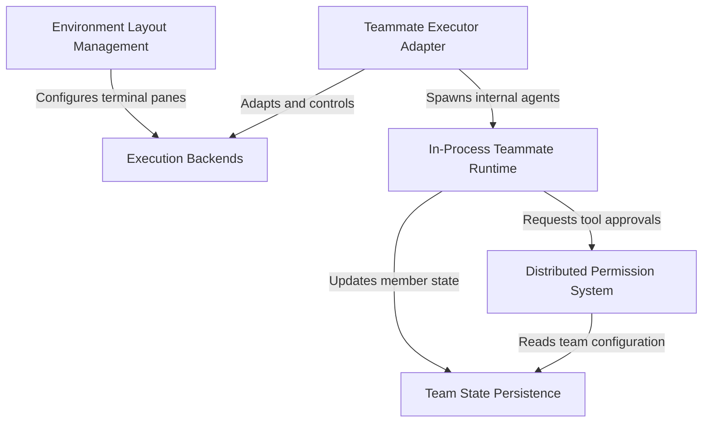

# Tutorial: swarm

This project implements a **hierarchical multi-agent system** ("swarm") where a leader agent can spawn and coordinate autonomous *teammate agents* to perform tasks in parallel. It abstracts the physical execution environment, allowing teammates to run as isolated **in-process tasks**, **tmux panes**, or **iTerm2 splits** through a unified interface. The system ensures safe collaboration via a **distributed permission system** that routes tool approval requests from workers to the leader, while persisting team state to disk to maintain continuity across sessions.

## Chapters

1. [In-Process Teammate Runtime](01_in_process_teammate_runtime.md)
2. [Teammate Executor Adapter](02_teammate_executor_adapter.md)
3. [Execution Backends](03_execution_backends.md)
4. [Environment Layout Management](04_environment_layout_management.md)
5. [Distributed Permission System](05_distributed_permission_system.md)
6. [Team State Persistence](06_team_state_persistence.md)

---

Generated by [Code IQ](https://github.com/adityasoni99/Code-IQ)