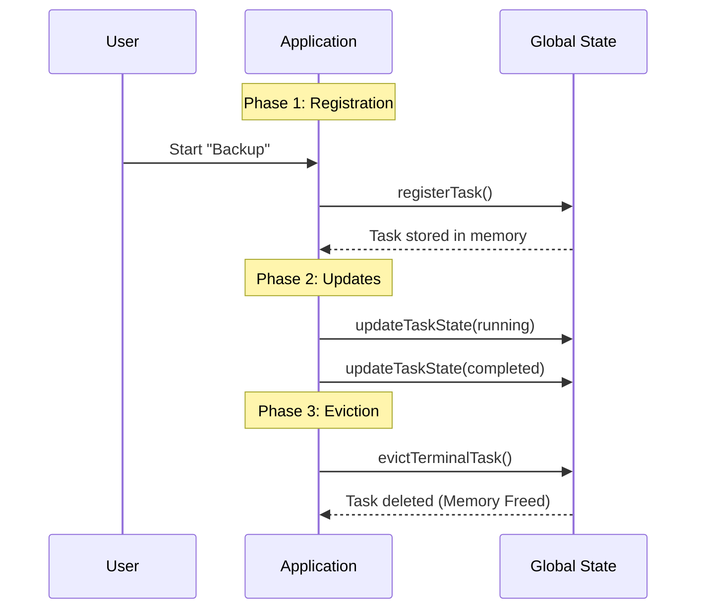

# Chapter 1: Task Lifecycle Orchestration

Welcome to the first chapter of the **Task** project tutorial! Here, we will explore the foundation of how our application manages work.

## The Motivation
Imagine a busy restaurant kitchen. The manager has a large **whiteboard**.
1.  When a new order comes in, they stick a ticket on the board (**Registration**).
2.  As the chefs cook, the manager marks the ticket as "Cooking" (**Update**).
3.  When the food is served and the customer pays, the manager throws the ticket away to make space for new orders (**Eviction**).

Without this system, the kitchen would lose orders, or the board would get so cluttered with old completed orders that no one could find the new ones.

In our application, **Task Lifecycle Orchestration** is that whiteboard. It manages the lifespan of a task from the moment it starts until it is deleted from memory.

## Key Concepts

We break the lifecycle down into three simple phases:

1.  **Registration**: Creating a new entry in the global state.
2.  **Updates**: Changing the status (e.g., from `running` to `completed`).
3.  **Eviction**: Removing the task from memory when it is no longer needed.

### The Central Use Case
Let's look at a concrete example: **"The User wants to run a background script."**
We need to track this script so the user knows if it is running, when it finishes, and eventually clean up the memory when the user has seen the result.

## How to Use It

Let's see how to manage a task using our framework functions.

### 1. Registering a Task
First, we need to tell the application that a new task exists. We use `registerTask`.

```typescript
// Define a simple task object
const newTask = {
  id: "task-123",
  type: "script_runner",
  status: "pending",
  description: "Run backup script",
  notified: false // Has the user been told it's done?
};

// Add it to the global application state
registerTask(newTask, setAppState);
```
*Explanation:* This creates a "card" on our whiteboard. The application now knows `task-123` exists.

### 2. Updating Status
As the script runs, we need to update its status. We use `updateTaskState` to do this safely.

```typescript
// Change status to 'running'
updateTaskState("task-123", setAppState, (task) => {
  return { ...task, status: "running" };
});

// Later, mark it as 'completed'
updateTaskState("task-123", setAppState, (task) => {
  return { ...task, status: "completed" };
});
```
*Explanation:* We don't overwrite the whole task. We provide a small function that takes the current task and returns a slightly modified version.

### 3. Eviction (Cleanup)
Once the task is `completed` (or `failed`) and we are sure the user has been notified, we remove it to free up memory using `evictTerminalTask`.

```typescript
// Mark as notified so it's eligible for deletion
updateTaskState("task-123", setAppState, (task) => {
  return { ...task, notified: true };
});

// Attempt to remove it from state
evictTerminalTask("task-123", setAppState);
```
*Explanation:* The framework checks: Is it done? Yes. Is the user notified? Yes. Okay, delete it from the state map.

## Under the Hood: How It Works

To understand how the system manages this automatically, let's look at the flow. The system constantly checks (polls) for tasks that need attention.

### Lifecycle Sequence



### Internal Implementation Details

Let's look at `framework.ts` to see how the logic ensures safety.

#### 1. Smart Registration
When registering, we must check if we are actually **resuming** an old task (e.g., if the app restarted).

```typescript
export function registerTask(task: TaskState, setAppState: SetAppState): void {
  setAppState(prev => {
    const existing = prev.tasks[task.id]
    // If it exists, merge old UI state with new data
    const merged = existing ? { ...task, ...existing } : task
    
    return { ...prev, tasks: { ...prev.tasks, [task.id]: merged } }
  })
  // ... (sends event triggers)
}
```
*Explanation:* We check `prev.tasks[task.id]`. If the task is already there, we preserve important history (like chat messages) instead of wiping it clean.

#### 2. Safe Eviction
We don't want to delete a task *instantly* when it finishes, or the user might miss the "Success" message!

```typescript
export function evictTerminalTask(taskId: string, setAppState: SetAppState): void {
  setAppState(prev => {
    const task = prev.tasks?.[taskId]
    // 1. Must be finished (completed/failed)
    if (!isTerminalTaskStatus(task.status)) return prev
    // 2. User must have been notified already
    if (!task.notified) return prev
    
    // If safe, delete the task
    const { [taskId]: _, ...remainingTasks } = prev.tasks
    return { ...prev, tasks: remainingTasks }
  })
}
```
*Explanation:* The code acts as a gatekeeper. It explicitly checks `!task.notified`. If the user hasn't received the notification yet, the function returns `prev` (do nothing), keeping the task alive on the whiteboard a little longer.

### Integrating with Polling
You might wonder: *Who* calls these functions automatically?
The system uses a "Poller" that runs every second. It looks for tasks that are done and calls the eviction logic.

We will cover exactly how this polling mechanism works in the next chapter: [Asynchronous State Synchronization (Polling)](02_asynchronous_state_synchronization__polling_.md).

Additionally, while the task is alive, it generates logs and data. We handle that using techniques described in [Hybrid Output Management](03_hybrid_output_management.md).

## Conclusion

In this chapter, we learned:
1.  **Task Lifecycle** consists of Registration (Start), Update (Run), and Eviction (End).
2.  **Registration** handles new tasks or resumes existing ones.
3.  **Eviction** ensures we only delete tasks after the user knows they are finished, keeping our memory clean.

Now that we understand *how* a task lives, let's learn how the system keeps watch over them automatically.

[Next Chapter: Asynchronous State Synchronization (Polling)](02_asynchronous_state_synchronization__polling_.md)

---

Generated by [Code IQ](https://github.com/adityasoni99/Code-IQ)