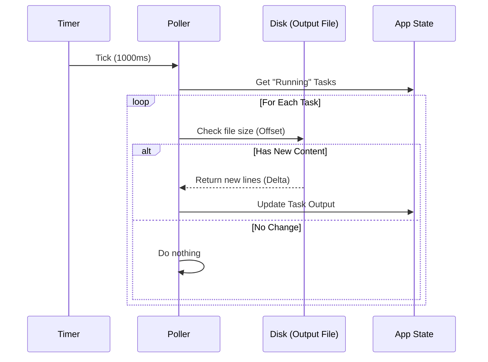

# Chapter 2: Asynchronous State Synchronization (Polling)

In the previous chapter, [Task Lifecycle Orchestration](01_task_lifecycle_orchestration.md), we learned how to create, update, and remove tasks from our global "whiteboard."

However, there is a missing piece. When a background script runs, it happens in a separate process (like a hidden kitchen). Our main application (the waiter) doesn't inherently know when the food is ready. We need a way to connect these two worlds.

## The Motivation

Imagine you are a security guard responsible for a large building.
*   **The Blocking Way:** You stand in front of Room A and stare at the door until something happens. While you do this, you cannot check Room B or C. If a thief enters Room C, you won't know because you are "blocked" by staring at Room A.
*   **The Asynchronous Way:** You walk a "round." You glance at Room A, note any changes, walk to Room B, check it, and so on. You do this every few minutes.

In software, **Polling** is that security guard. Instead of freezing our application to wait for a command to finish (which freezes the UI), we set up a "heartbeat" that quickly checks the status of all tasks every second.

### The Central Use Case
**"The User runs a long installation script (e.g., `npm install`)."**
This might take 2 minutes. We want to show a progress bar and log messages in real-time without the application freezing up.

## Key Concepts

1.  **The Heartbeat:** A timer that ticks at a specific interval (e.g., every 1000ms).
2.  **Polling:** The act of waking up on that tick to check resources.
3.  **Deltas:** To be efficient, we don't re-read the entire history of the task every second. We only read the *difference* (delta) since the last time we checked.

## How It Works: The High-Level Flow

We don't expect you to write the polling engine yourself—the framework handles it. However, understanding the flow is crucial for debugging why a task might not be updating.

1.  **Start:** The application starts a global timer.
2.  **Tick:** Every 1 second, the timer fires `pollTasks()`.
3.  **Check:** The system looks at every task marked as `running`.
4.  **Read:** It checks the output file on the disk to see if the file size has grown.
5.  **Update:** If the file is bigger, we read the new lines and update the UI.

## Under the Hood: The Implementation

Let's visualize the "Security Guard" (The Poller) interacting with the system.



### Code Walkthrough

The magic happens in `framework.ts`. Let's break down the actual code into bite-sized pieces to see how this is orchestrated.

#### 1. The Heartbeat Interval
We define how often the guard walks the rounds.

```typescript
// Standard polling interval for all tasks
export const POLL_INTERVAL_MS = 1000
```
*Explanation:* This constant defines the rhythm. 1000ms (1 second) is a balance between responsiveness (UI updates fast) and performance (not wasting CPU).

#### 2. The Main Polling Loop
This function is called every time the timer ticks.

```typescript
export async function pollTasks(
  getAppState: () => AppState,
  setAppState: SetAppState,
): Promise<void> {
  const state = getAppState()
  
  // 1. Calculate what changed (Deltas)
  const { attachments, updatedTaskOffsets, evictedTaskIds } =
    await generateTaskAttachments(state)

  // 2. Apply changes to the global state
  applyTaskOffsetsAndEvictions(setAppState, updatedTaskOffsets, evictedTaskIds)
}
```
*Explanation:* `pollTasks` is the coordinator. It asks "What changed?" (`generateTaskAttachments`) and then applies those changes (`applyTaskOffsetsAndEvictions`).

#### 3. Calculating Deltas (The "Check")
Inside `generateTaskAttachments`, we look for new content. We use an **Offset** to remember where we stopped reading last time.

```typescript
// Inside generateTaskAttachments loop...
if (taskState.status === 'running') {
  // Check disk for new data starting from our last known position (offset)
  const delta = await getTaskOutputDelta(
    taskState.id,
    taskState.outputOffset,
  )
  
  // If we found new text, record the new position
  if (delta.content) {
    updatedTaskOffsets[taskState.id] = delta.newOffset
  }
}
```
*Explanation:* If we read 100 bytes last time, `outputOffset` is 100. Next time, we ask the disk: "Give me everything after byte 100." This is extremely efficient.

#### 4. Applying the Update
Finally, we update the application state so the UI can render the new text.

```typescript
export function applyTaskOffsetsAndEvictions(
  setAppState: SetAppState,
  updatedTaskOffsets: Record<string, number>,
  evictedTaskIds: string[],
): void {
  setAppState(prev => {
    const newTasks = { ...prev.tasks }
    
    // Update the offset for tasks that had new output
    for (const id of Object.keys(updatedTaskOffsets)) {
      if (newTasks[id]) {
        newTasks[id].outputOffset = updatedTaskOffsets[id]!
      }
    }
    return { ...prev, tasks: newTasks }
  })
}
```
*Explanation:* We take the `newOffset` we calculated and save it into the global state. The next time the poller runs, it will start reading from this new position.

## Why use File Polling?

You might wonder: *Why read from a file? Why not just pipe the data directly from the process to the variable?*

Using files as the "middleman" provides **Durability**.
If the application crashes and restarts, the file is still on the disk. The application can read the file and "remember" exactly what happened before the crash.

## Conclusion

In this chapter, we learned:
1.  **Blocking is bad:** We cannot wait for tasks to finish; we must check on them asynchronously.
2.  **Polling:** We use a "heartbeat" to check tasks every second.
3.  **Offsets:** We track how much we have read so we only process new data.

But wait—we keep talking about reading from "Output Files." How does the data get into those files in the first place? And what happens if the file gets too big?

In the next chapter, we will explore exactly how we handle data flow.

[Next Chapter: Hybrid Output Management](03_hybrid_output_management.md)

---

Generated by [Code IQ](https://github.com/adityasoni99/Code-IQ)