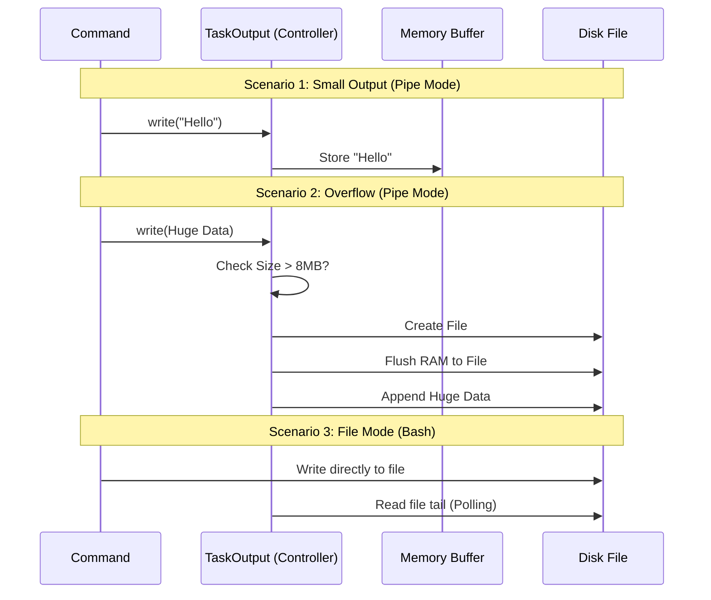

# Chapter 3: Hybrid Output Management

In the previous chapter, [Asynchronous State Synchronization (Polling)](02_asynchronous_state_synchronization__polling_.md), we learned how the application acts like a security guard, constantly checking files on the disk to see if a task is running.

But this raises a critical question: **How does the data get into those files in the first place?** And do we *always* need to write to a file?

## The Motivation

Imagine you are designing a rainwater system for a house.
1.  **Light Rain:** It’s inefficient to channel a few drops into a massive underground reservoir. It's faster to just catch them in a small rain barrel next to the house.
2.  **Heavy Storm:** If a storm hits, the small barrel will overflow instantly. You need a system that automatically diverts the flood into the massive reservoir to prevent your house from flooding.

In our application, **Memory (RAM)** is the small barrel, and the **Disk (File System)** is the massive reservoir.

If we store *everything* in Memory, a large log file will crash the application (Flooding).
If we write *everything* to Disk, simple commands become slow and complex (Over-engineering).

**Hybrid Output Management** is the intelligent plumbing system that switches between these two automatically.

### The Central Use Case

Consider two different tasks:
1.  **Task A (Tiny):** `echo "Hello World"` (Produces 11 bytes).
2.  **Task B (Huge):** `npm install` (Produces 5 Megabytes of logs).

We want a single system that handles Task A in milliseconds using fast memory, but handles Task B safely by spilling over to the disk without crashing.

## Key Concepts

We use a class called `TaskOutput` to act as our traffic controller. It operates in two specific modes:

1.  **Pipe Mode (The Smart Buffer):** The application captures the output. It holds it in memory. If the data exceeds a limit (e.g., 8MB), it automatically "spills" everything to a file.
2.  **File Mode (Direct Stream):** For shell commands (like Bash), we bypass memory entirely. The command writes directly to the disk, and we just read the file from the outside.

## How to Use It

Let's look at how we use `TaskOutput` to handle data safely.

### 1. Creating the Controller
When a task starts, we initialize its output manager.

```typescript
// false = Pipe Mode (Start in memory)
// 8MB limit
const output = new TaskOutput("task-123", null, false, 8 * 1024 * 1024);
```
*Explanation:* We create a manager for `task-123`. We tell it: "Don't write to a file immediately. Use memory until you hit 8MB."

### 2. Feeding Data (Pipe Mode)
As the task runs, we feed it text.

```typescript
// Small data
output.writeStdout("Hello World\n"); 

// Huge data chunk
output.writeStdout("...massive log data...");
```
*Explanation:* The `output` object decides internally: "Is this small enough to keep in variable `str`? Or should I append it to `task-123.output` on the disk?"

### 3. Retrieving Data
When we want to show the user the result, we simply ask for it.

```typescript
const result = await output.getStdout();
console.log(result);
```
*Explanation:* We don't care if the data is in RAM or on Disk. The `.getStdout()` method abstracts that away. If it's on disk, it reads it; if it's in RAM, it returns the variable.

## Under the Hood: How It Works

Let's visualize the "Traffic Controller" logic flow.

### The Flow Logic



### Internal Implementation Details

The magic happens in `TaskOutput.ts` and `diskOutput.ts`. Let's break down the logic.

#### 1. The Decision to Spill
Inside `TaskOutput`, the `writeBuffered` method acts as the gatekeeper.

```typescript
// Inside TaskOutput.ts
#writeBuffered(data: string, isStderr: boolean): void {
  // 1. If we are already using disk, just keep appending to it.
  if (this.#disk) {
    this.#disk.append(data)
    return
  }

  // 2. Check if adding this new data breaks the limit
  const totalMem = this.#stdoutBuffer.length + data.length
  
  if (totalMem > this.#maxMemory) {
    // 3. Too big! Switch to disk mode.
    this.#spillToDisk(null, data)
    return
  }

  // 4. Safe to keep in memory
  this.#stdoutBuffer += data
}
```
*Explanation:* This is the reservoir logic. If `this.#disk` exists, the "overflow channel" is already open. If not, check if the water level (`totalMem`) is too high. If yes, open the channel (`spillToDisk`).

#### 2. The Spill Mechanism
When the limit is breached, we move data from RAM to Disk using `DiskTaskOutput`.

```typescript
#spillToDisk(stderrChunk: string | null, stdoutChunk: string | null): void {
  // Create the disk writer
  this.#disk = new DiskTaskOutput(this.taskId)

  // Empty the current memory buffer into the file
  if (this.#stdoutBuffer) {
    this.#disk.append(this.#stdoutBuffer)
    this.#stdoutBuffer = '' // Clear RAM
  }

  // Append the new chunk that caused the overflow
  if (stdoutChunk) {
    this.#disk.append(stdoutChunk)
  }
}
```
*Explanation:* This creates the file and drains the bucket. `this.#stdoutBuffer` becomes empty strings, freeing up memory immediately.

#### 3. Reading Safely
When reading back, we need to know where to look.

```typescript
async getStdout(): Promise<string> {
  // Case A: It was always a file (e.g. Bash command)
  if (this.stdoutToFile) {
    return this.#readStdoutFromFile()
  }
  
  // Case B: It spilled to disk (Pipe Mode Overflow)
  if (this.#disk) {
     return `Output truncated. Full output saved to: ${this.path}`
  }
  
  // Case C: Small enough to stay in memory
  return this.#stdoutBuffer
}
```
*Explanation:* The consumer of this function receives a string regardless of where it came from. Note that in "Case B", we return a truncation message instead of loading the massive file back into memory (which would defeat the purpose!).

## Why "File Mode"?

You might wonder why we have a separate "File Mode" (`stdoutToFile = true`).

For system shells like Bash, it is faster to let the Operating System handle the writing. Instead of piping data into our Node.js process (slow), we tell Bash: "Write directly to `task.output`."
In this case, `TaskOutput` doesn't buffer anything. It simply watches the file using the Polling techniques we learned in [Chapter 2](02_asynchronous_state_synchronization__polling_.md).

## Conclusion

In this chapter, we learned:
1.  **Hybrid Management:** We use Memory for speed and Disk for safety.
2.  **Spilling:** We automatically detect when data is too large and move it to a file.
3.  **Abstraction:** The `TaskOutput` class hides this complexity, so the rest of the app just says "Write" and "Get".

Now that we know how to manage the flow of data while a task is running, what happens when we need to keep that data effectively forever, or manage the files on the disk more strictly?

[Next Chapter: Persistent Disk Storage](04_persistent_disk_storage.md)

---

Generated by [Code IQ](https://github.com/adityasoni99/Code-IQ)