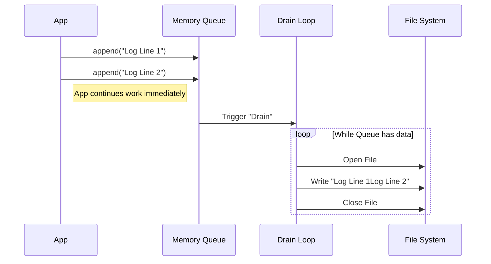

# Chapter 4: Persistent Disk Storage

In the previous chapter, [Hybrid Output Management](03_hybrid_output_management.md), we learned how the application acts as a "Traffic Controller," deciding whether data stays in fast memory or spills over to the disk.

Now, we need to visit the basement where that data actually lives. When the Traffic Controller says "Save this to disk," who actually handles the messy details of creating files, preventing errors, and stopping hackers?

Welcome to **Persistent Disk Storage**.

## The Motivation

Imagine a **Diligent Archivist** working in a secure basement.
Their job is simple but critical:
1.  Receive documents from the floors above.
2.  File them in the correct folder.
3.  **Security:** Ensure no one tricks them into filing a public document into a "Top Secret" folder (a Symlink attack).
4.  **Capacity:** If a folder gets too full (e.g., 5GB), stop filing new papers so the room doesn't explode.

If we just used standard file writing commands (`fs.writeFile`) naively, our application might freeze while waiting for the hard drive, or worse, crash entirely if a log file grows to 100GB. We need a specialized layer to handle these risks.

### The Central Use Case
**"The User runs a script that generates 1,000 log lines per second for an hour."**
We need to capture all this data safely, ensuring we don't run out of disk space and that the data is written in the correct order, without blocking the main application.

## Key Concepts

To understand how our "Archivist" works, we need to understand three tools they use:

1.  **The Queue (Buffer):** Writing to the physical disk is "slow" compared to CPU speed. We don't write every letter individually. We bunch them up in a queue and write them in batches.
2.  **Session Isolation:** Every time the app runs, it creates a unique Session ID. We group files by session so old tasks don't mix with new ones.
3.  **The Cap (Safety Valve):** We enforce a hard limit (e.g., 5GB). If a task exceeds this, we stop writing to save the user's hard drive.

## How to Use It

This layer is mostly internal, but here is how the higher levels of the application interact with it.

### 1. Initializing the File
Before writing, we must reserve the space.

```typescript
import { initTaskOutput } from './diskOutput';

// Create the file: /tmp/project/session-id/tasks/task-123.output
await initTaskOutput("task-123");
```
*Explanation:* This creates the empty file. It ensures the directory exists and that we aren't overwriting a restricted file.

### 2. Appending Data
We don't "write" to the file; we "append" to the task.

```typescript
import { appendTaskOutput } from './diskOutput';

// Add log data. This returns immediately (it's asynchronous).
appendTaskOutput("task-123", "Step 1 complete.\n");
appendTaskOutput("task-123", "Step 2 starting...\n");
```
*Explanation:* We just throw data at the function. We don't wait for the disk to spin up. The system handles the saving in the background.

### 3. Reading Data
When we need to show the logs to the user, we read the file.

```typescript
import { getTaskOutput } from './diskOutput';

// Read the content (with a safety limit so we don't crash memory)
const content = await getTaskOutput("task-123");
console.log(content);
```
*Explanation:* This reads the file safely. If the file is huge, it intelligently reads only the tail end or specific chunks.

## Under the Hood: The Implementation

How does the Archivist manage thousands of writes without blocking the main application?

### The "Drain" Workflow

We use a **Fire-and-Forget** queue system.



### Internal Code Details

Let's look at `diskOutput.ts` to see how this logic is enforced.

#### 1. The Write Queue
Inside the `DiskTaskOutput` class, we don't write to disk immediately. We push to a `queue`.

```typescript
class DiskTaskOutput {
  #queue: string[] = [] // The bucket

  append(content: string): void {
    // 1. Check if we hit the 5GB limit
    if (this.#bytesWritten > MAX_TASK_OUTPUT_BYTES) return;

    // 2. Add to the bucket
    this.#queue.push(content);
    
    // 3. Start the background worker (if not running)
    if (!this.#flushPromise) {
      this.#drain(); 
    }
  }
}
```
*Explanation:* This method is lightning fast because it only updates an array in memory. It doesn't touch the slow hard drive yet.

#### 2. The Drain Loop (The Archivist)
The `#drain` method is the hard worker. It takes everything in the queue and writes it in one go.

```typescript
async #drain(): Promise<void> {
  // Open the file with specific flags
  // 'a' = Append (don't overwrite)
  const fileHandle = await open(this.#path, 'a');

  // Turn all strings in queue into one big Buffer
  const bigChunk = this.#queueToBuffers();

  // Write it all at once
  await fileHandle.appendFile(bigChunk);
  
  await fileHandle.close();
}
```
*Explanation:* This is efficient. Opening and closing a file is "expensive" (slow). By batching 50 log lines into one "open/write/close" cycle, we save massive amounts of time.

#### 3. Security: The Symlink Attack
A common hacker trick is creating a **Symlink** (shortcut) named `task-123.output` that points to `/etc/password` (a sensitive system file). If our Archivist writes to the shortcut, they overwrite the system password!

We prevent this using `O_NOFOLLOW`.

```typescript
// Inside initTaskOutput
const fh = await open(outputPath, 
  fsConstants.O_WRONLY | 
  fsConstants.O_CREAT | 
  fsConstants.O_EXCL | 
  fsConstants.O_NOFOLLOW // <--- The Shield
)
```
*Explanation:* `O_NOFOLLOW` tells the Operating System: "If this path is a shortcut/symlink, **fail immediately**. Do not follow it." This ensures we only write to files we created.

#### 4. Reading Deltas
Remember [Chapter 2: Polling](02_asynchronous_state_synchronization__polling_.md)? The Poller asks for "New data only."

```typescript
export async function getTaskOutputDelta(taskId: string, fromOffset: number): Promise<any> {
  // Read file STARTING at 'fromOffset'
  const result = await readFileRange(getTaskOutputPath(taskId), fromOffset, 8 * 1024 * 1024);
  
  return {
    content: result.content,
    newOffset: fromOffset + result.bytesRead // New bookmark
  };
}
```
*Explanation:* This function allows the UI to update smoothly. If the file is 1GB, but we only appended 100 bytes since the last check, we only read those 100 bytes.

## Conclusion

In this chapter, we learned:
1.  **Queueing:** We buffer writes in memory to keep the application fast.
2.  **Safety:** We cap files at 5GB to protect the disk.
3.  **Security:** We use flags like `O_NOFOLLOW` to prevent hackers from tricking the file system.

We now have a system that creates tasks, monitors them, buffers the output, and saves it safely to disk. But raw text output can be ugly and hard to read.

How do we present this data to the user nicely? How do we handle truncation visually when things get too big?

[Next Chapter: Output Formatting and Truncation](05_output_formatting_and_truncation.md)

---

Generated by [Code IQ](https://github.com/adityasoni99/Code-IQ)