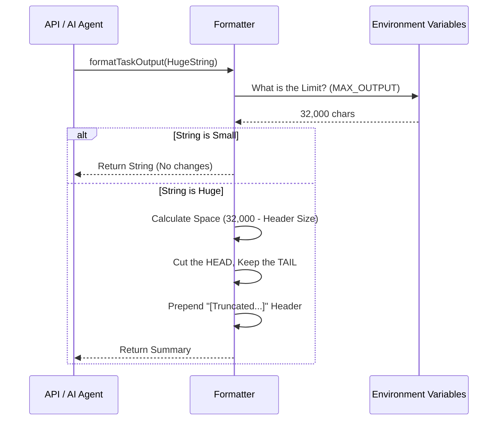

# Chapter 5: Output Formatting and Truncation

In the previous chapter, [Persistent Disk Storage](04_persistent_disk_storage.md), we learned how to act as a "Diligent Archivist," safely storing massive amounts of log data into files on the hard drive.

However, we now face a new problem. Our "CEO" (the Artificial Intelligence or the API User) needs to understand what happened in those logs. But AI models have a **Token Limit** (a limit on how much text they can read at once). If we try to feed a 500-page log file into an AI to ask "Why did this fail?", the AI will crash or reject the request because the input is too large.

We need a way to summarize the data before sending it. Welcome to **Output Formatting and Truncation**.

## The Motivation

Imagine you are an **Executive Summary Writer**.
The CEO (the AI) is extremely busy. They do not have time—and physically cannot hold the paper—to read a 10,000-line transcript of a software installation.

If the installation failed, the CEO only cares about the **last few lines**, because that is usually where the error message prints.

Your job is to:
1.  Take the massive document.
2.  Cut it down to a specific size (e.g., the last 3 pages).
3.  Add a sticky note to the front saying: *"This report was too long. I kept the recent updates. The full report is in the archives."*

### The Central Use Case
**"The AI needs to analyze a task failure."**
The task generated 5MB of text. The AI context window only allows for roughly 30KB. We must intelligently shorten the text to fit the window while preserving the critical error information at the end.

## Key Concepts

To solve this, we use a utility layer that enforces three rules:

1.  **The Hard Limit:** A maximum number of characters allowed (e.g., 32,000).
2.  **Tail Truncation:** When cutting text, we keep the *end* (the tail) and discard the *beginning* (the head). In log files, the most relevant information is almost always at the bottom.
3.  **The Pointer:** We never silently delete data. We inject a header telling the user exactly where on the disk the full data resides.

## How to Use It

This functionality is exposed through a single, simple function: `formatTaskOutput`.

### 1. Formatting a String
You simply pass the raw (potentially huge) string and the Task ID into the formatter.

```typescript
import { formatTaskOutput } from './outputFormatting';

const hugeLog = "...[1 million characters]... Error: File not found.";
const taskId = "task-123";

// Format it for the AI
const result = formatTaskOutput(hugeLog, taskId);
```
*Explanation:* The formatter takes the heavy input and prepares it.

### 2. The Result Object
The function returns an object telling you what happened.

```typescript
console.log(result.wasTruncated); // true
console.log(result.content);
```

**Output:**
```text
[Truncated. Full output: /tmp/task-123.output]

... Error: File not found.
```
*Explanation:* Notice the header. It points to the file path we created in [Persistent Disk Storage](04_persistent_disk_storage.md). The AI now knows: "I am looking at a partial view, but the full file exists at this path."

## Under the Hood: How It Works

Let's visualize the decision process of the "Executive Summary Writer."

### The Truncation Flow



### Internal Implementation Details

The logic is contained in `outputFormatting.ts`. Let's break down the code to see how it calculates the cut.

#### 1. Defining the Limit
First, we determine how big the "summary" is allowed to be. We check environment variables, but keep it within safe bounds (defaults to 32,000 characters).

```typescript
export function getMaxTaskOutputLength(): number {
  return validateBoundedIntEnvVar(
    'TASK_MAX_OUTPUT_LENGTH',      // Env var name
    process.env.TASK_MAX_OUTPUT_LENGTH, 
    32_000,                        // Default
    160_000,                       // Absolute Hard Limit
  ).effective
}
```
*Explanation:* We use a validator helper. It ensures the user doesn't set a limit that is too small (useless) or too big (crashes the AI).

#### 2. The Formatter Logic
This is the core logic. It decides *if* we need to cut, and *where* to cut.

```typescript
export function formatTaskOutput(output: string, taskId: string) {
  const maxLen = getMaxTaskOutputLength()

  // Scenario A: The output fits perfectly. Do nothing.
  if (output.length <= maxLen) {
    return { content: output, wasTruncated: false }
  }

  // Scenario B: It's too big. We need to truncate.
  // ... (continue to next block)
```
*Explanation:* This is the efficiency check. If the log is short, we return it immediately.

#### 3. Creating the Summary
If we must truncate, we calculate exactly how much space the "Pointer Header" takes, subtract that from our limit, and fill the rest with the log's tail.

```typescript
  // 1. Create the pointer header
  const filePath = getTaskOutputPath(taskId)
  const header = `[Truncated. Full output: ${filePath}]\n\n`

  // 2. How much space is left for actual content?
  const availableSpace = maxLen - header.length
  
  // 3. Keep only the END of the string
  const truncated = output.slice(-availableSpace)

  // 4. Stitch them together
  return { content: header + truncated, wasTruncated: true }
}
```
*Explanation:*
*   `getTaskOutputPath(taskId)`: Retrieves the path managed by the storage layer.
*   `output.slice(-availableSpace)`: The negative number tells JavaScript to start counting from the **end** of the string. This ensures we keep the most recent logs.

## Conclusion

In this chapter, we learned:
1.  **Context Limits:** AI and APIs have size limits; we cannot feed them infinite data.
2.  **Tail Truncation:** When shortening logs, we preserve the end because that's where the errors usually are.
3.  **Pointer Headers:** We always tell the user where the full data is located so nothing is truly "lost."

### Tutorial Series Wrap-Up

Congratulations! You have completed the **Task Project** tutorial series. Let's recap the journey of a task through our system:

1.  **[Task Lifecycle Orchestration](01_task_lifecycle_orchestration.md):** We created the task on the "Whiteboard" (Global State).
2.  **[Asynchronous State Synchronization](02_asynchronous_state_synchronization__polling_.md):** We set up a "Security Guard" to watch the task without blocking the app.
3.  **[Hybrid Output Management](03_hybrid_output_management.md):** We built a "Traffic Controller" to buffer data in memory and spill to disk if it got too big.
4.  **[Persistent Disk Storage](04_persistent_disk_storage.md):** We used an "Archivist" to safely write that data to the file system.
5.  **Output Formatting (This Chapter):** Finally, we prepared that data as an "Executive Summary" for the AI.

You now have a complete understanding of how to build a robust, persistent, and AI-ready task management system!

---

Generated by [Code IQ](https://github.com/adityasoni99/Code-IQ)