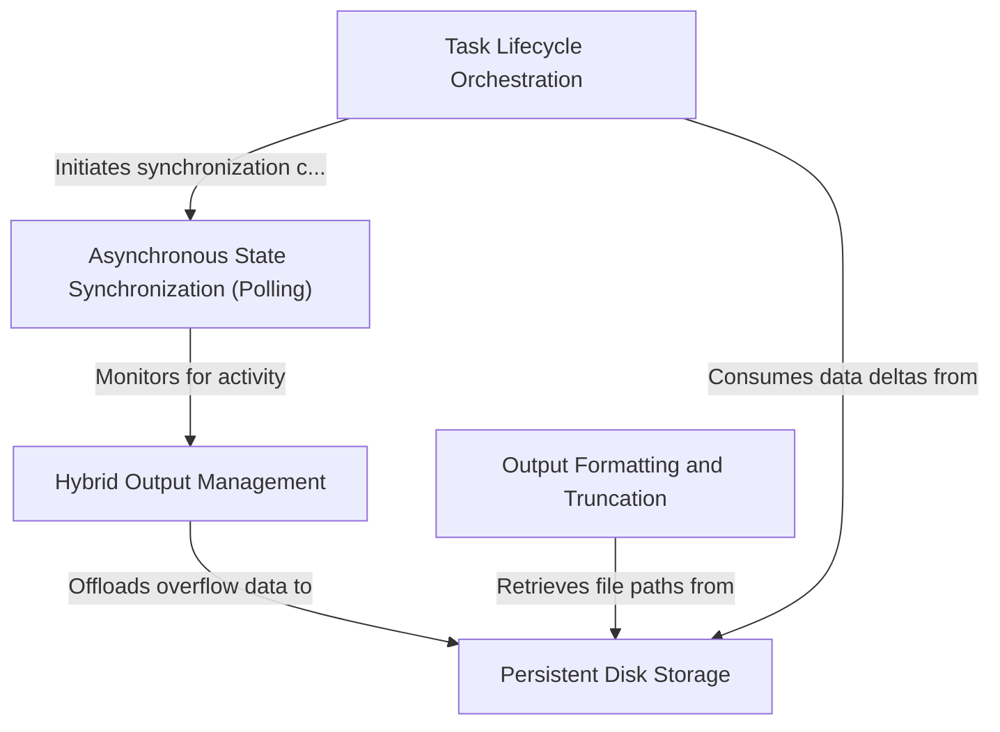

# Tutorial: task

This project creates a robust **task execution environment** designed to manage long-running background processes and their generated data. It utilizes an intelligent **hybrid buffering system** that keeps small data chunks in fast memory while automatically offloading massive logs to *persistent disk storage* to prevent overflows. The system orchestrates the full **lifecycle** of these tasks—from creation to eviction—ensuring the application stays synchronized via **asynchronous polling** and prepares output for AI consumption through smart **truncation and formatting**.

## Chapters

1. [Task Lifecycle Orchestration](01_task_lifecycle_orchestration.md)
2. [Asynchronous State Synchronization (Polling)](02_asynchronous_state_synchronization__polling_.md)
3. [Hybrid Output Management](03_hybrid_output_management.md)
4. [Persistent Disk Storage](04_persistent_disk_storage.md)
5. [Output Formatting and Truncation](05_output_formatting_and_truncation.md)

---

Generated by [Code IQ](https://github.com/adityasoni99/Code-IQ)