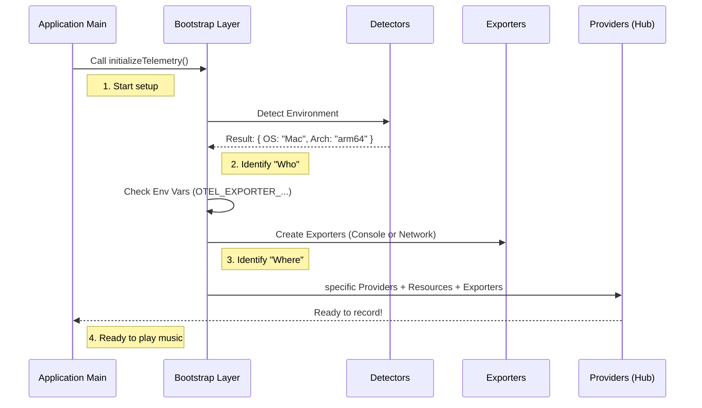

# Chapter 1: Telemetry Bootstrap & Instrumentation

Welcome to the first chapter of the **Telemetry** project tutorial!

Before our application can start recording useful data, we need to set up the recording equipment. In the software world, this setup phase is called **Bootstrap & Instrumentation**.

## The "Sound Check" Analogy

Think of your application as a band about to play a concert.
*   **The Band:** Your Application Logic (doing the actual work).
*   **The Music:** The data (logs, metrics, and traces).
*   **The Audience:** The developers or dashboards observing the data.

**Telemetry Bootstrap** is the **Sound Check**. Before the band starts playing, the sound engineer must:
1.  **Connect Microphones (Instrumentation):** Place sensors where the sound happens.
2.  **Check the Venue (Resource Detection):** Are we in a stadium (Cloud) or a basement (Local Laptop)?
3.  **Wire the Speakers (Exporters):** connect the cables so the music goes to the audience (Console) or a recording studio (Cloud Endpoint).

If you skip the sound check, the band plays in silence.

## Central Use Case: "Who, What, and Where?"

Imagine you are starting the `claude-code` CLI tool. You want to answer three questions automatically every time the app runs:
1.  **Who is running this?** (Windows? Mac? Docker?)
2.  **What is happening?** (Errors, button clicks, performance speed).
3.  **Where should the data go?** (Print to screen? Send to a database?)

We solve this by creating a centralized `initializeTelemetry()` function that runs immediately when the app starts.

## Key Concepts

### 1. Resource Detectors (The "Who")
A **Resource** describes the environment. Instead of hardcoding "I am a Mac," we use detectors to figure it out dynamically.

### 2. Providers (The "Hub")
There are three main types of telemetry data, each with its own "Provider" (manager):
*   **LoggerProvider:** Manages text logs (like `console.log` but better).
*   **MeterProvider:** Manages metrics (numbers, like "memory usage").
*   **TracerProvider:** Manages traces (timelines of operations).

### 3. Exporters (The "Destination")
An **Exporter** takes the data from the Provider and sends it somewhere.
*   **Console Exporter:** Prints to your terminal (good for debugging).
*   **OTLP Exporter:** Sends over the internet to a server (OpenTelemetry Protocol).

## How It Works: The Setup Flow

The following diagram shows what happens inside the `telemetry` system when the application boots up.



## Internal Implementation

Let's look at how this is implemented in `instrumentation.ts`. We will break the complex initialization process into small, understandable steps.

### Step 1: Detect the Environment
First, we gather attributes about the machine. We use standard OpenTelemetry detectors (`osDetector`, `envDetector`) and merge them with our own custom attributes.

```typescript
// From instrumentation.ts
const baseAttributes = {
  [ATTR_SERVICE_NAME]: 'claude-code',
  [ATTR_SERVICE_VERSION]: MACRO.VERSION,
}

// Create the "Resource" (The identity of the app)
const resource = resourceFromAttributes(baseAttributes)
  .merge(osDetector.detect())   // e.g., Windows 11
  .merge(hostDetector.detect()) // e.g., x64 architecture
  .merge(envDetector.detect())  // e.g., AWS / Local
```

### Step 2: Configure Exporters (The Speakers)
Next, we decide where the data goes. We look at environment variables (like `OTEL_LOGS_EXPORTER`). This is like plugging in the cables.

```typescript
// Helper function to pick the right exporter
async function getOtlpLogExporters() {
  const exporterTypes = parseExporterTypes(process.env.OTEL_LOGS_EXPORTER)
  const exporters = []

  // If environment says "console", use the Console exporter
  if (exporterTypes.includes('console')) {
    exporters.push(new ConsoleLogRecordExporter())
  }
  
  // If environment says "otlp" (network), use the Network exporter
  if (exporterTypes.includes('otlp')) {
    // Dynamically import the heavy network code only if needed
    const { OTLPLogExporter } = await import('@opentelemetry/exporter-logs-otlp-http')
    exporters.push(new OTLPLogExporter(getOTLPExporterConfig()))
  }
  
  return exporters
}
```

> **Note:** We use `await import(...)` inside the `if` statement. This is a performance trick! If we aren't sending network logs, we don't load the heavy network code, making the app start faster.

### Step 3: Initialize Providers (The Hub)
Now we create the managers (Providers) and give them the Resource (identity) and Exporters (destination).

```typescript
// From initializeTelemetry()
const meterProvider = new MeterProvider({
  resource,
  readers: await getOtlpReaders(), // Metric readers
})

// Save this provider globally so we can use it later
setMeterProvider(meterProvider)

// Return the meter so the app can start counting things immediately
return meterProvider.getMeter('com.anthropic.claude_code')
```

### Step 4: Safety & Cleanup
What happens if the user closes the app while we are uploading data? We need to ensure we flush (finish sending) the data before the process dies.

```typescript
// Define what happens when the app shuts down
const shutdownTelemetry = async () => {
  // Stop the music!
  endInteractionSpan() 

  // Force all providers to send their remaining data
  await Promise.all([
    meterProvider.shutdown(),
    loggerProvider?.shutdown(),
    tracerProvider?.shutdown()
  ])
}

// Hook this into the process exit event
registerCleanup(shutdownTelemetry)
```

## Advanced Topic: Beta Tracing
You might notice references to `initializeBetaTracing` in the code. This is a special, parallel system for detailed debugging. It allows developers to turn on "High Definition" recording without affecting the standard telemetry used for general analytics.

We will cover how traces interact with logs in [Session Tracing & Context Propagation](02_session_tracing___context_propagation.md).

## Summary
In this chapter, we learned:
1.  **Bootstrap** is the "Sound Check" that runs before the app does real work.
2.  **Resources** tell us *who* is running the app (OS, Version).
3.  **Exporters** determine *where* the data goes (Console vs. OTLP).
4.  **Providers** tie everything together.

Now that our system is initialized and ready to record, we need to understand how to track the user's journey through the application.

[Next Chapter: Session Tracing & Context Propagation](02_session_tracing___context_propagation.md)

---

Generated by [Code IQ](https://github.com/adityasoni99/Code-IQ)