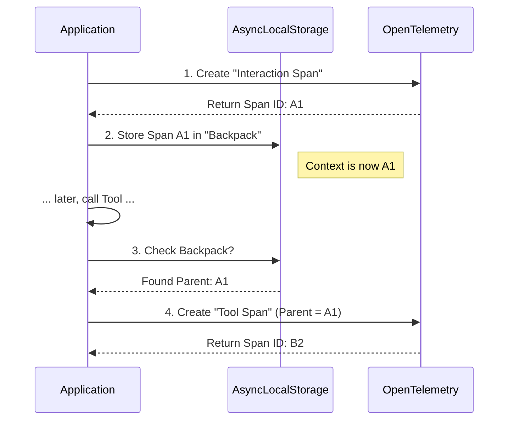

# Chapter 2: Session Tracing & Context Propagation

In [Chapter 1: Telemetry Bootstrap & Instrumentation](01_telemetry_bootstrap___instrumentation.md), we set up our "recording studio"—the Providers and Exporters. Now that the equipment is ready, we need to record the actual "music" of our application.

In an asynchronous application like Claude Code (CLI), many things happen at once. A user types a prompt, the AI thinks, a tool executes, and files are read. **Session Tracing** is the art of connecting all these separate actions into a single, coherent story.

## The "Nesting Doll" Analogy

To understand tracing, think of **Russian Nesting Dolls**.

1.  **The Outer Doll (Interaction):** This is the user asking a question (e.g., "Check the weather"). Everything that happens to answer this question lives inside this doll.
2.  **The Middle Doll (LLM Request):** The application asks the AI model what to do.
3.  **The Inner Doll (Tool Execution):** The AI decides to run a command (e.g., `curl weather.api`).

If the "Inner Doll" (Tool) breaks, we need to know exactly which "Outer Doll" (User Interaction) it belonged to. This linking process is called **Context Propagation**.

## Central Use Case: The User Journey

Imagine a user runs this command:
> "Create a new file called hello.txt"

We want our telemetry to generate a timeline that looks like this:

```text
[Interaction Span: "Create hello.txt"] (Total: 2000ms)
  ├── [LLM Request Span] (Thinking... 500ms)
  ├── [Tool Span: FileCreator] (Writing... 100ms)
  └── [LLM Request Span] (Confirming... 200ms)
```

Without tracing, these would just be four unconnected log messages. With tracing, they are a family tree.

## Key Concepts

### 1. Spans
A **Span** is a single operation with a start time and an end time. It represents one "doll."
*   **Root Span:** The parent of all (The User Interaction).
*   **Child Span:** A step inside the parent (The Tool).

### 2. Context Propagation
This is the invisible thread that connects a child to its parent. When code executes `await doSomething()`, the system must remember "Who called me?" so the child span creates the correct link.

### 3. AsyncLocalStorage (The Magic Glue)
In Node.js/TypeScript, we use a tool called `AsyncLocalStorage`. Think of it as a **backpack** that automatically follows your code execution. If you put the "Parent Span" in the backpack at the start, any function called later can look inside the backpack to find its parent.

## How to Use It

The `sessionTracing.ts` module provides helper functions to manage these dolls easily.

### 1. Starting the Outer Doll (Interaction)
When the user hits "Enter", we start the main span.

```typescript
import { startInteractionSpan, endInteractionSpan } from './sessionTracing'

// 1. Start the stopwatch for the user's request
const span = startInteractionSpan("Create a file")

try {
  // ... Application logic runs here ...
} finally {
  // 2. Stop the stopwatch when done
  endInteractionSpan()
}
```

### 2. The Middle Doll (LLM Request)
Inside the interaction, we might call the LLM. Notice we don't manually pass the parent! The "backpack" handles it.

```typescript
import { startLLMRequestSpan, endLLMRequestSpan } from './sessionTracing'

// The system automatically knows this is inside the Interaction
const llmSpan = startLLMRequestSpan("claude-3-5-sonnet")

// Call the AI API...
await callAnthropicAPI()

// Stop the stopwatch, recording success or failure
endLLMRequestSpan(llmSpan, { 
    inputTokens: 50, 
    success: true 
})
```

### 3. The Inner Doll (Tools)
If the LLM decides to run a tool, we wrap that too.

```typescript
import { startToolSpan, endToolSpan } from './sessionTracing'

// Start the tool timer
startToolSpan("file_writer", { filename: "hello.txt" })

// Do the actual file writing...
await fs.writeFile("hello.txt", "Hello!")

// Stop the tool timer
endToolSpan("Success")
```

## Internal Implementation: How it Works

What happens under the hood when we call `startInteractionSpan`?

1.  We create a new OpenTelemetry Span.
2.  We put that Span into the `AsyncLocalStorage` (the backpack).
3.  Any future code that runs looks into the backpack to see if it has a parent.

### Visual Flow



### Deep Dive: The Code

Let's look at `sessionTracing.ts` to see how this is built.

#### Step 1: The Storage (The Backpack)
We create a storage container. This is a built-in Node.js feature that is "async-aware."

```typescript
// From sessionTracing.ts
import { AsyncLocalStorage } from 'async_hooks'

// Holds the current active span
const interactionContext = new AsyncLocalStorage<SpanContext | undefined>()
```

#### Step 2: Starting the Span & Storing Context
When we start a span, we enter the context.

```typescript
export function startInteractionSpan(userPrompt: string): Span {
  const tracer = getTracer()
  
  // 1. Create the span using OpenTelemetry
  const span = tracer.startSpan('claude_code.interaction', {
    attributes: { user_prompt: userPrompt }
  })

  // 2. Prepare the object to store
  const spanContextObj = { span, startTime: Date.now(), attributes: {} }
  
  // 3. Put it in the backpack! 
  // All code following this line will see this span as "active"
  interactionContext.enterWith(spanContextObj)

  return span
}
```

> **Beginner Note:** `interactionContext.enterWith(...)` is the critical line. It says, "For the rest of this asynchronous execution chain, this object is our global state."

#### Step 3: Child Spans Linking to Parents
When a child (like a tool) starts, it checks the backpack.

```typescript
export function startToolSpan(toolName: string): Span {
  const tracer = getTracer()
  
  // 1. Look inside the backpack
  const parentSpanCtx = interactionContext.getStore()

  // 2. If a parent exists, link them!
  const ctx = parentSpanCtx
    ? trace.setSpan(otelContext.active(), parentSpanCtx.span)
    : otelContext.active()
    
  // 3. Start the child span associated with that context
  return tracer.startSpan('claude_code.tool', { attributes: { tool_name: toolName } }, ctx)
}
```

#### Step 4: Safety & Garbage Collection
You might notice maps like `activeSpans` using `WeakRef` in the full code.

```typescript
const activeSpans = new Map<string, WeakRef<SpanContext>>()
```

This is a safety mechanism. If a developer forgets to call `endInteractionSpan()`, the `WeakRef` allows the memory to be freed (Garbage Collected) automatically, preventing memory leaks in long-running applications.

## Advanced: "High Definition" Tracing (Beta)

Sometimes standard tracing isn't enough. We might want to see the exact system prompt used or the full output of the LLM. This is handled in `betaSessionTracing.ts`.

It uses a clever **Hashing Strategy** to avoid sending too much data.

```typescript
// From betaSessionTracing.ts

// Instead of sending a 50kb system prompt every time...
const promptHash = hashSystemPrompt(newContext.systemPrompt)

// We check if we've seen it before
if (!seenHashes.has(promptHash)) {
  // If new, send the full prompt
  logOTelEvent('system_prompt', { text: fullPrompt })
  seenHashes.add(promptHash)
} else {
  // If seen, just send the hash ID (saves bandwidth!)
  span.setAttribute('system_prompt_hash', promptHash)
}
```

## Summary

In this chapter, we learned:
1.  **Session Tracing** organizes messy async events into a clean timeline ("Nesting Dolls").
2.  **Context Propagation** links children to parents automatically.
3.  **AsyncLocalStorage** is the "backpack" that carries the parent ID through the code execution.

Now that we have the *timeline* (Spans) set up, we often need to record specific point-in-time occurrences, like "User clicked a button" or "Error occurred." For that, we need Logs.

[Next Chapter: Discrete Event Logging](03_discrete_event_logging.md)

---

Generated by [Code IQ](https://github.com/adityasoni99/Code-IQ)