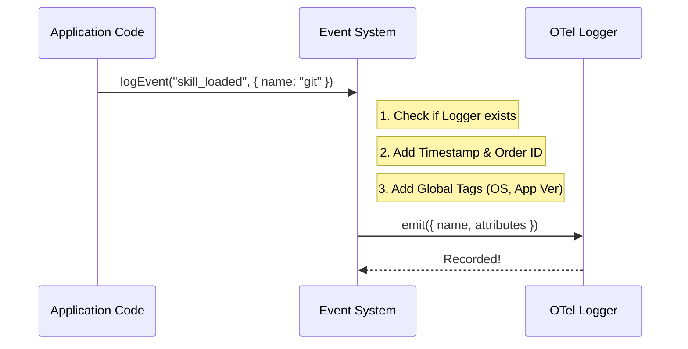

# Chapter 3: Discrete Event Logging

In the previous chapter, [Session Tracing & Context Propagation](02_session_tracing___context_propagation.md), we learned how to record the "video" of our application—tracking how long operations take and how they nest inside each other.

However, sometimes you don't need a video. Sometimes, you just need a **photograph**.

Welcome to **Discrete Event Logging**.

## The "Scrapbook" Analogy

If Spans are a continuous video recording of a birthday party (showing the flow of time), **Events** are the Polaroid photos you snap at specific moments.

*   **The Event:** "The cake was cut." (A single point in time).
*   **The Attributes:** Writing on the back of the photo: "Chocolate cake," "2:00 PM," "Guest count: 10."
*   **The Log:** The scrapbook where you paste these photos in order.

Unlike a Span, an Event doesn't have a "duration." It just happens. We use events to track things like "A tool was loaded," "An error popped up," or " The user rejected a permission."

## Central Use Case: "The Tool Inventory"

Imagine Claude Code is starting up. It scans your folder and finds available "Skills" (tools it can use, like Git or a File Reader).

We want to answer: **"Which skills were available to the user in this session?"**

We don't care how long it took to find them (that's a Span). We just want a list.
*   *Photo 1:* "Found Git Skill"
*   *Photo 2:* "Found File Editor Skill"

## Key Concepts

### 1. The Point in Time
Events happen instantly. In our telemetry system, we record the exact millisecond the event occurred.

### 2. Standard Attributes
Just like every photo needs a date, every event needs standard context:
*   **Timestamp:** When did it happen?
*   **Sequence ID:** Which photo came first? (Crucial for putting them in order later).
*   **Session ID:** Which scrapbook does this belong to?

### 3. The Payload
This is the custom writing on the back of the photo. For our use case, the payload contains the `skill_name` and `skill_source`.

## How to Use It

Let's look at how we implement the "Tool Inventory" check using `skillLoadedEvent.ts`.

We iterate through the list of skills and snap a photo (log an event) for each one.

### 1. Import the Logger
First, we import the generic `logEvent` function.

```typescript
// From skillLoadedEvent.ts
import { logEvent } from '../../services/analytics/index.js'
import { getSkillToolCommands } from '../../commands.js'
```

### 2. Loop and Log
We loop through the skills and fire an event for each one.

```typescript
export async function logSkillsLoaded(cwd: string): Promise<void> {
  const skills = await getSkillToolCommands(cwd)

  for (const skill of skills) {
    // Only log prompts, skip other types for now
    if (skill.type !== 'prompt') continue

    // SNAP THE PHOTO!
    logEvent('tengu_skill_loaded', {
      _PROTO_skill_name: skill.name,
      skill_source: skill.source,
      skill_loaded_from: skill.loadedFrom
    })
  }
}
```

> **Note on Safety:** You might see complex types in the real code (like `AnalyticsMetadata_...`). These are safety tags that tell the system, "I promise I checked this data, and it doesn't contain secret passwords." We'll cover privacy in the next chapter.

## Internal Implementation: How it Works

What happens inside `logEvent`? It's not just a `console.log`. It needs to attach metadata and send it to the OpenTelemetry system.

### Visual Flow



### Deep Dive: The Code

Let's look under the hood at `events.ts`.

#### Step 1: The Sequence Counter
Computers are fast. Sometimes two events happen in the same millisecond. To ensure we know the exact order, we use a simple counter variable.

```typescript
// From events.ts

// A global counter that goes up by 1 every time we log something
let eventSequence = 0
```

#### Step 2: Preparing the Attributes
When `logOTelEvent` is called, we mix the user's data with system data.

```typescript
export async function logOTelEvent(eventName: string, metadata: {}): Promise<void> {
  const eventLogger = getEventLogger()
  
  // 1. Combine global info (OS, Version) with event info
  const attributes: Attributes = {
    ...getTelemetryAttributes(), // e.g. { os: "macOS" }
    'event.name': eventName,     // e.g. "tengu_skill_loaded"
    'event.timestamp': new Date().toISOString(),
    'event.sequence': eventSequence++, // Increment the counter!
  }
```

> **Why `eventSequence++`?** This ensures that even if two events have the exact same timestamp, we can sort them by `sequence` number later to reconstruct the timeline perfectly.

#### Step 3: Handling Metadata & Emitting
We take the custom data (like `skill_name`), add it to the attributes, and finally "emit" (send) the record.

```typescript
  // 2. Add the custom data passed by the user
  for (const [key, value] of Object.entries(metadata)) {
    if (value !== undefined) {
      attributes[key] = value
    }
  }

  // 3. Send the "Photo" to the backend
  eventLogger.emit({
    body: `claude_code.${eventName}`,
    attributes,
  })
}
```

### Safety Checks
The system is robust. If the logger isn't ready (maybe the app is crashing), it fails gracefully.

```typescript
  if (!eventLogger) {
    // If the camera is broken, just print a warning and stop.
    // We don't want to crash the app just because logging failed.
    logForDebugging(`Event dropped: ${eventName}`, { level: 'warn' })
    return
  }
```

## Summary

In this chapter, we learned:
1.  **Discrete Events** are for single points in time, like taking a photo.
2.  **Sequencing** is vital; we use a counter (`eventSequence`) to keep photos in order.
3.  **Attributes** give context to the event (timestamp, name, metadata).

We briefly touched on "Safety Tags" in the code snippets. Since we are collecting data about user behavior, we must be extremely careful not to accidentally record passwords, API keys, or personal files.

In the next chapter, we will learn how to secure this data using hashing and privacy metadata.

[Next Chapter: Privacy-Aware Metadata & Hashing](04_privacy_aware_metadata___hashing.md)

---

Generated by [Code IQ](https://github.com/adityasoni99/Code-IQ)