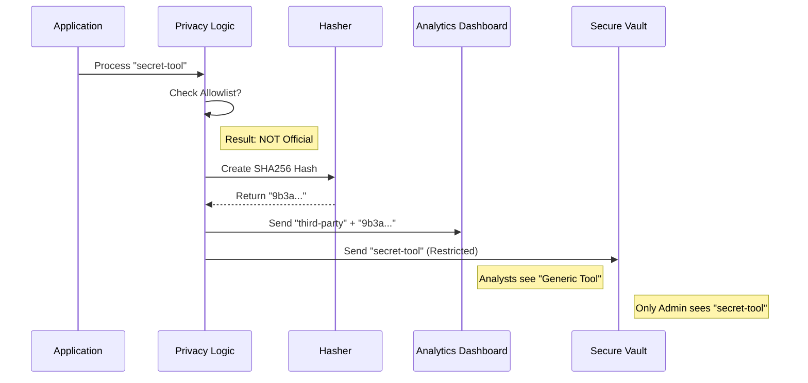

# Chapter 4: Privacy-Aware Metadata & Hashing

In the previous chapter, [Discrete Event Logging](03_discrete_event_logging.md), we learned how to take "snapshots" of our application's behavior using Events.

But here is the problem: **What if the snapshot contains secrets?**

If a user installs a plugin named `super-secret-company-deployment-tool`, and we log that name to our cloud, we have accidentally collected sensitive business data. We need a way to understand *how* people use the tool without spying on *what* they are building.

Welcome to **Privacy-Aware Metadata & Hashing**.

## The "Redaction Team" Analogy

Think of your telemetry system as a government archive. Before any document is released for public statistics, it goes through a **Redaction Team**.

1.  **The Black Marker (Redaction):** Specific names are crossed out and replaced with generic labels like `[REDACTED]` or `third-party`.
2.  **The Fingerprint (Hashing):** Instead of storing the text "Project X," we store a unique math code (hash) like `a1b2...`. This lets us count how many people work on "Project X" without knowing its name.
3.  **The Sealed Envelope (Twin-Column Pattern):** Sometimes, for debugging, we need the raw data. We put the sensitive name in a "Sealed Envelope" (a restricted database column) that only a few security engineers can open, while the redacted version goes to the general analytics dashboard.

## Central Use Case: "The Plugin Privacy Problem"

Imagine Claude Code allows users to install custom plugins.
*   **User A** installs: `@anthropic/git-tool` (Official, Safe).
*   **User B** installs: `my-secret-crypto-bot` (Private, Sensitive).

We want to answer: *"Which plugins are popular?"*
*   For **User A**, we can log `@anthropic/git-tool`.
*   For **User B**, we must **hide** the name `my-secret-crypto-bot` but still count it as "One Third-Party Plugin."

## Key Concepts

### 1. The Twin-Column Pattern
We never send just one field for sensitive data. We send two:
*   **Redacted Column:** Safe for everyone to see (e.g., "third-party").
*   **Raw (`_PROTO_`) Column:** The real name, marked with a warning tag (`_PROTO_`), routed to a restricted database with short retention policies.

### 2. Hashing
A **Hash** is a one-way transformation. You can turn "Hello" into `185f8db...`, but you can't turn `185f8db...` back into "Hello." This is perfect for tracking *trends* (e.g., "5 users used this same plugin") without knowing the name.

### 3. Allowlisting (Scope)
We check names against a "VIP List" (Allowlist). If a plugin comes from a trusted source (like `@anthropic`), we log the real name. If not, we redact it.

## How to Use It

We use the helper `buildPluginTelemetryFields` in `pluginTelemetry.ts` to automatically generate safe data.

### Example Scenario
A user loads a plugin. We want to prepare the data for logging.

```typescript
import { buildPluginTelemetryFields } from './pluginTelemetry'

// 1. User loads a private plugin
const pluginName = "my-secret-bot"
const marketplace = "user-local" // Not an official store

// 2. Generate the safe fields
const data = buildPluginTelemetryFields(pluginName, marketplace)

// 3. What does 'data' look like?
// {
//    plugin_name_redacted: "third-party",    <-- SAFE!
//    plugin_id_hash: "f4a7c...",             <-- UNIQUE FINGERPRINT
//    is_official_plugin: false               <-- METADATA
// }
```

In this example, the analytics dashboard sees "third-party", but the hash `f4a7c...` lets us see that this specific third-party plugin was used 500 times, differentiating it from others.

## Internal Implementation: How it Works

Let's trace how the "Redaction Team" processes a plugin name.

### Visual Flow



### Deep Dive: The Code

Let's look at `pluginTelemetry.ts` to see how this logic is built.

#### Step 1: The Hashing Logic
We use a "Salt" (a secret random string) combined with the name to create the fingerprint.

```typescript
// From pluginTelemetry.ts
import { createHash } from 'crypto'

const SALT = 'claude-plugin-telemetry-v1' // Fixed salt

export function hashPluginId(name: string): string {
  // Create a unique fingerprint
  return createHash('sha256')
    .update(name + SALT)
    .digest('hex')
    .slice(0, 16) // Keep it short
}
```

> **Why the Salt?** It prevents attackers from pre-calculating hashes (Rainbow Tables) to reverse-engineer plugin names.

#### Step 2: The Scope Check (The Allowlist)
We determine if the plugin is "Official" or "User Local."

```typescript
export function getTelemetryPluginScope(name: string, market: string): string {
  // If it comes from our official store, it's safe
  if (isOfficialMarketplaceName(market)) return 'official'
  
  // If it's built-in to the app, it's safe
  if (market === 'builtin') return 'default-bundle'
  
  // Otherwise, we don't know what it is. Treat as private.
  return 'user-local'
}
```

#### Step 3: Building the Twin Columns
This is where the redaction happens. We decide what goes into the safe column.

```typescript
// Inside buildPluginTelemetryFields...

const scope = getTelemetryPluginScope(name, marketplace)
const isSafe = scope === 'official' || scope === 'default-bundle'

return {
  // The Fingerprint (Always sent)
  plugin_id_hash: hashPluginId(name),

  // The Redacted Column (The Logic)
  // If safe, send name. If not, send "third-party"
  plugin_name_redacted: isSafe ? name : 'third-party'
}
```

## Advanced Topic: Bandwidth Saving via Hashing
Hashing isn't just for privacy; it's also for **performance**.

In `betaSessionTracing.ts`, we handle "System Prompts" (instructions to the AI). These can be huge (50KB+). Sending the same 50KB text every time the AI thinks is wasteful.

Instead, we use hashing to deduplicate data.

```typescript
// From betaSessionTracing.ts
const seenHashes = new Set<string>()

function logSystemPrompt(fullPrompt: string) {
  const hash = hashSystemPrompt(fullPrompt) // e.g. "sp_abc123"

  // Have we sent this specific text before in this session?
  if (!seenHashes.has(hash)) {
    // No? Send the FULL text and remember the hash
    logOTelEvent('system_prompt', { text: fullPrompt, hash: hash })
    seenHashes.add(hash)
  } else {
    // Yes? Just send the hash ID to save bandwidth!
    logOTelEvent('system_prompt', { hash: hash })
  }
}
```

This technique reduces telemetry data usage by over 90% for long sessions.

## Summary

In this chapter, we learned:
1.  **Twin-Column Pattern:** Sending a "Redacted" safe version alongside a "Raw" restricted version gives us the best of both worlds (Privacy & Debuggability).
2.  **Hashing:** Creating unique fingerprints allows us to count distinct items without reading their sensitive names.
3.  **Allowlisting:** We only trust data sources we control (Official Plugins); everything else is treated as private.

Now that we have clean, safe, and organized data, we can start looking at how fast our application is running.

[Next Chapter: Perfetto Performance Profiling](05_perfetto_performance_profiling.md)

---

Generated by [Code IQ](https://github.com/adityasoni99/Code-IQ)