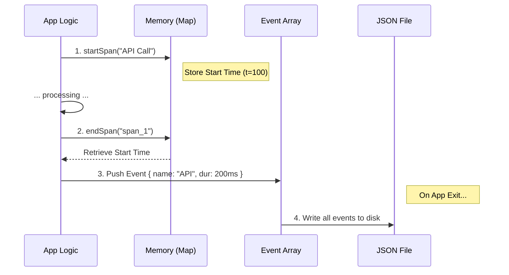

# Chapter 5: Perfetto Performance Profiling

In the previous chapter, [Privacy-Aware Metadata & Hashing](04_privacy_aware_metadata___hashing.md), we learned how to sanitize data so we can safely record user behavior.

Now, let's talk about **Speed**.

Sometimes, knowing *what* happened isn't enough. You need to know exactly *how fast* it happened, down to the millisecond. While OpenTelemetry gives us a broad overview, we sometimes need a microscope to debug performance issues locally.

Welcome to **Perfetto Performance Profiling**.

## The "Engine Room" Analogy

To understand why we need a second tracing system, think of a massive ocean liner.

1.  **OpenTelemetry (The Ship's Logbook):**
    *   *Audience:* Headquarters / The Captain.
    *   *Data:* "Arrived at port at 14:00. Engine temperature normal."
    *   *Purpose:* Long-term records and high-level health.

2.  **Perfetto (The Engine Room Oscilloscope):**
    *   *Audience:* The Mechanic on duty.
    *   *Data:* "Cylinder 3 misfired for 4 milliseconds during the startup sequence."
    *   *Purpose:* Real-time, high-frequency debugging.

Perfetto creates a **Chrome Trace** file. This is a visual timeline that shows every function call, every cache hit, and every millisecond of "thinking" time, stored locally on your machine.

## Central Use Case: "Why is the AI sluggish?"

Imagine a user reports: *"Claude feels slow today."*

"Slow" is vague. Is it:
1.  Slow to connect to the internet?
2.  Slow to generate the first word (**Time To First Token** or **TTFT**)?
3.  Slow to finish typing (**Tokens Per Second**)?

Perfetto profiling captures these exact metrics so we can visualize them in a Gantt chart.

## Key Concepts

### 1. The Chrome Trace Format
This is a standard JSON format used by Google Chrome and Android developers. It records events with:
*   **`ph` (Phase):** Is this the Start (`B`) or End (`E`) of an event?
*   **`ts` (Timestamp):** Microsecond precision.
*   **`pid` / `tid`:** Process and Thread IDs to stack the visual bars correctly.

### 2. High-Frequency Metrics
We track very granular data points that might be too noisy for standard telemetry:
*   **TTFT (Time To First Token):** How long user waited for the first character.
*   **Cache Hit Rate:** Did we reuse previous Prompt Cache results?
*   **ITPS / OTPS:** Input/Output Tokens Per Second.

### 3. Local Circular Buffer
Unlike OpenTelemetry, which sends data away, Perfetto keeps data in a local array (a buffer). If the array gets too full (over 100,000 events), we drop the oldest ones. This ensures the tool never uses too much memory, even if left running for days.

## How to Use It

Because this generates large files, it is usually disabled by default. You enable it via environment variables.

### 1. Enable Tracing
Set the flag before running the application.

```bash
# Enable tracing and save to a specific file
export CLAUDE_CODE_PERFETTO_TRACE=./my-trace.json
claude-code
```

### 2. Visualize the Data
After the application exits, you:
1.  Go to [ui.perfetto.dev](https://ui.perfetto.dev) in your browser.
2.  Click "Open trace file".
3.  Select `my-trace.json`.

You will see a beautiful timeline view of your session!

## Internal Implementation: How it Works

The system is designed to be lightweight. It doesn't use complex objects; it mostly pushes simple data into an array.

### Visual Flow



### Deep Dive: The Code

Let's look at `perfettoTracing.ts` to see how we handle these high-speed events.

#### Step 1: Initialization
We check the environment variable. If it's not set, the functions do nothing (preserving performance).

```typescript
// From perfettoTracing.ts
export function initializePerfettoTracing(): void {
  const envValue = process.env.CLAUDE_CODE_PERFETTO_TRACE
  
  // If env var is missing, don't turn it on
  if (!envValue) return

  isEnabled = true
  startTimeMs = Date.now()
  
  // Set up auto-save on exit
  registerCleanup(async () => await writePerfettoTrace())
}
```

#### Step 2: Starting a Span
When an operation starts (like an API call), we generate a `spanId` and store the start time in a `pendingSpans` Map.

```typescript
export function startLLMRequestPerfettoSpan(args: { model: string }): string {
  if (!isEnabled) return ''

  const spanId = generateSpanId() // e.g., "span_42"

  // Store the "Begin" state in memory
  pendingSpans.set(spanId, {
    name: 'API Call',
    startTime: getTimestamp(), // Current time in microseconds
    args: { model: args.model }
  })
  
  // Create a "Begin" (B) event for the timeline
  events.push({ ph: 'B', name: 'API Call', ... })

  return spanId
}
```

#### Step 3: Ending a Span & Calculating Metrics
When the operation finishes, we look up the start time, calculate the duration, and record the detailed metrics.

```typescript
export function endLLMRequestPerfettoSpan(spanId: string, metadata: any): void {
  const pending = pendingSpans.get(spanId)
  if (!pending) return

  // Calculate fancy metrics
  const duration = getTimestamp() - pending.startTime
  const itps = calculateTokensPerSecond(metadata.promptTokens, duration)

  // Push the "End" (E) event with the metrics attached
  events.push({
    ph: 'E', // Phase: End
    name: pending.name,
    args: { 
      ttft_ms: metadata.ttftMs,
      itps: itps,
      cache_hit_rate: metadata.cacheHitRate
    }
  })
  
  // Clean up memory
  pendingSpans.delete(spanId)
}
```

#### Step 4: Writing to Disk
Finally, when the user quits, we dump the `events` array into a file.

```typescript
async function writePerfettoTrace(): Promise<void> {
  const traceData = {
    traceEvents: events, // The big list of everything that happened
    metadata: { agent_count: totalAgentCount }
  }

  // Save to hard drive
  await writeFile(tracePath, JSON.stringify(traceData))
}
```

## Advanced Topic: Stale Span Eviction
Sometimes code crashes halfway through. If `startSpan` is called but `endSpan` is never reached (due to an error), the memory map would grow forever.

We run a "Garbage Collector" every minute to find spans that have been open for too long (e.g., 30 minutes) and forcibly close them, marking them as "evicted" in the trace.

```typescript
function evictStaleSpans(): void {
  const now = getTimestamp()
  for (const [spanId, span] of pendingSpans) {
    if (now - span.startTime > THIRTY_MINUTES) {
        // Force close it so we don't leak memory
        events.push({ ph: 'E', args: { evicted: true } })
        pendingSpans.delete(spanId)
    }
  }
}
```

## Summary

In this chapter, we learned:
1.  **Perfetto** is for high-precision, local performance debugging (the "Oscilloscope").
2.  **Chrome Trace Format** allows us to visualize parallel events in a Gantt chart.
3.  **Calculated Metrics** like TTFT and ITPS help us quantify "sluggishness."

We have now covered how to initialize telemetry, trace sessions, log events, sanitize data, and profile performance.

However, all this data is internal. What if business leadership wants to know: *"How many users are using the 'Explain Code' feature?"* We need a way to summarize this data and export it specifically for business dashboards.

[Next Chapter: Custom Metrics Export Strategy](06_custom_metrics_export_strategy.md)

---

Generated by [Code IQ](https://github.com/adityasoni99/Code-IQ)