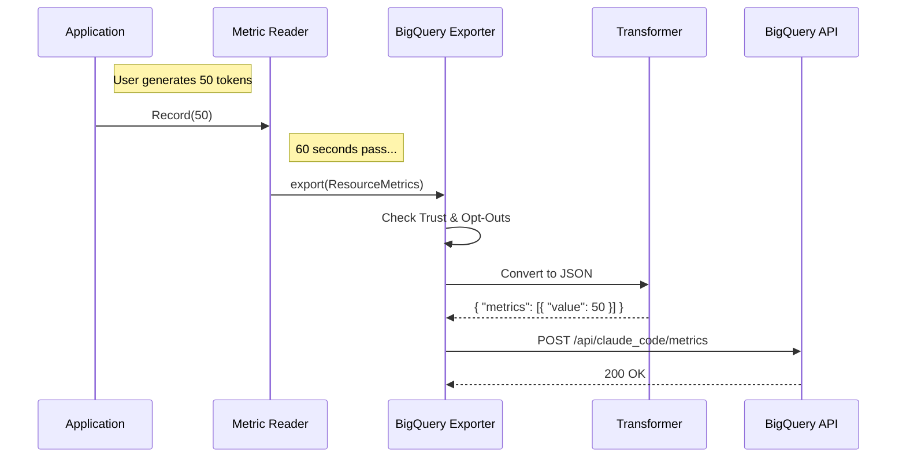

# Chapter 6: Custom Metrics Export Strategy

In the previous chapter, [Perfetto Performance Profiling](05_perfetto_performance_profiling.md), we acted like mechanics in the engine room, using high-precision tools to debug performance issues locally on a single machine.

But what if the "Captain" (Product Management) asks: **"Are users running into more errors today than yesterday across the entire world?"**

We cannot look at every user's local trace file. We need to ship summary data from thousands of computers to a central warehouse where we can run SQL queries.

Welcome to the **Custom Metrics Export Strategy**.

## The "Specialized Courier" Analogy

Think of OpenTelemetry (OTel) as a factory that boxes up data (metrics) into standard shipping containers.

However, our destination—**Google BigQuery**—is very picky. It doesn't have a dock for standard containers. It requires:
1.  **Specific Forms:** Data must be in a strict JSON format, not the standard OTel format.
2.  **ID Checks:** The shipment must have specific authentication headers.
3.  **Custom Packaging:** Metadata like "User OS" or "Subscription Type" must be stamped on every box.

The `BigQueryMetricsExporter` is our **Specialized Courier**. It takes the standard boxes, unpacks them, fills out the BigQuery paperwork, repackages them, and drives them to the warehouse.

## Central Use Case: "The Executive Dashboard"

Imagine we want to build a dashboard that shows:
> "Total tokens generated by Claude Code users per hour."

To make this happen:
1.  The App records: `tokens_generated.add(50)`.
2.  The Exporter waits for a batch of these numbers.
3.  The Exporter **transforms** them into a JSON payload.
4.  The Exporter **pushes** them to the BigQuery API endpoint.

## Key Concepts

### 1. PushMetricExporter
This is the job title. In OpenTelemetry, an "Exporter" is a class responsible for sending data away. "Push" means we actively send data on a schedule (e.g., every 60 seconds), rather than waiting for the server to ask for it.

### 2. Aggregation Temporality: Delta vs. Cumulative
This is the most important technical concept in this chapter.

*   **Cumulative (The Odometer):** "I have driven 10,000 miles total since I bought the car."
*   **Delta (The Trip Meter):** "I drove 5 miles in the last hour."

BigQuery likes **Delta**. If we send "10,000" and then "10,005", BigQuery might add them together (20,005), which is wrong. By sending **Delta**, we simply send "5", and BigQuery adds that to the total.

### 3. Transformation
The raw OTel data is a complex tree of objects. BigQuery wants a flat list. The exporter acts as a "flattening" machine.

## How It Works: The Workflow

Before looking at the code, let's visualize the journey of a metric.



## Internal Implementation

We implement this in `bigqueryExporter.ts`. Let's break it down into small, digestible steps.

### Step 1: The Safety Checks
Before we act as a courier, we check if we are allowed to deliver the package. We check if the user has trusted the app and if they have opted out of telemetry.

```typescript
// From bigqueryExporter.ts

private async doExport(metrics: ResourceMetrics, callback: any): Promise<void> {
  // 1. Check if the user has accepted the trust dialog
  const hasTrust = checkHasTrustDialogAccepted()
  
  // 2. Check if the organization has disabled metrics
  const metricsStatus = await checkMetricsEnabled()
  
  if (!hasTrust || !metricsStatus.enabled) {
    // If not allowed, pretend we succeeded but do nothing
    callback({ code: ExportResultCode.SUCCESS })
    return
  }
  // ... continue to export ...
}
```

### Step 2: The Transformation
This is the heart of the "Courier" work. We take the raw `metrics` object and reshape it into `InternalMetricsPayload`.

We extract the **Resource Attributes** (Who is this?) and the **Data Points** (What happened?).

```typescript
// Inside transformMetricsForInternal()

const resourceAttributes = {
  // Identify the sender
  'service.name': 'claude-code',
  'os.type': attrs['os.type'] || 'unknown',
  
  // Identify the customer type (Free vs Paid)
  'user.customer_type': isClaudeAISubscriber() ? 'claude_ai' : 'api'
}

// Map the complex OTel structure to simple JSON
const payload = {
  resource_attributes: resourceAttributes,
  metrics: metrics.scopeMetrics.flatMap(scope => 
    scope.metrics.map(metric => ({
       name: metric.descriptor.name,
       data_points: this.extractDataPoints(metric)
    }))
  )
}
```

### Step 3: Extracting Values (Flattening)
A metric might have many data points. We filter out anything that isn't a number and convert the timestamp to a human-readable string.

```typescript
private extractDataPoints(metric: MetricData): DataPoint[] {
  return metric.dataPoints
    // Ensure we only send numbers
    .filter((p): p is OTelDataPoint<number> => typeof p.value === 'number')
    
    // Create the clean data object
    .map(point => ({
      attributes: this.convertAttributes(point.attributes),
      value: point.value,
      timestamp: new Date().toISOString() // Simplified for tutorial
    }))
}
```

### Step 4: The Delivery (Network Request)
Finally, we put the JSON payload in an HTTP POST request and send it to the Anthropic API (which forwards it to BigQuery).

```typescript
// Inside doExport()

// Get security headers (Auth tokens)
const authResult = getAuthHeaders()

const response = await axios.post(
  this.endpoint, 
  payload, 
  {
    headers: {
      'Content-Type': 'application/json',
      ...authResult.headers, // Attach the ID badge
    }
  }
)
```

## Advanced Topic: Controlling "Delta" Time

As mentioned in the concepts, sending "Total since startup" (Cumulative) messes up our database math. We must force the system to reset the counter to 0 after every export.

We do this by overriding a specific configuration method in the class.

```typescript
selectAggregationTemporality(): AggregationTemporality {
  // DO NOT CHANGE THIS TO CUMULATIVE
  // If we do, the dashboard graphs will show massive, incorrect spikes.
  
  return AggregationTemporality.DELTA
}
```

> **Beginner Note:** `DELTA` means if you count 5 errors, send "5". The next time you count 3 errors, send "3".
> `CUMULATIVE` would send "5", and then the next time send "8" (5+3).

## Summary of the Series

Congratulations! You have completed the **Telemetry** tutorial series. Let's look at the full picture of what you have built:

1.  **Bootstrap:** You set up the recording studio in [Chapter 1](01_telemetry_bootstrap___instrumentation.md).
2.  **Tracing:** You recorded the video timeline of user actions in [Chapter 2](02_session_tracing___context_propagation.md).
3.  **Events:** You took snapshots of specific moments in [Chapter 3](03_discrete_event_logging.md).
4.  **Privacy:** You redacted secrets and hashed names in [Chapter 4](04_privacy_aware_metadata___hashing.md).
5.  **Profiling:** You diagnosed local engine speed in [Chapter 5](05_perfetto_performance_profiling.md).
6.  **Exporting:** You finally shipped the business stats to the warehouse in this chapter.

You now understand the complete lifecycle of observability in a modern production application. From the moment a user presses a key, to the moment a graph updates on an executive dashboard, you own the pipeline.

---

Generated by [Code IQ](https://github.com/adityasoni99/Code-IQ)