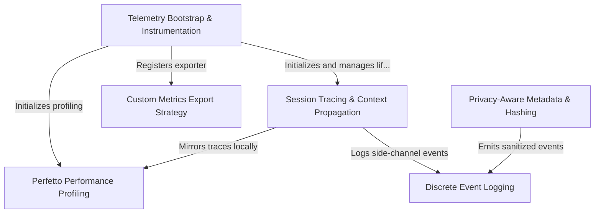

# Tutorial: telemetry

This project implements a comprehensive **telemetry and observability system** for an AI coding assistant. It orchestrates the collection of *distributed traces* (using OpenTelemetry), *discrete events*, and *performance profiles* (using Perfetto) to monitor user interactions, LLM requests, and tool executions. The system emphasizes **privacy-aware data handling** by hashing sensitive information and redacting PII before exporting data to various backends like BigQuery or OTLP endpoints.

## Chapters

1. [Telemetry Bootstrap & Instrumentation](01_telemetry_bootstrap___instrumentation.md)
2. [Session Tracing & Context Propagation](02_session_tracing___context_propagation.md)
3. [Discrete Event Logging](03_discrete_event_logging.md)
4. [Privacy-Aware Metadata & Hashing](04_privacy_aware_metadata___hashing.md)
5. [Perfetto Performance Profiling](05_perfetto_performance_profiling.md)
6. [Custom Metrics Export Strategy](06_custom_metrics_export_strategy.md)

---

Generated by [Code IQ](https://github.com/adityasoni99/Code-IQ)