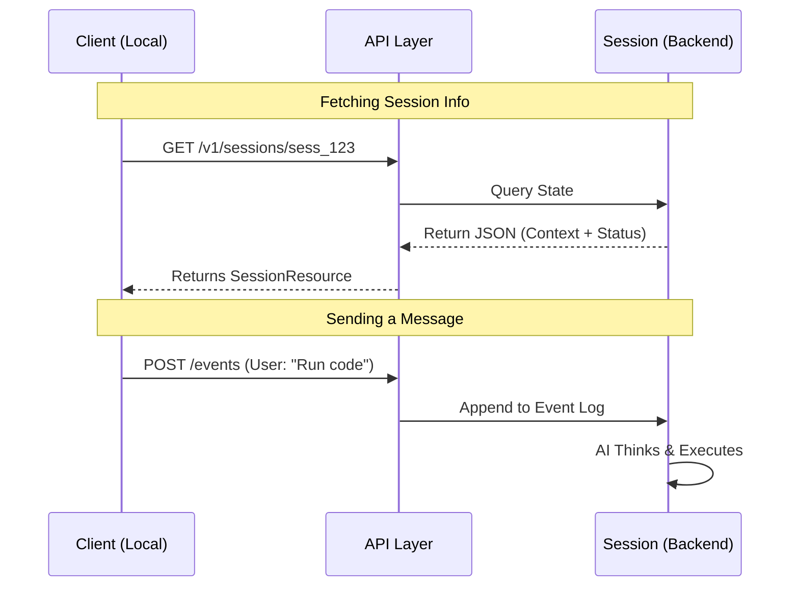

# Chapter 1: Remote Code Sessions

Welcome to the world of `teleport`! If you are building tools that allow AI to write and execute code, you are starting in the right place.

## The Motivation: Why do we need "Sessions"?

Imagine you are hiring a remote developer to fix a bug in your app. You wouldn't just send them a single text message and expect the job to be done instantly, right? You need a **workspace** where:
1.  They can download your code.
2.  You can have a back-and-forth conversation.
3.  They can remember what you said five minutes ago.
4.  They have a computer to actually run the code.

In `teleport`, this workspace is called a **Remote Code Session**.

Without a Session, an AI interaction is just a one-off question and answer. *With* a Session, it becomes a persistent, working environment that maintains state over time.

## Key Concept: The Virtual Meeting Room

Think of a Session as a **Virtual Meeting Room** hosted in the cloud.

*   **Session ID:** This is the room number. The local client (your CLI or app) needs this ID to enter the room.
*   **Context:** This is the whiteboard in the room. It holds the history of the chat, the current Git repository, and the files being edited.
*   **Status:** Is the meeting happening right now (`running`), or is the AI waiting for you to speak (`idle`)?

### The Use Case

Let's say we want to build a feature where a user types: *"Run the tests in my repo."*

To solve this with `teleport`:
1.  The user connects to a **Session**.
2.  The user sends a "message" (event) to that Session ID.
3.  The Session (running on the backend) receives the message, executes the command, and updates its history.

## How to Use Sessions

Let's look at how to interact with these sessions using the provided API helper functions.

### 1. Finding Your Sessions

First, we need to see what "rooms" are currently open. We use the `fetchCodeSessionsFromSessionsAPI` function.

```typescript
// Import the fetcher function
import { fetchCodeSessionsFromSessionsAPI } from './api.js'

// Get the list of all active sessions
const mySessions = await fetchCodeSessionsFromSessionsAPI();

// Check the first one
console.log(`Found session: ${mySessions[0].title}`);
console.log(`Status: ${mySessions[0].status}`);
```

**Explanation:**
This function calls the backend and returns a list of summaries. It tells you the Title (e.g., "Fix login bug") and the Status (e.g., `working` or `waiting`).

### 2. Entering a Specific Session

Once you have an ID (perhaps selected from the list above), you can get the full details of that specific room using `fetchSession`.

```typescript
import { fetchSession } from './api.js'

// The ID is usually a string like "sess_01..."
const sessionId = "sess_abc123";

// Get full details
const detailedSession = await fetchSession(sessionId);

console.log(`Working on repo: ${detailedSession.session_context.cwd}`);
```

**Explanation:**
This retrieves the `SessionResource`. Unlike the summary list, this object contains the heavy details, like the `session_context` (which Git repo is loaded) and `outcomes` (what happened recently).

### 3. Talking to the Session

A meeting is useless if you don't talk! In `teleport`, talking means sending an **Event**.

```typescript
import { sendEventToRemoteSession } from './api.js'

const message = "Please run npm test";

// Send the message to the cloud session
const success = await sendEventToRemoteSession(
  "sess_abc123",
  message
);

if (success) console.log("Message sent!");
```

**Explanation:**
`sendEventToRemoteSession` pushes your message into the session's timeline. The backend AI will see this, process it, and eventually respond by running code or sending a message back.

## Under the Hood: How it Works

What actually happens when you fetch a session or send a message?

### The Flow

1.  **Preparation:** The client prepares authentication (OAuth tokens).
2.  **Request:** The client sends an HTTP request to the API Gateway.
3.  **Routing:** The API finds the persistent workspace (container) associated with the Session ID.
4.  **Update:** The workspace receives the data and updates its state.



### Implementation Deep Dive

Let's look at `api.ts` to see how this robustness is built.

#### Handling Network Flakiness
The internet isn't perfect. Sometimes the "Meeting Room" phone line crackles. The code handles this with `axiosGetWithRetry`.

```typescript
// api.ts
export async function axiosGetWithRetry<T>(url: string, config?: AxiosRequestConfig) {
  // Try up to 4 times (plus initial attempt)
  for (let attempt = 0; attempt <= MAX_TELEPORT_RETRIES; attempt++) {
    try {
      return await axios.get<T>(url, config)
    } catch (error) {
      // If it's a server error (5xx) or network drop, retry!
      if (!isTransientNetworkError(error)) throw error;
      
      // Wait a bit (2s, 4s, 8s...) before trying again
      await sleep(TELEPORT_RETRY_DELAYS[attempt]);
    }
  }
}
```

**Explanation:**
This wrapper around `axios.get` ensures that if the API blips for a second, your application doesn't crash. It uses "exponential backoff," meaning it waits longer between each failed try.

#### The Session Data Structure
The `SessionResource` type defines exactly what a Session looks like in memory.

```typescript
// api.ts
export type SessionResource = {
  type: 'session'
  id: string
  session_status: 'running' | 'idle' | ... 
  session_context: {
    sources: SessionContextSource[] // Git repos attached
    cwd: string                     // Current Working Directory
  }
  // ... timestamps and IDs
}
```

**Explanation:**
This matches the JSON response from the backend. Notice `session_context`: this is the brain of the session. It knows which Git repository (`sources`) is currently active and where in the folder structure (`cwd`) the AI is currently standing.

## Summary

In this chapter, we learned:
*   **Remote Code Sessions** are persistent workspaces in the cloud.
*   They act like virtual meeting rooms where context (files, chat history) is saved.
*   We use `fetchSession` to see what's happening and `sendEventToRemoteSession` to interact with the AI.

However, a Session is just a container for state. For the code to actually *run*, the Session needs computing power—a CPU and memory.

In the next chapter, we will explore the engine that powers these sessions:
[Next Chapter: Execution Environments](02_execution_environments.md)

---

Generated by [Code IQ](https://github.com/adityasoni99/Code-IQ)