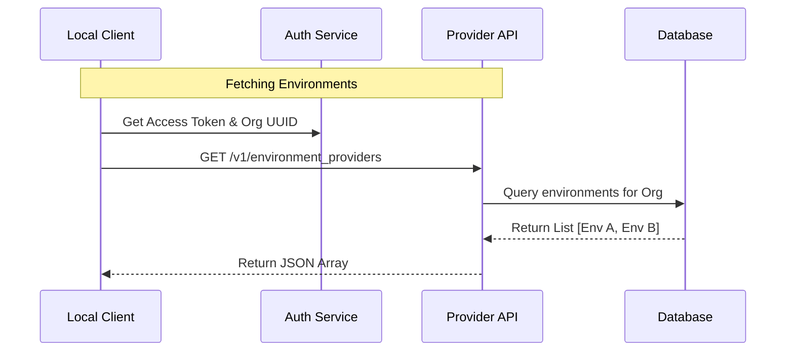

# Chapter 2: Execution Environments

In the previous chapter, [Remote Code Sessions](01_remote_code_sessions.md), we learned how to create a virtual meeting room where you and the AI can collaborate.

However, a meeting room is just an abstract concept. For a meeting to actually happen, that room needs to exist inside a physical building with electricity, wifi, and furniture. Similarly, for your code to run, the Session needs **Compute Infrastructure** (CPU, RAM, and Disk).

In `teleport`, we call these "buildings" **Execution Environments**.

## The Motivation: Code Needs a Home

Imagine you ask the AI: *"Analyze this 500MB CSV file."*

The Session object holds the chat history, but it doesn't have a hard drive to store that file or a CPU to process it. We need to assign the Session to a specific machine.

### The Use Case

We need to build a workflow that:
1.  Checks if the user has any available computers (Environments) registered.
2.  If they don't, we automatically build a new one for them in the cloud.
3.  We return the ID of the machine so the Session can boot up there.

## Key Concept: The "Building" Types

An Execution Environment is simply a container for compute resources. `teleport` supports two main types:

1.  **Anthropic Cloud (`anthropic_cloud`):** Think of this like a hotel room. It is fully managed, comes with Python and Node.js pre-installed, and is ready to use immediately.
2.  **Bring-Your-Own-Compute (`byoc`):** Think of this like your own house. You provide the server (a Docker container or a remote Linux machine), and `teleport` connects to it.

## How to Manage Environments

Let's write the code to find a place for our work to happen.

### 1. Listing Available Environments

First, we check what infrastructure is already available to us using `fetchEnvironments`.

```typescript
import { fetchEnvironments } from './environments.js';

try {
  // 1. Get the list from the API
  const myEnvironments = await fetchEnvironments();

  // 2. Log what we found
  console.log(`Found ${myEnvironments.length} environments.`);
  if (myEnvironments.length > 0) {
    console.log(`First one: ${myEnvironments[0].name} (${myEnvironments[0].kind})`);
  }
} catch (err) {
  console.error("Could not fetch environments:", err);
}
```

**Explanation:**
This function communicates with the backend to retrieve a list of `EnvironmentResource` objects. Each object tells you the `kind` (cloud or byoc) and its current `state`.

### 2. Creating a New Cloud Environment

If the list comes back empty, the user has nowhere to run code. We need to provision a new "building" for them. We use `createDefaultCloudEnvironment`.

```typescript
import { createDefaultCloudEnvironment } from './environments.js';

// If we have no environments, create a default one
const envName = "My Default Cloud Box";

console.log("Provisioning new cloud environment...");
const newEnv = await createDefaultCloudEnvironment(envName);

console.log(`Created! ID: ${newEnv.environment_id}`);
console.log(`State: ${newEnv.state}`); // usually 'active'
```

**Explanation:**
This sends a request to the `anthropic_cloud` provider. It spins up a standardized Linux container with common tools (Python 3.11, Node 20) pre-installed. It returns the environment details immediately.

## Under the Hood: How it Works

When you ask for environments, `teleport` acts as a broker between your local machine and the cloud infrastructure.

### The Flow

1.  **Authentication:** The system checks your OAuth token (from your login) and Organization ID.
2.  **Provider Request:** It asks the `environment_providers` service for a list of resources owned by your organization.
3.  **Filtering:** It returns a list containing both your Cloud instances and any BYOC servers you've connected.



### Implementation Deep Dive

Let's look into `environments.ts` to see how the request is constructed.

#### Authenticated Requests
We can't just let anyone query infrastructure. The request must include specific headers.

```typescript
// environments.ts
const accessToken = getClaudeAIOAuthTokens()?.accessToken
const orgUUID = await getOrganizationUUID()

// We must attach these headers to prove who we are
const headers = {
  ...getOAuthHeaders(accessToken),
  'x-organization-uuid': orgUUID,
}
```

**Explanation:**
Before making the network call, we gather the user's `accessToken` and their `orgUUID`. If these are missing, the function throws an error immediately, preventing unauthorized access.

#### The Data Structure
The API returns an array of `EnvironmentResource` objects. This is the blueprint of our "building."

```typescript
// environments.ts
export type EnvironmentResource = {
  kind: 'anthropic_cloud' | 'byoc' | 'bridge'
  environment_id: string
  name: string
  created_at: string
  state: 'active' // It must be active to accept a Session
}
```

**Explanation:**
The `environment_id` is the crucial piece of data here. In the next stages of our application, when we want to start a Session, we will pass this ID to tell the Session *where* to live.

## Smart Selection

In a real application, you might have five different environments. How do you pick which one to use?

The file `environmentSelection.ts` contains logic to handle this automatically:

```typescript
// environmentSelection.ts (simplified logic)
export async function getEnvironmentSelectionInfo() {
  const environments = await fetchEnvironments();
  
  // 1. Default Strategy: Pick the first available non-bridge env
  let selected = environments.find(e => e.kind !== 'bridge');

  // 2. Override Strategy: Check user settings
  const settings = getSettings_DEPRECATED();
  if (settings?.remote?.defaultEnvironmentId) {
     // If user specifically asked for Env X, try to find it
     selected = environments.find(e => e.id === settings.defaultId) || selected;
  }
  
  return { selectedEnvironment: selected };
}
```

**Explanation:**
This helper function abstracts the decision-making. It prioritizes user settings (did you set a default?) but falls back gracefully to "just pick the first working one" if no preference is set.

## Summary

In this chapter, we learned:
*   **Execution Environments** are the compute infrastructure (CPU/RAM) where code runs.
*   We use `fetchEnvironments` to see what computers we have access to.
*   We use `createDefaultCloudEnvironment` to spin up a managed cloud instance if we don't have one.

Now that we have a **Session** (the meeting room) and an **Environment** (the building), we need to formalize exactly how the system decides which building to pick when things get complex.

[Next Chapter: Environment Selection Strategy](03_environment_selection_strategy.md)

---

Generated by [Code IQ](https://github.com/adityasoni99/Code-IQ)