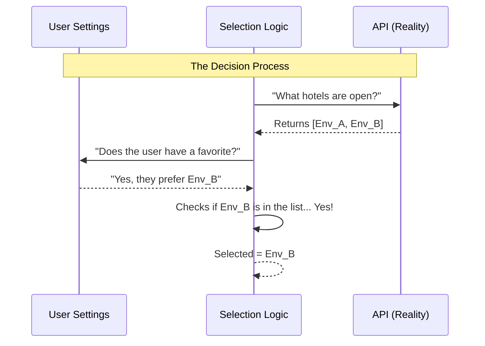

# Chapter 3: Environment Selection Strategy

In the previous chapter, [Execution Environments](02_execution_environments.md), we learned that code needs a physical place to run—a "building" with CPU and memory.

But what happens if you have *two* buildings? Or five? How does `teleport` know which one you want to use for your new session?

This chapter introduces the **Environment Selection Strategy**.

## The Motivation: The "Travel Agent" Problem

Imagine you are planning a trip. You have:
1.  A list of all available hotels in the city (provided by the API).
2.  A sticky note on your desk where you wrote down your favorite hotel ID.

You need a smart "Travel Agent" logic that looks at the list of open hotels, checks your sticky note, and books the correct room.

### The Use Case

Without this strategy, `teleport` might randomly pick a server you didn't intend to use. We need a system that:
1.  **Queries** what is available.
2.  **Checks** your configuration (Global config, Local project config, or Command-line flags).
3.  **Decides** on the single best environment for your session.

## Key Concepts

The selection strategy relies on three pieces of data working together.

### 1. Available Environments
This is the raw list from the API. It represents reality. If a server is down or deleted, it won't be on this list.

### 2. The Default Environment ID
This is your preference. You might have set this in your settings file (`.teleportrc`) to say: *"Always try to use the environment named 'My Super Computer' first."*

### 3. Setting Sources
Not all preferences are equal.
*   **Flags:** (Highest priority) You typed `--env=123` in the terminal.
*   **Local Config:** A setting in the specific project folder.
*   **Global Config:** (Lowest priority) A setting for your whole user profile.

## How to Use the Strategy

In `teleport`, you don't typically "set" the strategy manually; it runs automatically when you start a session. However, understanding the output of this logic is crucial for debugging.

We use the function `getEnvironmentSelectionInfo` to see the brain of the Travel Agent at work.

### 1. Getting the Selection Data

```typescript
import { getEnvironmentSelectionInfo } from './environmentSelection.js';

// Ask the logic to make a decision
const selectionInfo = await getEnvironmentSelectionInfo();

// What did it decide?
if (selectionInfo.selectedEnvironment) {
  console.log(`Selected: ${selectionInfo.selectedEnvironment.name}`);
}
```

**Explanation:**
This function does all the heavy lifting. It fetches the list of environments and applies the logic to pick one. It returns an object containing the result.

### 2. Checking the Source

Sometimes you want to know *why* a specific environment was picked. Was it a default? Or did a config file force it?

```typescript
// Check where the decision came from
const source = selectionInfo.selectedEnvironmentSource;

if (source) {
  console.log(`Choice based on setting from: ${source}`);
} else {
  console.log("Using default fallback (first available).");
}
```

**Explanation:**
If `selectedEnvironmentSource` is `null`, it means the Travel Agent didn't find any specific instructions from you, so it just picked the first available hotel (the default fallback).

## Under the Hood: How it Works

Let's look at the decision-making process. The system acts as a matchmaker between the API's reality and your configuration's desires.

### The Flow

1.  **Fetch:** Get the list of real, active environments from the Cloud.
2.  **Load:** Read user settings to see if there is a `defaultEnvironmentId`.
3.  **Match:** If a preference exists, try to find it in the real list.
4.  **Fallback:** If the preference is missing (or that server is down), pick the first valid cloud environment.



### Implementation Deep Dive

Let's explore `environmentSelection.ts`. This file handles the logic of prioritizing your requests.

#### Step 1: Fetch and Fallback
First, we get the list. We also set a "safe default." If nothing else works, we will just use the first one on the list.

```typescript
// environmentSelection.ts
export async function getEnvironmentSelectionInfo() {
  const environments = await fetchEnvironments()

  // Default Strategy: Pick the first one (that isn't a bridge)
  let selectedEnvironment = environments
    .find(env => env.kind !== 'bridge') ?? environments[0]
    
  // ... continued below
```

**Explanation:**
We treat the `bridge` kind differently (it's a special local connection), so we try to avoid picking it automatically unless it's the only thing available. `selectedEnvironment` is now our "Plan B."

#### Step 2: Applying User Preferences
Now we check if the user has a "Plan A."

```typescript
  // Get settings to see if user has a preference
  const settings = getSettings_DEPRECATED()
  const preferredId = settings?.remote?.defaultEnvironmentId

  // If the user has a favorite, try to find it
  if (preferredId) {
    const match = environments.find(e => e.environment_id === preferredId)
    
    // If the favorite exists in reality, update our selection!
    if (match) {
      selectedEnvironment = match
    }
  }
```

**Explanation:**
This is the core logic. We look for a `preferredId`. Crucially, **we verify it against the API list**. Even if your config says "Use Server X," if Server X is deleted or offline (not in `environments`), the code ignores the setting and sticks to the "Plan B" fallback. This prevents the tool from crashing due to outdated config files.

#### Step 3: Identifying the Source (Advanced)
Finally, we want to know *which* config file controlled this decision. Was it the global file or the local project file?

```typescript
    // Iterate through sources (Global, Local, etc.)
    for (let i = SETTING_SOURCES.length - 1; i >= 0; i--) {
      const source = SETTING_SOURCES[i]
      const sourceSettings = getSettingsForSource(source)
      
      // If this source contains our ID, it is the winner
      if (sourceSettings?.remote?.defaultEnvironmentId === preferredId) {
        selectedEnvironmentSource = source
        break // Stop looking, we found the highest priority source
      }
    }
```

**Explanation:**
The code loops through setting sources in priority order. It identifies exactly which configuration file provided the `defaultEnvironmentId`. This is very helpful when a user asks, "Why is it connecting to the wrong server?" You can tell them exactly which file to edit.

## Summary

In this chapter, we learned:
*   **Environment Selection** is the logic that connects your preferences (Settings) with reality (API).
*   It acts like a **Travel Agent**, ensuring your specific requests are honored if possible, but providing a safe fallback if not.
*   We use `getEnvironmentSelectionInfo` to calculate exactly where the session will launch.

Now we have a **Session** (Chapter 1), an **Environment** (Chapter 2), and we've selected the correct one (Chapter 3).

We are ready to start coding! But wait—your code is on your laptop, and the environment is in the cloud. How do we get your files up there?

[Next Chapter: State Synchronization (Git Bundling)](04_state_synchronization__git_bundling_.md)

---

Generated by [Code IQ](https://github.com/adityasoni99/Code-IQ)