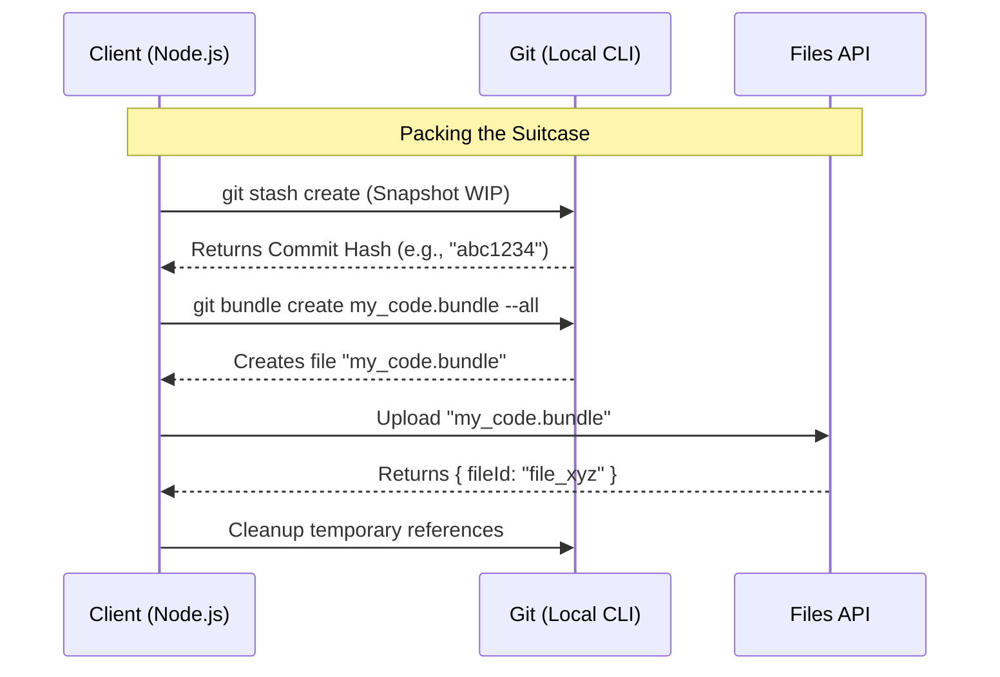

# Chapter 4: State Synchronization (Git Bundling)

In the previous chapter, [Environment Selection Strategy](03_environment_selection_strategy.md), we successfully identified the perfect "building" (server) to run our code.

But there is a problem: the building is empty. Your code is still on your local laptop.

To make the Remote Code Session work, we need to teleport your files to the cloud. You might think, *"Why not just use `git pull` on the server?"* The answer is that you often have **uncommitted work**—messy, half-written code that you haven't pushed to GitHub yet. The AI needs to see that too!

This chapter introduces **State Synchronization**, specifically using a technique called **Git Bundling**.

## The Motivation: The "Suitcase" Problem

Imagine you are going on a trip. You need to pack two types of things:
1.  **Folded Clothes:** These are your committed changes. They are neat, organized, and saved in Git history.
2.  **The Messy Pile:** These are the clothes currently on your chair. This is your "Work In Progress" (WIP)—files you are currently editing but haven't saved to history yet.

If you only send the "Folded Clothes" (via standard Git), the AI won't see the bug you are currently trying to fix.

### The Solution

`teleport` uses `git bundle` to act as a suitcase. It stuffs both the folded clothes (commits) and the messy pile (stashed WIP) into a single file called a **bundle**. We upload this suitcase to the server, and the server unpacks it, recreating your exact setup.

## Key Concept: What is a Git Bundle?

A **Git Bundle** is a single file (like a `.zip`) that contains Git objects (commits, tags, branches).

Normally, Git sends data over a network connection (like SSH or HTTPS). However, `git bundle` allows Git to treat a *file* as if it were a remote repository. This allows us to "push" your code into a file, upload that file, and then "pull" from that file on the other side.

## How to Use It

We use the function `createAndUploadGitBundle` to perform this magic. It handles the packing and the uploading in one go.

### 1. Packing and Uploading

```typescript
import { createAndUploadGitBundle } from './gitBundle.js';

// 1. Run the bundler
console.log("Packing your code suitcase...");
const result = await createAndUploadGitBundle(filesApiConfig);

// 2. Check the result
if (result.success) {
  console.log(`Success! Bundle ID: ${result.fileId}`);
  console.log(`Suitcase size: ${result.bundleSizeBytes} bytes`);
}
```

**Explanation:**
This function scans your current folder. It looks for a `.git` folder, packs up your history, and crucially, grabs your uncommitted changes. It returns a `fileId` (e.g., `file_123...`).

You will hand this `fileId` to the Session later, effectively saying: *"Here is the key to my luggage."*

### 2. Handling the "Messy Pile" (WIP)

You don't need to do anything special. The function automatically detects if you have modified files.

```typescript
if (result.hasWip) {
  console.log("Note: Your uncommitted changes were included!");
}
```

**Explanation:**
The system uses a boolean flag `hasWip` to let you know that it successfully grabbed your work-in-progress files.

## Under the Hood: How it Works

This is one of the most sophisticated parts of `teleport`. It has to be careful not to break your local Git repository while reading from it.

### The Flow

1.  **Stash:** We take a snapshot of your uncommitted files using `git stash create`. This creates a floating commit without actually changing your files.
2.  **Pack:** We run `git bundle create` to pack that snapshot + your history into a file.
3.  **Upload:** We send that file to the API.
4.  **Cleanup:** We delete the temporary references so your Git history stays clean.



### Implementation Deep Dive

Let's look at `gitBundle.ts` to see how it handles the "Suitcase Packing Strategy."

#### 1. Capturing the Messy Pile
We don't want to run `git stash push` because that would actually hide your files from your editor. Instead, we use `git stash create`.

```typescript
// gitBundle.ts

// Create a dangling commit object of current changes
const stashResult = await execFileNoThrowWithCwd(
  gitExe(), 
  ['stash', 'create'], 
  { cwd: gitRoot }
);

// If successful, we get a hash (SHA) back
const wipStashSha = stashResult.stdout.trim();
```

**Explanation:**
`git stash create` is a plumbing command. It makes a commit object of your changes but **does not** touch your working directory or HEAD. It returns the ID of that commit, which we save.

#### 2. The Packing Strategy (Fallback Logic)
Sometimes, a repository is too huge (gigabytes of data) to pack into one suitcase. `teleport` tries three different suitcase sizes:

1.  **`--all`**: Try to pack every branch and tag.
2.  **`HEAD`**: If `--all` is too big, just pack the current branch.
3.  **`Squashed`**: If `HEAD` is still too big, flatten the history into one single commit (no history, just files).

```typescript
// gitBundle.ts (Simplified)

// Attempt 1: Try to bundle everything
let result = await execGit(['bundle', 'create', bundlePath, '--all']);

// If too big, try Attempt 2: Just the current branch
if (result.size > MAX_BYTES) {
  result = await execGit(['bundle', 'create', bundlePath, 'HEAD']);
}

// If still too big, try Attempt 3: Squash history
if (result.size > MAX_BYTES) {
  // Create a new single commit with no parents
  await execGit(['commit-tree', 'HEAD^{tree}', '-m', 'seed']);
  // Bundle that single commit
}
```

**Explanation:**
This ensures that the upload succeeds even on large repositories. The remote AI usually doesn't need 5 years of history—it just needs the current files to run the code.

#### 3. Uploading
Once the bundle file exists on your disk, we upload it using the `uploadFile` helper.

```typescript
// gitBundle.ts
const upload = await uploadFile(
  bundlePath, 
  '_source_seed.bundle', 
  config
);

return { 
  success: true, 
  fileId: upload.fileId // This is what we need!
};
```

## Summary

In this chapter, we learned:
*   **Git Bundling** creates a portable snapshot of your repository.
*   It solves the problem of syncing **uncommitted changes** (WIP) to the remote server.
*   We use `createAndUploadGitBundle` to generate a `fileId`.
*   The system is smart enough to shrink the bundle (by dropping history) if the repository is too large.

We have now prepared the **Session** (Room), the **Environment** (Building), and the **Bundle** (Suitcase).

We are finally ready to connect everything and start talking to the AI.

[Next Chapter: API Communication Layer](05_api_communication_layer.md)

---

Generated by [Code IQ](https://github.com/adityasoni99/Code-IQ)