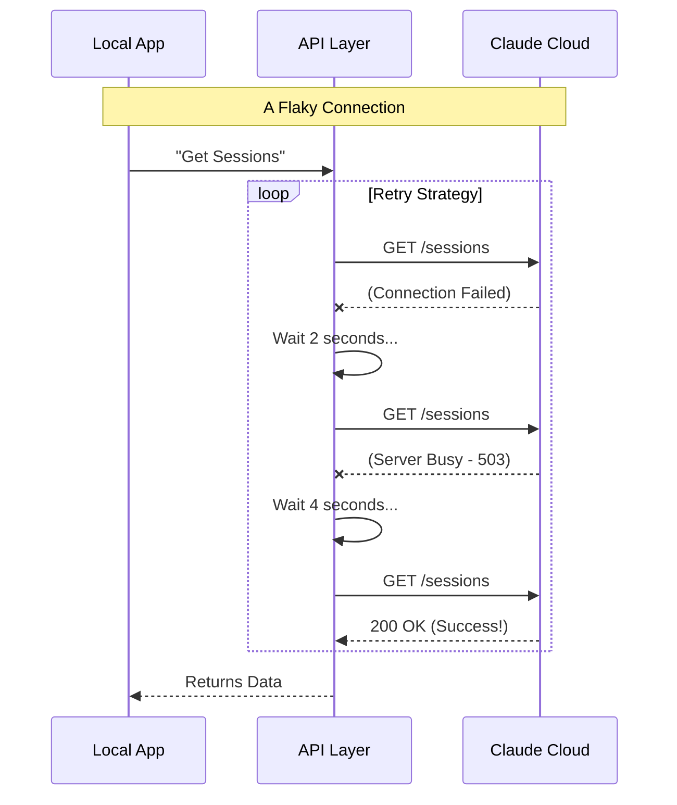

# Chapter 5: API Communication Layer

Welcome to the final chapter of our specific deep dive into the `teleport` architecture!

In the previous chapter, [State Synchronization (Git Bundling)](04_state_synchronization__git_bundling_.md), we learned how to pack your code into a "suitcase" (Git Bundle) so it can be sent to the cloud.

Now, we need to actually drive that truck. We need a way to send commands, upload files, and check status updates over the internet.

You might think, *"Can't we just use a standard HTTP request?"*

In a perfect world, yes. But the internet is messy. Wifi drops, servers get overloaded, and connections time out. This chapter introduces the **API Communication Layer**, the resilient courier that ensures your messages get delivered, no matter how bumpy the road is.

## The Motivation: The Persistent Courier

Imagine you send a courier to deliver a package to a warehouse.
1.  **Scenario A (Standard HTTP):** The courier knocks once. Nobody answers immediately. The courier drops the package in the mud and leaves. **Result: Application Crash.**
2.  **Scenario B (Teleport Layer):** The courier knocks. Nobody answers. The courier waits 2 seconds. Knocks again. Still nothing. Waits 4 seconds. Knocks again. Someone opens the door! **Result: Success.**

### The Use Case

We want to fetch the list of active coding sessions.
*   **Challenge:** The user is on a spotty coffee shop Wifi.
*   **Goal:** The app shouldn't crash just because one packet was lost. It should silently retry until it connects or definitely fails.

## Key Concept: Exponential Backoff

This layer implements a strategy called **Exponential Backoff**. This is a fancy term for "waiting longer and longer between tries."

If the server is struggling, hammering it with retries every 0.1 seconds will only make it worse. Instead, we wait:
*   Attempt 1: Fail.
*   Wait **2 seconds**.
*   Attempt 2: Fail.
*   Wait **4 seconds**.
*   Attempt 3: Fail.
*   Wait **8 seconds**.

This gives the server "breathing room" to recover.

## How to Use the API Layer

As a developer using `teleport`, you rarely see the retry logic directly. You simply call the helper functions, and they handle the struggle for you.

Let's look at `fetchCodeSessionsFromSessionsAPI`.

### 1. Making a Resilient Call

```typescript
import { fetchCodeSessionsFromSessionsAPI } from './api.js';

console.log("Contacting the Mothership...");

try {
  // This might take a few seconds if the network is bad
  // but it won't crash immediately!
  const sessions = await fetchCodeSessionsFromSessionsAPI();
  
  console.log(`Success! Found ${sessions.length} sessions.`);
} catch (error) {
  console.error("Okay, the internet is truly broken:", error);
}
```

**Explanation:**
You call the function normally. Behind the scenes, `teleport` is doing the heavy lifting—authenticating, adding headers, and retrying if necessary. You only get an error if it fails *after* exhausting all attempts.

## Under the Hood: How it Works

Let's visualize the lifecycle of a single request through this layer.

### The Flow

1.  **Stamping:** The layer attaches your "Passports" (OAuth Token and Organization ID).
2.  **Sending:** It tries to talk to the server.
3.  **Judgement:** If an error occurs, it decides: *"Is this a permanent error (404 Not Found) or a temporary glitch (500 Server Error)?"*
4.  **Retry:** If it's a glitch, it sleeps (pauses) and loops back to Step 2.



### Implementation Deep Dive

Let's look at `api.ts` to see how this resilience is coded.

#### 1. The Retry Loop (`axiosGetWithRetry`)

This is the heart of the communication layer. It wraps the standard `axios` library.

```typescript
// api.ts
export async function axiosGetWithRetry<T>(url: string, config?: AxiosRequestConfig) {
  // Try up to MAX_TELEPORT_RETRIES (usually 4)
  for (let attempt = 0; attempt <= MAX_TELEPORT_RETRIES; attempt++) {
    try {
      // 1. Attempt the request
      return await axios.get<T>(url, config)
    } catch (error) {
      // 2. If it fails, check if we should give up
      if (!isTransientNetworkError(error)) throw error;
      
      // 3. If we are out of retries, throw the error
      if (attempt >= MAX_TELEPORT_RETRIES) throw error;

      // 4. Wait (2s, 4s, 8s...)
      const delay = TELEPORT_RETRY_DELAYS[attempt];
      await sleep(delay);
    }
  }
}
```

**Explanation:**
This loop ensures that transient errors don't kill your process. The `sleep` function pauses execution, preventing the code from spamming the server.

#### 2. Identifying "Transient" Errors

Not all errors should be retried. If you ask for a page that doesn't exist (404), retrying 5 times won't make it exist.

```typescript
// api.ts
export function isTransientNetworkError(error: unknown): boolean {
  if (!axios.isAxiosError(error)) return false;

  // No response? (Internet down) -> RETRY
  if (!error.response) return true;

  // Server Error (500, 502, 503)? -> RETRY
  if (error.response.status >= 500) return true;

  // Client Error (400, 401, 404)? -> DO NOT RETRY
  return false;
}
```

**Explanation:**
This logic saves time. It distinguishes between "The server is confused/down" (retry) and "You made a mistake" (don't retry).

#### 3. Authentication Headers

Every request acts as a secure handshake. We can't just send data; we must prove who we are.

```typescript
// api.ts
export async function prepareApiRequest() {
  const accessToken = getClaudeAIOAuthTokens()?.accessToken;
  const orgUUID = await getOrganizationUUID();

  // If we don't have these, we can't talk to the API
  if (!accessToken || !orgUUID) {
    throw new Error('Authentication required');
  }

  return { accessToken, orgUUID };
}
```

**Explanation:**
Before the retry loop even starts, we gather the credentials. This ensures we don't waste time retrying a request that is guaranteed to fail due to lack of permission.

## Summary

In this final chapter, we learned:
*   **The API Communication Layer** acts as a protective shell around network requests.
*   **Exponential Backoff** is a strategy of waiting longer between failures to let the network recover.
*   **Transient vs. Permanent Errors:** We only retry when it makes sense (network blips), not when the user makes a bad request.

### Conclusion of the Series

Congratulations! You have navigated the entire architecture of `teleport`.

1.  We created a **Remote Code Session** (The Meeting Room).
2.  We provisioned an **Execution Environment** (The Building).
3.  We used **Selection Strategy** to pick the right building.
4.  We packed our code into a **Git Bundle** (The Suitcase).
5.  And finally, we delivered it all via a **Resilient API Layer** (The Courier).

With these five pillars, `teleport` enables a seamless bridge between your local development environment and the limitless power of cloud AI. Happy coding!

---

Generated by [Code IQ](https://github.com/adityasoni99/Code-IQ)