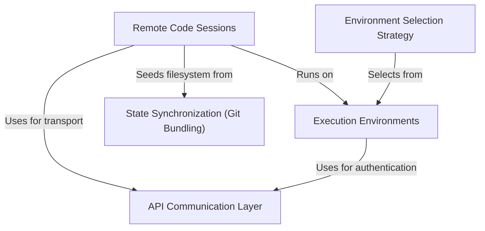

# Tutorial: teleport

This project enables **remote code execution** by establishing persistent *Sessions* where an AI agent can safely read and write code. It orchestrates the lifecycle of these sessions across different *Execution Environments* (such as managed cloud instances), ensuring the remote workspace perfectly mirrors the local codebase by **synchronizing state** via git bundles and managing network interactions through a resilient API layer.

## Chapters

1. [Remote Code Sessions](01_remote_code_sessions.md)
2. [Execution Environments](02_execution_environments.md)
3. [Environment Selection Strategy](03_environment_selection_strategy.md)
4. [State Synchronization (Git Bundling)](04_state_synchronization__git_bundling_.md)
5. [API Communication Layer](05_api_communication_layer.md)

---

Generated by [Code IQ](https://github.com/adityasoni99/Code-IQ)