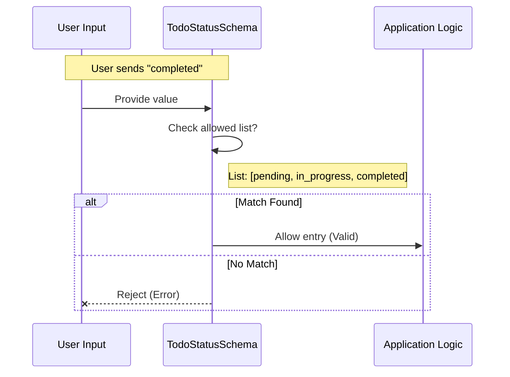

# Chapter 1: Task Lifecycle State

Welcome to the **Todo** project! If you've ever written a checklist on a sticky note, you know that a task usually changes over time. It starts as something you *need* to do, then you *start* doing it, and finally, it's *done*.

In this chapter, we will build the foundation of our application by defining exactly what "states" a task can be in.

## Motivation: The Traffic Light System

Imagine driving a car. You rely on traffic lights to know what to do. A traffic light works because it follows strict rules:
*   **Red**: Stop.
*   **Yellow**: Caution.
*   **Green**: Go.

If a traffic light suddenly turned **Purple**, you wouldn't know what to do! It would cause chaos.

In software, we have the same problem. If we let users type *anything* as the status of a task, we might get:
*   "Done"
*   "Finished"
*   "Dun"
*   "Did it"

This makes it impossible for our code to know which tasks are actually complete. We need a "Traffic Light System" for our Todo app to ensure every task is in a known, valid state.

## The Concept: `TodoStatusSchema`

To solve this, we use a concept called **Task Lifecycle State**. We define a strict list of allowed options. In our project, a task can only be in one of these three phases:

1.  `pending`: The task is on the list but hasn't been started.
2.  `in_progress`: You are working on it right now.
3.  `completed`: The task is finished.

We enforce this using a tool called **Zod** (which helps us create "schemas" or blueprints for data). Specifically, we use a function called `z.enum`.

### Use Case: Defining the Rules

Let's look at how we define these rules in our code. We want to create a "bouncer" that only lets specific words in.

```typescript
import { z } from 'zod/v4'
import { lazySchema } from '../lazySchema.js'

// We define our "Traffic Light" colors here
const TodoStatusSchema = lazySchema(() =>
  z.enum(['pending', 'in_progress', 'completed']),
)
```

**Explanation:**
*   `z.enum([...])`: Think of this as a multiple-choice question. It tells the system, "The value MUST be one of these strings."
*   The list `['pending', 'in_progress', 'completed']` contains our allowed states.
*   `lazySchema`: This is a helper wrapper. We will explore exactly why we need it in [Lazy Evaluation Pattern](05_lazy_evaluation_pattern.md), but for now, just know it helps organize our definitions.

## How to Use It

Now that we have our rule (`TodoStatusSchema`), how does it help us? It acts as a validator. It checks data before our application tries to process it.

### Example 1: Valid Data
If we send a correct status to the schema, it accepts it.

```typescript
// Input: A valid status string
const input = 'pending';

// We ask the schema: "Is this valid?"
const result = TodoStatusSchema().parse(input);

console.log(result); 
// Output: 'pending'
```

### Example 2: Invalid Data
If we send a "Purple Traffic Light" (invalid data), the schema rejects it immediately.

```typescript
// Input: A typo or made-up status
const input = 'finished'; // We only allow 'completed'

try {
  TodoStatusSchema().parse(input);
} catch (error) {
  console.log("Error: Invalid input!");
}
// Output: Error: Invalid input!
```

By doing this, we ensure that deep inside our application, we never have to wonder if a task status is valid. We *know* it is.

## Under the Hood: Implementation

What actually happens when we call `TodoStatusSchema`? Let's visualize the flow.

Imagine the `TodoStatusSchema` is a gatekeeper guarding the entrance to a club.



### Deep Dive into `types.ts`

Let's look at the actual source code in `types.ts` to see how this fits into the larger picture.

The status schema doesn't live alone; it is usually part of a larger object, like a whole Todo Item.

```typescript
// types.ts (Excerpt)

export const TodoItemSchema = lazySchema(() =>
  z.object({
    // ... other fields ...
    status: TodoStatusSchema(), // Using our status rule here!
    // ... other fields ...
  }),
)
```

**Explanation:**
1.  **Reusability**: We defined `TodoStatusSchema` once, and now we plug it into `TodoItemSchema`. This keeps our code clean.
2.  **Composition**: `z.object` creates a blueprint for an object (like a dictionary or hash map). By setting the `status` field to use `TodoStatusSchema()`, we enforce that the status field *inside* a Todo Item must follow the traffic light rules.

You will learn more about the full item definition in [Todo Entity Definition](03_todo_entity_definition.md).

## Summary

In this chapter, we learned:
1.  **Task Lifecycle State**: Tasks need strict stages to prevent logic errors.
2.  **The Traffic Light Analogy**: Just as lights can't be purple, tasks can't have random status text.
3.  **`z.enum`**: The code tool we use to enforce a specific list of allowed values (`pending`, `in_progress`, `completed`).

By strictly defining these states now, we prevent bugs later. We never have to write code that says `if (status === 'Done' || status === 'done' || status === 'finished')`. We simply check for `completed`.

In the next chapter, we will see how to actually run these checks against real data coming into our system.

[Next Chapter: Runtime Schema Validation](02_runtime_schema_validation.md)

---

Generated by [Code IQ](https://github.com/adityasoni99/Code-IQ)