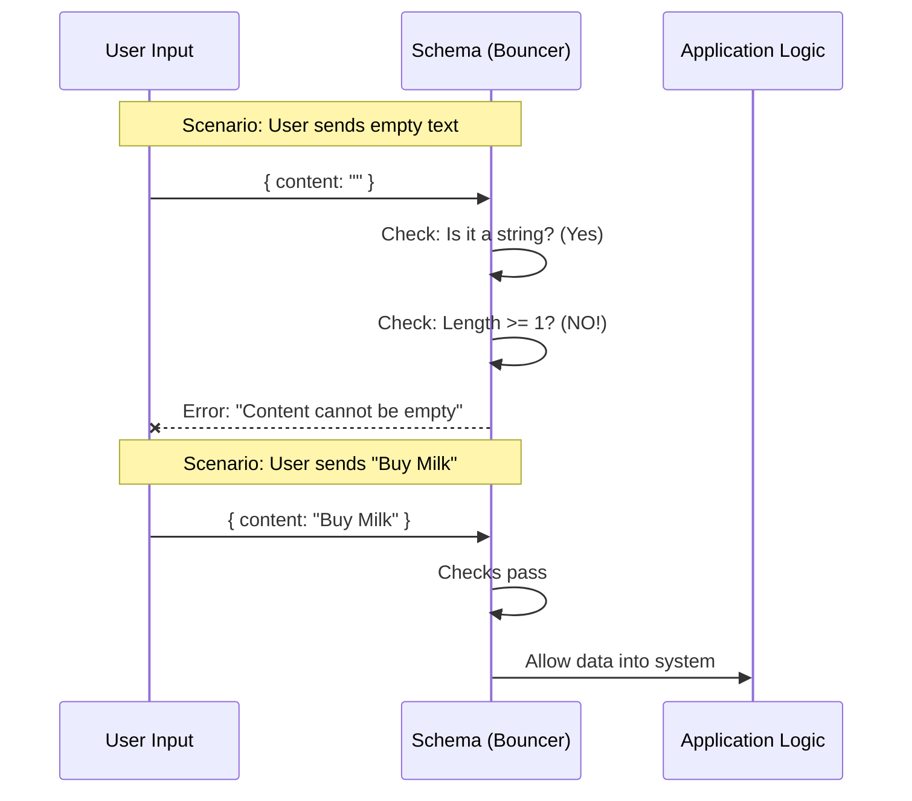

# Chapter 2: Runtime Schema Validation

Welcome back! In the previous chapter, [Task Lifecycle State](01_task_lifecycle_state.md), we defined the "Traffic Light" rules for our tasks—deciding that a task can only be `pending`, `in_progress`, or `completed`.

Now, we need to enforce those rules.

## Motivation: The Club Bouncer

Imagine your application is an exclusive club. The code inside your application (the database, the logic) is the VIP area. You don't want just *any* data walking in there. You don't want empty text, weird numbers, or invalid statuses.

If "bad" data gets into the VIP area, your app might crash or behave strangely.

To prevent this, we hire a **Bouncer**. In our project, this bouncer is a concept called **Runtime Schema Validation**. It stands at the door and checks every piece of data against a strict checklist before letting it in.

### The Use Case

Let's say a user tries to add a new Todo item, but they accidentally hit "Enter" without typing anything.
*   **Without Validation:** We get an empty task in our list. It looks like a bug.
*   **With Validation:** The Bouncer sees the text is empty, stops it immediately, and tells the user to fix it.

## The Tool: Zod Objects

To build this bouncer, we use the Zod library to create a **Schema**. A Schema is just a fancy word for "The Checklist."

We need to validate an entire "Todo Item," which is an object containing text and a status.

### Step 1: Defining the Checklist
Here is how we tell Zod what a valid Todo Item looks like.

```typescript
// types.ts
import { z } from 'zod/v4'
import { lazySchema } from '../lazySchema.js'

export const TodoItemSchema = lazySchema(() =>
  z.object({
    content: z.string().min(1, 'Content cannot be empty'),
    // ... other rules
  }),
)
```

**Explanation:**
1.  `z.object({...})`: This says, "I am expecting a Javascript Object (a group of related data)."
2.  `content`: This is the specific field we are checking (the text of the task).
3.  `z.string()`: The data *must* be text (not a number, not a date).
4.  `.min(1)`: The text must have at least 1 character. If it's empty, reject it!

## How to Use It

Once we have our Schema (the Bouncer), we can ask it to check data for us using the `.parse()` command.

### Scenario A: Good Data
The user types "Buy Milk".

```typescript
const input = { content: "Buy Milk" };

// Ask the Bouncer to check the input
const safeData = TodoItemSchema().parse(input);

console.log("Success!");
// Output: Success!
```

### Scenario B: Bad Data
The user types nothing (empty string).

```typescript
const input = { content: "" }; // Too short!

try {
  TodoItemSchema().parse(input);
} catch (error) {
  console.log("Bouncer rejected it!");
}
// Output: Bouncer rejected it!
```

The application logic *never* touches the bad data. It is stopped at the door.

## Under the Hood: The Flow

What happens internally when we run that `.parse()` command? Let's visualize the Bouncer at work.



## Implementation Deep Dive

Let's look at the actual code in `types.ts`. You'll notice we combine the rules we learned in [Task Lifecycle State](01_task_lifecycle_state.md) with our new text rules.

We use `lazySchema` here to help with circular dependencies (a concept we will clarify in [Lazy Evaluation Pattern](05_lazy_evaluation_pattern.md)), but the core logic is inside `z.object`.

```typescript
// types.ts

export const TodoItemSchema = lazySchema(() =>
  z.object({
    content: z.string().min(1, 'Content cannot be empty'),
    status: TodoStatusSchema(), 
    activeForm: z.string().min(1, 'Active form cannot be empty'),
  }),
)
```

**Breakdown of the Code:**

1.  **`content`**: As discussed, ensures the user actually typed a task.
2.  **`status`**: Here is the connection to the previous chapter! We plug in `TodoStatusSchema()` to ensure the status is one of our "Traffic Light" colors (pending, in_progress, completed).
3.  **`activeForm`**: This is a piece of data our app uses to know which UI form is open. We enforce that it acts as a valid string ID.

You will learn more about the structure of this entire object in the next chapter, [Todo Entity Definition](03_todo_entity_definition.md).

## Summary

In this chapter, we learned:
1.  **Runtime Schema Validation**: The process of checking data while the app is running to prevent bugs.
2.  **The Bouncer Analogy**: We stop bad data at the door before it hurts our app.
3.  **`z.object` and `.min(1)`**: How to enforce that an object has the right shape and that text fields aren't empty.

Now that we have our "Traffic Lights" (Status) and our "Bouncer" (Validation), we are ready to define exactly what a "Todo Item" looks like in the final Typescript definition.

[Next Chapter: Todo Entity Definition](03_todo_entity_definition.md)

---

Generated by [Code IQ](https://github.com/adityasoni99/Code-IQ)