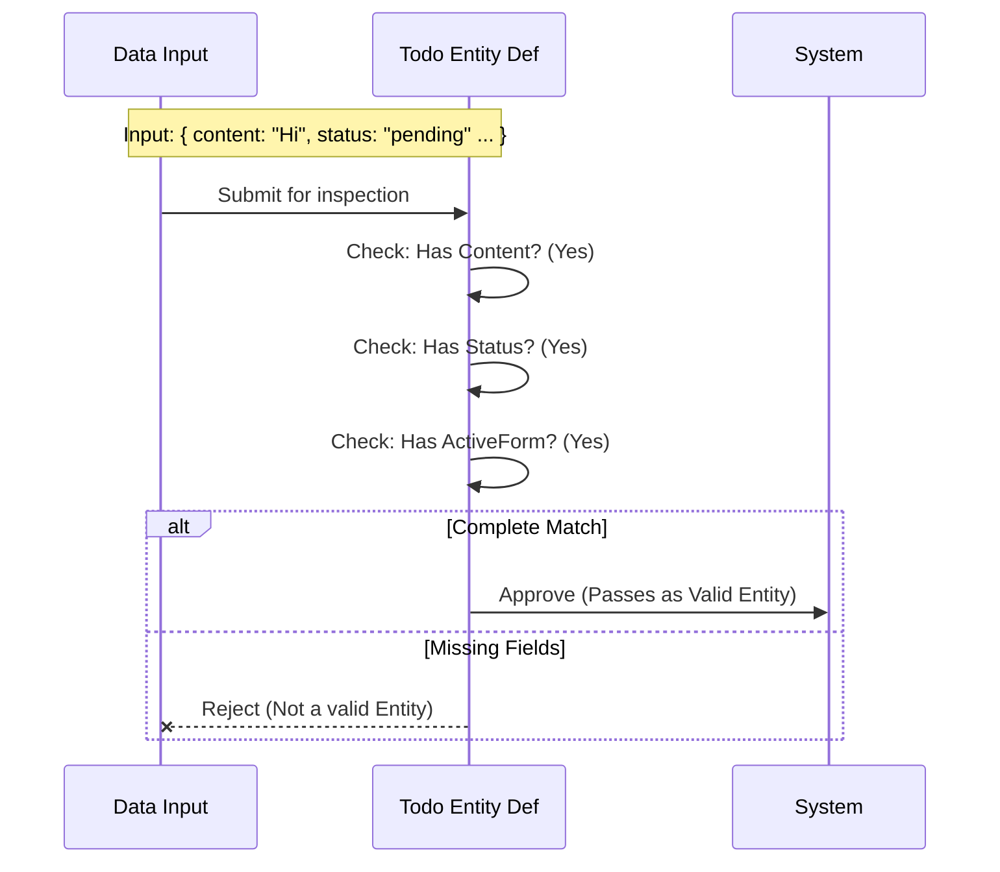

# Chapter 3: Todo Entity Definition

Welcome back!

In the previous chapter, [Runtime Schema Validation](02_runtime_schema_validation.md), we built a "Bouncer" that stops bad data (like empty text) from entering our app. Before that, in [Task Lifecycle State](01_task_lifecycle_state.md), we defined the "Traffic Light" rules for task progress.

Now, we bring these pieces together. We need to define the **Whole Package**. We need to define the **Todo Entity**.

## Motivation: The Standardized Form

Imagine a busy bureaucratic office. If you want to get anything done, you can't just scribble a request on a napkin. You must fill out a **Standardized Form**.

Why?
1.  **Consistency:** The clerk knows exactly where to look for your name.
2.  **Completeness:** You can't forget to fill in the date because there is a specific box for it.
3.  **Efficiency:** The filing system is built to hold exactly that size of paper.

In our Todo application, the "Todo Entity" is that Standardized Form. It serves as the single source of truth for what a "Task" actually is. It ensures that every part of our system—from the screen the user sees to the logic behind the scenes—speaks the exact same language.

## Use Case: Creating the Blueprint

Our goal is to create a blueprint so that every time we create a task, it looks exactly like this:

*   **Content**: What needs to be done? (e.g., "Wash the car")
*   **Status**: Is it done yet? (e.g., "pending")
*   **Active Form**: Which UI element is currently handling this? (e.g., "new-task-form")

If we didn't have this definition, one developer might name the text `content`, while another names it `title`, and the app would break.

## The Concept: `TodoItemSchema`

We define this entity using **Zod** (our schema tool). We group individual rules into one big object definition.

### The Three Pillars
Our Todo Entity is made of three specific fields.

1.  **Content (`string`)**: The actual text description.
2.  **Status (`TodoStatusSchema`)**: This reuses the logic we built in Chapter 1. It enforces `pending`, `in_progress`, or `completed`.
3.  **Active Form (`string`)**: An ID used by the user interface to know which form is currently open.

## How to Use It

When we define the entity in code, we are essentially creating a mold. Any data poured into our app must fit this mold.

### Example: A Perfect Fit
Here is what a valid Todo Entity looks like in JavaScript:

```typescript
const validTask = {
  content: "Buy groceries",
  status: "pending", 
  activeForm: "main-list"
};

console.log("This fits the blueprint!");
```

### Example: A Misfit
Here is an object that fails to be a Todo Entity. It is missing the `status` and `activeForm`.

```typescript
const invalidTask = {
  content: "Buy groceries" 
  // Missing 'status'!
  // Missing 'activeForm'!
};

// The system would reject this because 
// it doesn't match the Entity Definition.
```

## Under the Hood: The Blueprint Check

How does the system use this definition? Think of it as a quality control scanner in a factory.



## Implementation Deep Dive

Let's look at `types.ts` to see how we define this blueprint. We use `z.object` to bundle our requirements together.

We wrap this in `lazySchema` (which we will explain in [Lazy Evaluation Pattern](05_lazy_evaluation_pattern.md)), but the focus here is the object structure.

### The Code

```typescript
// types.ts
import { z } from 'zod/v4'
import { lazySchema } from '../lazySchema.js'

// We combine our rules into one object
export const TodoItemSchema = lazySchema(() =>
  z.object({
    content: z.string().min(1, 'Content cannot be empty'),
    status: TodoStatusSchema(), // Reusing Chapter 1 logic!
    activeForm: z.string().min(1, 'Active form cannot be empty'),
  }),
)
```

**Walkthrough:**
1.  **`z.object({...})`**: This creates the "Standardized Form." It dictates that the data *must* be an object with keys and values.
2.  **`content`**: We define that every task MUST have text.
3.  **`status: TodoStatusSchema()`**: This is the power of composition! Instead of rewriting the "Traffic Light" rules, we simply refer to the concept we built in [Task Lifecycle State](01_task_lifecycle_state.md).
4.  **`activeForm`**: We ensure the system tracks which form ID this task belongs to.

### Defining the Type
Once we have the Schema (the runtime checker), we usually want a TypeScript type (for coding help).

```typescript
// types.ts

// This creates a TypeScript type called "TodoItem"
// based exactly on the rules above.
export type TodoItem = z.infer<ReturnType<typeof TodoItemSchema>>
```

*Note: The magic of how `z.infer` turns our validation rules into TypeScript code is the main topic of our next chapter, [Type Inference Bridge](04_type_inference_bridge.md).*

## Summary

In this chapter, we learned:
1.  **Todo Entity Definition**: The central blueprint that defines what a "Task" is.
2.  **Standardization**: By forcing every task to have `content`, `status`, and `activeForm`, we prevent "missing data" bugs.
3.  **Composition**: We built this entity by combining basic strings with our custom `TodoStatusSchema`.

We now have a complete definition of our data. But there is a gap: We have a **Zod Schema** (for JavaScript runtime) and we have **TypeScript Code**. How do we keep them perfectly in sync without writing everything twice?

Find out in the next chapter.

[Next Chapter: Type Inference Bridge](04_type_inference_bridge.md)

---

Generated by [Code IQ](https://github.com/adityasoni99/Code-IQ)