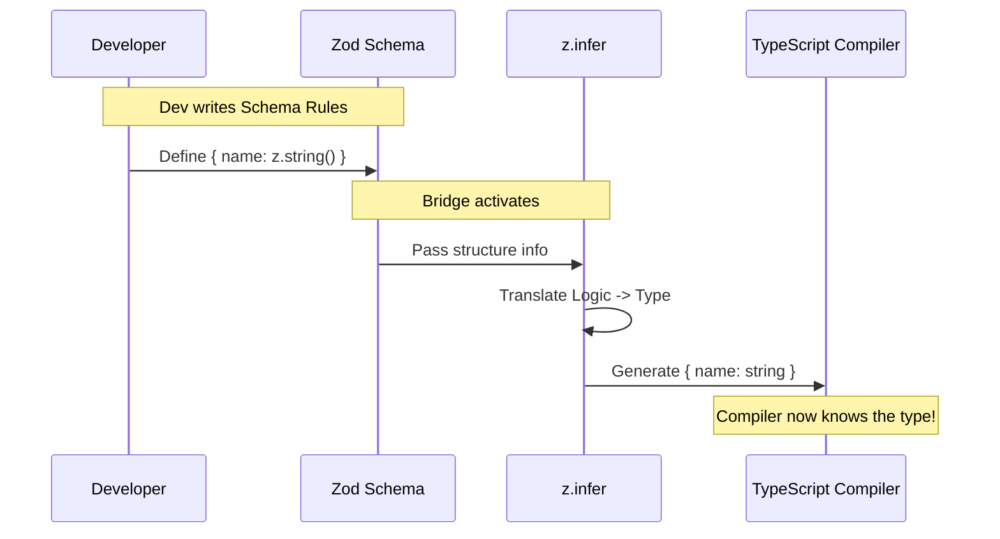

# Chapter 4: Type Inference Bridge

Welcome to Chapter 4!

In the previous chapter, [Todo Entity Definition](03_todo_entity_definition.md), we built the blueprint (Schema) for our Todo Item. We defined exactly what fields are required (`content`, `status`, `activeForm`) and what rules they must follow.

Now, we face a new challenge. We have rules for the **Runtime** (when the app runs), but we also need rules for the **Compiler** (when we write code). This usually means writing the same definition twice.

In this chapter, we will build a **Type Inference Bridge** to automate this work.

## Motivation: The "Two Notebooks" Problem

Imagine you are managing a store. You have two notebooks:
1.  **The Rulebook**: A list of rules for the security guard (e.g., "Must show ID").
2.  **The Employee Handbook**: A guide for staff on what data to expect (e.g., "Customers will have an ID").

If you change a rule in the **Rulebook**, you *must* remember to update the **Handbook**. If you forget, your staff will be confused, and mistakes will happen.

In programming:
*   **The Rulebook** is the Zod Schema (Runtime Validation).
*   **The Handbook** is the TypeScript Interface (Static Typing).

Writing them separately is dangerous. If they get out of sync, your app breaks. We need a way to write the Rulebook once and have the Handbook appear magically.

## The Concept: `z.infer`

The **Type Inference Bridge** is that magical connection.

We use a tool provided by Zod called `z.infer`. It acts as a translator. It looks at your Zod Schema (the code that runs) and automatically generates the TypeScript Type (the code that checks for errors while you type).

### Use Case: The Automatic Translator

We want to define a `TodoItem` type that TypeScript understands, but we don't want to manually type `interface TodoItem { ... }`. We want to derive it from our existing `TodoItemSchema`.

## How to Use It

Let's look at how we build this bridge. It involves a specific chain of commands.

### Step 1: The Schema (The Source)
First, recall our schema from the previous chapter. This is our "Source of Truth."

```typescript
// From Chapter 3
const TodoItemSchema = lazySchema(() =>
  z.object({
    content: z.string(),
    status: z.enum(['pending', 'completed']),
  })
)
```

### Step 2: The Bridge (The Translation)
Now, instead of writing a TypeScript interface manually, we ask Zod to do it.

```typescript
// The Bridge
import { z } from 'zod/v4'

// 1. Get the return value of our schema function
type SchemaType = ReturnType<typeof TodoItemSchema>;

// 2. Infer the TypeScript type from that schema
export type TodoItem = z.infer<SchemaType>;
```

**What just happened?**
If you hover over `TodoItem` in your code editor, TypeScript will tell you it looks like this:

```typescript
type TodoItem = {
  content: string;
  status: "pending" | "completed";
}
```

We never typed that! The bridge created it for us.

## Under the Hood: The Flow

How does the data flow from a validation rule to a static type?

Imagine the **Developer** (you) only writing in one notebook (the Schema). The **Bridge** reads that notebook and projects a hologram for the **Compiler** to read.



## Implementation Deep Dive

Let's look at the exact line in `types.ts` that handles this for our project. It looks a bit complex because we are using `lazySchema`, so let's break it down into small pieces.

```typescript
// types.ts

// The Schema (Runtime Code)
export const TodoItemSchema = lazySchema(() =>
  z.object({ /* ... rules ... */ })
)

// The Bridge (Compile-time Code)
export type TodoItem = z.infer<ReturnType<typeof TodoItemSchema>>
```

**Step-by-Step Explanation:**

1.  **`typeof TodoItemSchema`**:
    This tells TypeScript: "Look at the variable `TodoItemSchema`." Since we used a helper function, TypeScript sees this as a **Function**.

2.  **`ReturnType<...>`**:
    Since `TodoItemSchema` is a function wrapper (for lazy evaluation), we don't want the type of the *function*. We want the type of the *result* that the function produces. `ReturnType` extracts the actual Zod Object from inside the wrapper.

3.  **`z.infer<...>`**:
    This is the final step. It takes that Zod Object and converts it into a pure TypeScript type.
    *   `z.string()` becomes `string`
    *   `z.enum(...)` becomes `"pending" | "completed"`

### Why is this better?

If you decide tomorrow that `content` should actually be optional, or you add a `created_at` date:

1.  You update the **Schema** (Runtime).
2.  **That's it.**

The `TodoItem` type updates automatically. The compiler immediately knows about the new field. You have zero maintenance work to keep types in sync.

## Summary

In this chapter, we learned:
1.  **The "Two Notebooks" Problem**: Maintaining separate validation logic and type definitions leads to bugs.
2.  **The Solution**: Using `z.infer` as a **Bridge** between runtime Zod schemas and static TypeScript types.
3.  **Single Source of Truth**: We define our rules once in the Schema, and the Type follows automatically.

We now have a robust system. We have Lifecycle States, Validation, Definitions, and perfectly synced Types.

However, throughout these chapters, you might have noticed the function `lazySchema` wrapping our code. Why is that there? Why couldn't we just write `z.object` directly?

In the next chapter, we will solve the mystery of circular dependencies.

[Next Chapter: Lazy Evaluation Pattern](05_lazy_evaluation_pattern.md)

---

Generated by [Code IQ](https://github.com/adityasoni99/Code-IQ)