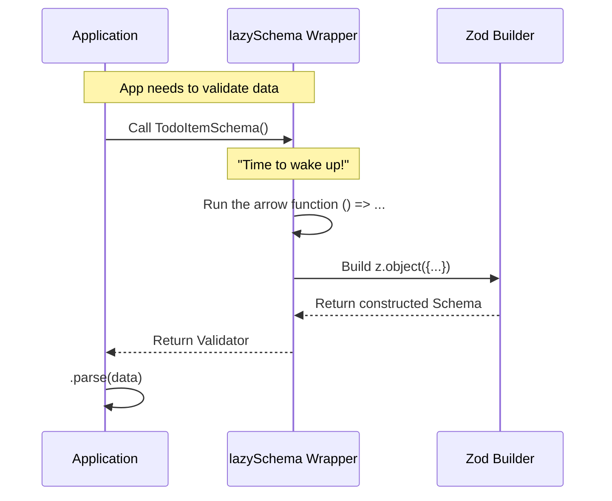

# Chapter 5: Lazy Evaluation Pattern

Welcome to the final chapter of our Todo tutorial series!

In the previous chapter, [Type Inference Bridge](04_type_inference_bridge.md), we learned how to automatically generate TypeScript types from our validation logic. Throughout that code, you might have noticed a mysterious helper function wrapping our definitions: `lazySchema`.

You might have asked: "Why can't we just write `z.object(...)` directly? Why do we need this wrapper?"

In this chapter, we will answer that question by exploring the **Lazy Evaluation Pattern**.

## Motivation: The Pop-Up Book

Imagine you are reading a complex Pop-Up Book.
*   **Closed Book**: The pages are flat. The castles and dragons inside take up very little space.
*   **Open Page**: As soon as you turn the page, *pop*! The structure builds itself into 3D.

If the book tried to keep all the pop-ups fully built while closed, the book would be 5 feet thick and impossible to carry!

In programming, we face a similar issue called **Circular Dependencies** (or the "Chicken and Egg" problem).

### The Problem: Who Comes First?
Imagine we want to upgrade our Todo app so that a Task can have "Sub-tasks".
1.  A `Task` contains a list of `SubTasks`.
2.  But a `SubTask` is just another `Task`.

If the computer tries to build the `Task` definition, it asks: "What is a SubTask?"
It goes to look at `SubTask`, which says: "I am a Task."
The computer gets confused about who to build first and crashes.

## The Concept: `lazySchema`

The **Lazy Evaluation Pattern** solves this. Instead of building the schema immediately (Eager), we give the computer a set of instructions (a Function) on *how* to build it, but we tell it:

> "Don't build this yet. Wait until I actually ask for it."

In our code, `lazySchema` is that instruction envelope.

### Use Case: Defining the Schema

Let's look at how we defined our `TodoItemSchema` in the previous chapters.

```typescript
// types.ts
import { z } from 'zod/v4'
import { lazySchema } from '../lazySchema.js'

// We wrap the definition in a function: () => ...
export const TodoItemSchema = lazySchema(() =>
  z.object({
    // ... fields ...
    status: TodoStatusSchema(), // We call this as a function!
  }),
)
```

**Key Differences:**
1.  **The Wrapper**: We wrap everything in `lazySchema(...)`.
2.  **The Arrow Function**: We pass `() => z.object(...)`. This is the "Instruction Manual." The code inside the arrow function *does not run* when the file loads. It only runs later when needed.

## How to Use It

Using a lazy schema is slightly different from using a normal variable. Because it is a function, we must **call it** with parentheses `()` to get the actual validator.

### Step 1: Defining It
We define the schema using the arrow function syntax.

```typescript
// Definition
const MyLazySchema = lazySchema(() => 
  z.string()
);
```

### Step 2: Using It
When we want to check data (like we did in [Runtime Schema Validation](02_runtime_schema_validation.md)), we execute the function.

```typescript
const input = "Hello World";

// Notice the parentheses: MyLazySchema()
const result = MyLazySchema().parse(input);

console.log(result); // "Hello World"
```

If we forgot the parentheses—`MyLazySchema.parse(input)`—it would fail because `MyLazySchema` is just a function waiting to be called, not the validator itself.

## Under the Hood: The Construction

What happens when our application starts versus when we validate data?

### Phase 1: Application Start (Fast)
The program loads the file. It sees `lazySchema`, but it **doesn't** look inside. It just notes: "Okay, I have a recipe for a Todo Schema." This makes startup very fast.

### Phase 2: Validation Request (Action)
When a user submits data, we finally "open the pop-up book."



## Implementation Deep Dive

Let's look at `types.ts` again to see how this pattern connects our different schemas.

We have a `TodoItem` (single task) and a `TodoList` (array of tasks).

```typescript
// types.ts (Simplified)

// 1. Define the Item first
export const TodoItemSchema = lazySchema(() =>
  z.object({ /* fields */ })
)

// 2. Define the List, which uses the Item
export const TodoListSchema = lazySchema(() => 
  z.array(TodoItemSchema()) 
)
```

**Explanation:**
1.  `TodoListSchema` needs to know what an Item looks like.
2.  Inside `z.array(...)`, we call `TodoItemSchema()`.
3.  Because both are wrapped in `lazySchema`, it doesn't matter strictly which one is defined first in the file execution order. They resolve each other only when the app actually runs validation.

This makes our code **Robust**. We can move files around, split them up, or create circular references (like Sub-Tasks), and the application won't crash on startup.

## Summary

In this final chapter, we learned:
1.  **Lazy Evaluation**: The concept of delaying the creation of an object until it is strictly needed.
2.  **The Pop-Up Book Analogy**: Keeping complex structures "flat" until we turn the page.
3.  **Why we use it**: To prevent circular dependency crashes and organize our code safely using `lazySchema(() => ...)` wrappers.

### Tutorial Conclusion

Congratulations! You have completed the **Todo** project tutorial. You have built a rock-solid foundation for data management:

1.  **[Task Lifecycle State](01_task_lifecycle_state.md)**: You defined the traffic rules (`pending`, `completed`).
2.  **[Runtime Schema Validation](02_runtime_schema_validation.md)**: You built a bouncer to reject bad inputs.
3.  **[Todo Entity Definition](03_todo_entity_definition.md)**: You created the master blueprint for your data.
4.  **[Type Inference Bridge](04_type_inference_bridge.md)**: You automated your TypeScript types.
5.  **Lazy Evaluation Pattern**: You optimized the structure for scalability.

You now possess the tools to build applications that are type-safe, bug-resistant, and easy to maintain. Happy coding!

---

Generated by [Code IQ](https://github.com/adityasoni99/Code-IQ)