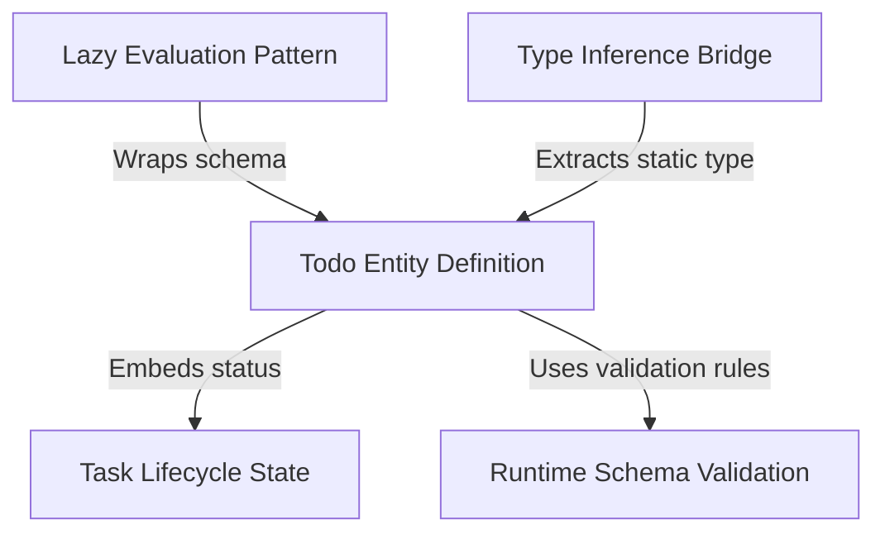

# Tutorial: todo

This project establishes the foundational structure for a **Todo List Application**. It focuses on defining the "Todo Item" with strict rules to ensure data integrity, validating inputs like text content and *Task Lifecycle States* (e.g., pending or completed) in real-time to prevent errors.

## Chapters

1. [Task Lifecycle State](01_task_lifecycle_state.md)
2. [Runtime Schema Validation](02_runtime_schema_validation.md)
3. [Todo Entity Definition](03_todo_entity_definition.md)
4. [Type Inference Bridge](04_type_inference_bridge.md)
5. [Lazy Evaluation Pattern](05_lazy_evaluation_pattern.md)

---

Generated by [Code IQ](https://github.com/adityasoni99/Code-IQ)