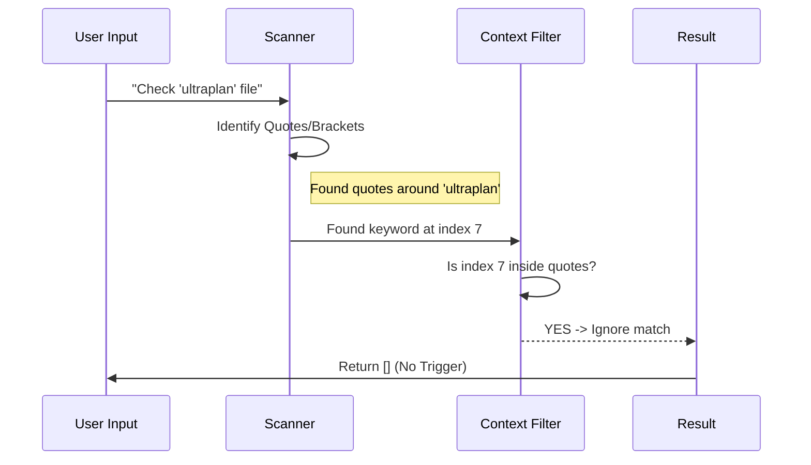

# Chapter 1: Context-Aware Keyword Detection

Welcome to the **Ultraplan** project tutorial! In this series, we will build a powerful AI planning system step-by-step.

We start with the most fundamental question: **How does the system know when you are talking to it?**

## The Motivation: A Smart Listener

Imagine you are building a coding assistant. You want it to wake up and start planning whenever you type the magic word: **"ultraplan"**.

However, a simple "Find and Replace" isn't good enough. Why? Consider these two sentences:

1.  **"Please ultraplan a new database schema."**
    *   *Intent:* You want the AI to act.
2.  **"I am editing the file `src/ultraplan/config.ts`."**
    *   *Intent:* You are just talking about a file name. You **don't** want the AI to wake up.

If we just searched for the string "ultraplan", the AI would trigger annoying interruptions in the second case. We need **Context-Aware Keyword Detection**.

Think of this abstraction as a **Grammar Bouncer**. It stands at the door of your input box. It doesn't just look for the keyword; it looks at the *context*—where the word is standing—to decide if it's a real command.

## How It Works: The Rules

To be "Smart," our detector follows a strict set of rules. It will **ignore** the keyword if:

1.  It is inside **quotes** or **brackets** (e.g., `"ultraplan"`, `(ultraplan)`).
2.  It looks like a **file path** (e.g., `/ultraplan/`, `ultraplan.ts`).
3.  It is part of a **slash command** (e.g., `/rename ultraplan`).
4.  It is a **question** about the feature (e.g., `ultraplan?`).

## Using the Detector

Let's look at how we use this in our application. The main function we care about is `hasUltraplanKeyword`. It takes a user's text string and returns `true` or `false`.

### Basic Usage

```typescript
import { hasUltraplanKeyword } from './keyword';

const userInput = "Let's ultraplan a React component";

if (hasUltraplanKeyword(userInput)) {
  console.log("🚀 Launching Planner!");
} else {
  console.log("Just normal text.");
}
```

### Transforming the Input

Once we detect the keyword, we often want to "clean it up" before sending it to the AI. If you type "Please ultraplan this," the AI might be confused by the made-up word "ultraplan." We swap it for "plan".

```typescript
import { replaceUltraplanKeyword } from './keyword';

const raw = "Please ultraplan the database.";
const clean = replaceUltraplanKeyword(raw);

// Output: "Please plan the database."
console.log(clean);
```

## Internal Implementation: The Logic

How does it actually work under the hood? It doesn't use heavy AI libraries; it uses clever logic and character scanning.

Here is the flow of the `findKeywordTriggerPositions` function, which powers the detection:



### Code Walkthrough

Let's break down the implementation in `keyword.ts`. To keep things simple, we'll look at the key parts of the logic.

#### 1. Ignoring Slash Commands
First, if the user is typing a command like `/rename`, we exit immediately. Slash commands are handled by a different part of the system.

```typescript
function findKeywordTriggerPositions(text: string, keyword: string) {
  // Use a case-insensitive regex for the word
  const re = new RegExp(keyword, 'i')
  if (!re.test(text)) return []

  // If it starts with '/', it's a slash command, not a trigger
  if (text.startsWith('/')) return []
  
  // ... continued below
```

#### 2. detecting "Safe Zones" (Quotes & Brackets)
Next, the code scans the string character by character. It looks for opening quotes (`"`, `'`, `` ` ``) or brackets (`{`, `[`, `<`). It remembers these "safe zones." If the keyword appears inside a safe zone, it's not a trigger.

```typescript
  const quotedRanges = []
  let openQuote = null
  
  // Simple loop to find ranges like "foo" or (bar)
  for (let i = 0; i < text.length; i++) {
    const ch = text[i]
    // Logic to track opening and closing delimiters...
    // If we find a pair, we push it to quotedRanges
  }
```

*Note: The actual code handles complex cases, like distinguishing an apostrophe in "let's" from a single quote.*

#### 3. Checking the Neighbors
Finally, we find the keyword and check its immediate neighbors. This prevents file paths like `src/ultraplan` (neighbor is `/`) or filenames like `ultraplan.ts` (neighbor is `.`).

```typescript
  const matches = text.matchAll(new RegExp(`\\b${keyword}\\b`, 'gi'))
  
  for (const match of matches) {
    const start = match.index
    const end = start + match[0].length

    // Check 1: Is it inside quotes?
    if (quotedRanges.some(r => start >= r.start && start < r.end)) continue

    // Check 2: Is it touching path characters?
    const before = text[start - 1]
    const after = text[end]
    if (before === '/' || before === '\\' || before === '-') continue
    
    // ... add to valid triggers
  }
}
```

## Summary

In this chapter, we learned how **Context-Aware Keyword Detection** allows `ultraplan` to feel natural and unobtrusive. It acts as a smart filter, ensuring the AI only helps when you explicitly ask for it, ignoring casual mentions, code references, or file paths.

Once a valid keyword is detected, the system wakes up. But how does it know what the AI is doing on the server? We need a way to check for updates.

[Next Chapter: Remote Session Polling](02_remote_session_polling.md)

---

Generated by [Code IQ](https://github.com/adityasoni99/Code-IQ)