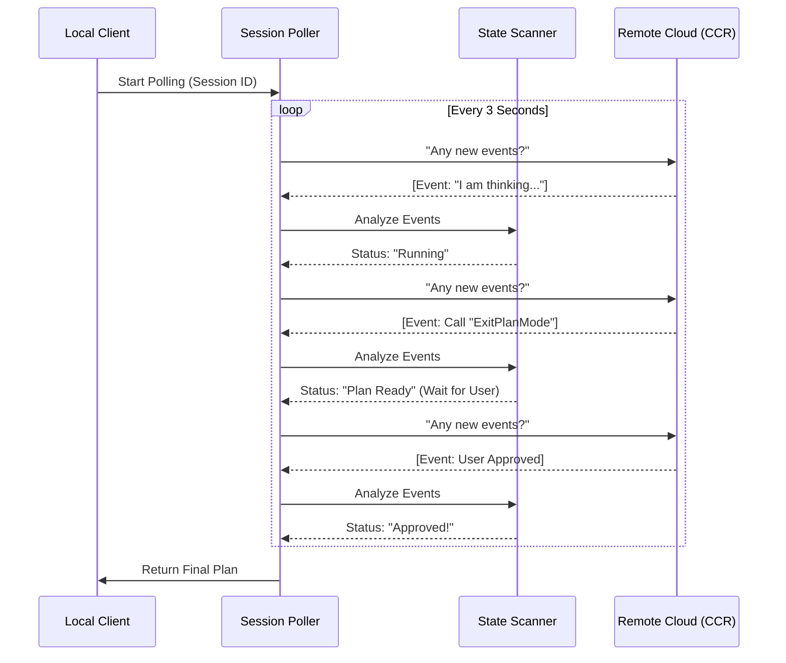

# Chapter 2: Remote Session Polling

In the previous chapter, [Context-Aware Keyword Detection](01_context_aware_keyword_detection.md), we learned how to detect when the user wants to start a planning session.

Once the "ultraplan" keyword wakes up the system, we send a request to our remote Cloud Code Runtime (CCR). But here is the problem: **Thinking takes time.** Generating a complex coding plan might take 30 seconds or even minutes. We cannot keep a single HTTP connection open that long without risking timeouts.

This chapter explains how we solve this using **Remote Session Polling**.

## The Motivation: The Patient Courier

Imagine you are ordering a custom-made suit.
1.  You drop off your measurements (the initial request).
2.  The tailor (the Remote Agent) starts working.
3.  You don't stand at the counter staring at the tailor for 4 hours. You go home.
4.  Every so often, you send a **Courier** to the shop to ask: "Is it ready yet?"

In `ultraplan`, our abstraction acts as this **Courier**. It manages the asynchronous loop between your local computer and the remote server.

It handles three main jobs:
1.  **Patience:** Waiting for the plan to be generated.
2.  **Resilience:** If the internet flickers (transient errors), it retries without crashing.
3.  **Translation:** It reads the messy stream of server events and converts them into a simple status (e.g., "Ready", "Running", or "Approved").

## Using the Poller

The main function we use is `pollForApprovedExitPlanMode`. You give it a `sessionId` (the ticket number for your suit), and it waits until the plan is approved.

### Basic Usage

Here is how we use it in the main application flow:

```typescript
import { pollForApprovedExitPlanMode } from './ccrSession';

async function waitForPlan(sessionId: string) {
  console.log("Waiting for remote agent...");

  // Start the polling loop
  const result = await pollForApprovedExitPlanMode(
    sessionId,
    60 * 1000 // Timeout after 60 seconds
  );

  console.log("Plan Received:", result.plan);
}
```

### Handling UI Updates

While waiting, we want to show the user what is happening. Is the AI thinking? Is it waiting for the user to click "Approve"? We can pass a callback to track the **Phase**.

```typescript
// Update the UI based on the courier's report
const onPhaseChange = (phase) => {
  if (phase === 'running') console.log("AI is thinking...");
  if (phase === 'plan_ready') console.log("AI is waiting for your approval!");
};

await pollForApprovedExitPlanMode(
  sessionId, 
  60000, 
  onPhaseChange
);
```

## Internal Implementation: How It Works

Under the hood, this isn't just a simple loop. It utilizes a **State Scanner**.

The remote server sends back a stream of "Events" (like chat messages). The Scanner looks specifically for a tool called `ExitPlanMode`. This tool is the AI's way of saying, "I have a plan, please review it."

### The Courier's Workflow

Here is the flow of the polling system:



### Code Walkthrough

Let's look at `ccrSession.ts` to see how the code handles this logic.

#### 1. The Polling Loop
We use a `while` loop that runs until we hit a deadline (timeout).

```typescript
export async function pollForApprovedExitPlanMode(
  sessionId: string,
  timeoutMs: number
) {
  const deadline = Date.now() + timeoutMs
  let cursor = null // Bookmark for where we are in the chat

  while (Date.now() < deadline) {
    // ... fetch logic (see below)
    // ... scan logic (see below)
    await sleep(3000) // Wait 3 seconds before asking again
  }
}
```

#### 2. Fetching Events & Handling Network Errors
We fetch events using `pollRemoteSessionEvents`. If the network fails, we check if it's a "transient" (temporary) error. If it is, we ignore it and try again next loop.

```typescript
    try {
      // Get new events since the last cursor (bookmark)
      const resp = await pollRemoteSessionEvents(sessionId, cursor)
      newEvents = resp.newEvents
      cursor = resp.lastEventId // Update bookmark
      failures = 0 // Reset failure count on success
    } catch (e) {
      // If internet blips, wait and retry. If too many fails, throw error.
      if (!isTransientNetworkError(e) || ++failures >= 5) {
        throw new UltraplanPollError('Network failed', 'network_or_unknown', 0)
      }
      continue // Skip to next loop iteration
    }
```

#### 3. The Scanner (The Translator)
We feed the raw events into `ExitPlanModeScanner`. This class decides if we are done.

```typescript
    const scanner = new ExitPlanModeScanner() // Maintains state
    // ... inside loop ...
    const result = scanner.ingest(newEvents)

    if (result.kind === 'approved') {
      return { plan: result.plan, executionTarget: 'remote' }
    }
```

The `Scanner` is the brain. It ignores intermediate chat messages and looks specifically for the `ExitPlanMode` tool usage.

#### 4. Plan Teleportation
Sometimes, the user sees the plan in the browser but decides to run it **locally** on their own machine instead of the cloud. We call this "Teleportation". The scanner detects a specific "Sentinel" string (a secret code) in the response.

```typescript
    if (result.kind === 'teleport') {
      // User clicked "Run Locally" in the browser
      return { 
        plan: result.plan, 
        executionTarget: 'local' // Tell client to run it here
      }
    }
```
*We will cover the mechanics of this in [Chapter 5: Plan Teleportation Protocol](05_plan_teleportation_protocol.md).*

## Summary

In this chapter, we built the **Courier** that keeps our local application in sync with the remote AI.

1.  We use a **Polling Loop** to ask for updates every few seconds.
2.  We handle **Transient Errors** so a flaky connection doesn't kill the process.
3.  We use a **Scanner** to translate raw server events into clear states like "Running", "Plan Ready", or "Approved".

Now that we are receiving events from the server, how do we manage the different stages of the session internally?

[Next Chapter: Session Phase Lifecycle](03_session_phase_lifecycle.md)

---

Generated by [Code IQ](https://github.com/adityasoni99/Code-IQ)