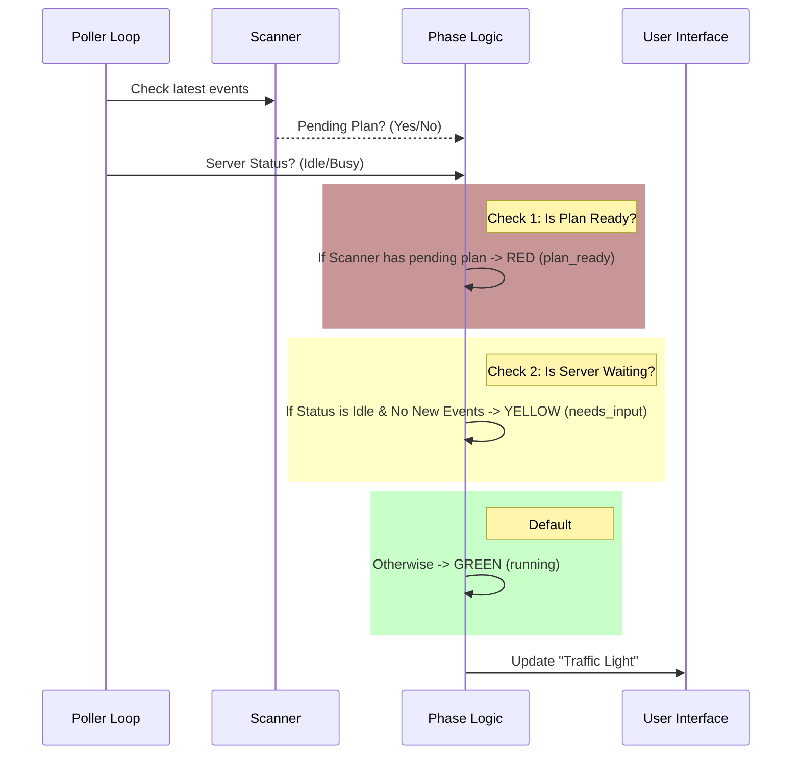

# Chapter 3: Session Phase Lifecycle

In the previous chapter, [Remote Session Polling](02_remote_session_polling.md), we built a "Courier" that repeatedly visits the server to fetch updates.

However, simply fetching updates isn't enough. The server sends back hundreds of raw events—logs, internal thoughts, and function calls. If we showed all of this to the user, it would look like The Matrix code. It's overwhelming.

We need a translator. We need to boil down that complex stream of data into a simple status that anyone can understand. This is the **Session Phase Lifecycle**.

## The Motivation: The "Traffic Light" UI

Imagine you are watching a status indicator on your screen while the AI builds a plan. You don't care about the internal JSON packets; you only care about three things:

1.  **Is it working?** (Don't disturb it).
2.  **Is it stuck?** (Does it need me to answer a question?).
3.  **Is it finished?** (Can I see the result?).

We solved this by abstracting the entire system state into a **Traffic Light** model.

### The Three Phases

We define a TypeScript type called `UltraplanPhase` with exactly three states:

1.  🟢 **`running`**: The AI is thinking, writing files, or checking code. The user should sit back and wait.
2.  🟡 **`needs_input`**: The AI has paused. It might be asking a clarifying question ("Which database do you prefer?") or asking for permission to run a command. The user needs to act.
3.  🔴 **`plan_ready`**: The AI has finished the plan. It has stopped and is waiting for the user to approve or reject the proposal.

## Using the Lifecycle

In Chapter 2, we introduced the polling function. Now, let's see how we use the **Phase Lifecycle** to update our UI.

We pass a simple "callback" function to our poller. Every time the phase changes, this function runs.

### Example: The Status Pill

```typescript
import { pollForApprovedExitPlanMode, type UltraplanPhase } from './ccrSession';

// 1. Define how the UI reacts to changes
const updateTrafficLight = (phase: UltraplanPhase) => {
  if (phase === 'running')     showGreenSpinner();
  if (phase === 'needs_input') showYellowAlert();
  if (phase === 'plan_ready')  showRedReviewButton();
};

// 2. Start the polling loop with the callback
await pollForApprovedExitPlanMode(
  sessionId, 
  60000, 
  updateTrafficLight // <--- Pass the listener here
);
```

By using this simple abstraction, the frontend code doesn't need to know anything about "events" or "tools." It just listens for the traffic light to change color.

## Internal Implementation: The Logic

How do we actually determine the phase? The server doesn't explicitly send "Green" or "Yellow." We have to deduce it by looking at two things:
1.  **The Event Stream:** What messages just arrived?
2.  **The Session Status:** Is the server currently idle?

Here is the decision flow we implement inside the poller:



### Code Walkthrough

Let's look at `ccrSession.ts` to see how this logic is written in code. It happens at the very end of our polling loop.

#### 1. Defining the States
First, we define the valid states for our system.

```typescript
/**
 * running -> AI is working
 * needs_input -> AI stopped to ask a question
 * plan_ready -> AI finished the plan, waiting for approval
 */
export type UltraplanPhase = 'running' | 'needs_input' | 'plan_ready'
```

#### 2. Determining "Needs Input"
This is the trickiest part. The server is "Idle" (waiting) if the `sessionStatus` is `idle`.

However, we add a safety check: we only consider it truly idle if `newEvents.length === 0`. If events are still flowing in, the AI is probably still "typing," so we keep the light Green (`running`) to prevent the UI from flickering Yellow for a split second.

```typescript
    // We only trust "idle" status if no new events arrived.
    // Otherwise, the system is technically working/streaming.
    const quietIdle =
      (sessionStatus === 'idle' || sessionStatus === 'requires_action') &&
      newEvents.length === 0
```

#### 3. The "Traffic Light" Logic
Now we combine everything into a single variable. Order of operations matters here!

1.  **Priority 1:** If the Scanner sees a pending plan, we are **Ready** (Red).
2.  **Priority 2:** If the server is quietly idle, we need **Input** (Yellow).
3.  **Priority 3:** Otherwise, we assume the AI is **Running** (Green).

```typescript
    const phase: UltraplanPhase = scanner.hasPendingPlan
      ? 'plan_ready'
      : quietIdle
        ? 'needs_input'
        : 'running'
```

#### 4. Notifying the UI
Finally, we check if the phase has changed since the last loop. We don't want to spam the UI with updates if the light is still Green.

```typescript
    // Only fire the callback if the color changed
    if (phase !== lastPhase) {
      logForDebugging(`[ultraplan] phase ${lastPhase} → ${phase}`)
      lastPhase = phase
      onPhaseChange?.(phase)
    }
```

## Summary

In this chapter, we learned how to humanize the AI's complex internal state.

We built a **Session Phase Lifecycle** that acts as a traffic light:
*   **Green (`running`)**: Polling continues silently.
*   **Yellow (`needs_input`)**: The poller detects the server is idle and needs the user.
*   **Red (`plan_ready`)**: The poller detects the plan is finished.

But wait—how exactly does the `scanner` know that a plan is pending? How does it tell the difference between a normal chat message and a structured coding plan?

We will explore that machinery in the next chapter.

[Next Chapter: Event Stream State Machine](04_event_stream_state_machine.md)

---

Generated by [Code IQ](https://github.com/adityasoni99/Code-IQ)