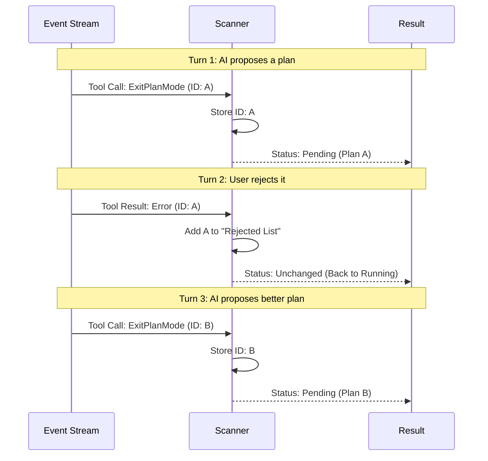

# Chapter 4: Event Stream State Machine

In the previous chapter, [Session Phase Lifecycle](03_session_phase_lifecycle.md), we built a "Traffic Light" system to show the user if the AI is running (Green), waiting for input (Yellow), or done (Red).

But to change those lights correctly, we need to understand what is actually happening inside the conversation. The server sends us a chaotic stream of raw events: log messages, code execution results, and tool calls.

This chapter introduces the **Event Stream State Machine**, the pure logic engine that makes sense of the chaos.

## The Motivation: The Scorekeeper

Imagine a baseball scorekeeper who is not watching the game live. Instead, they are sitting in a quiet room, receiving a **Ticker Tape** (a stream of paper strips) with updates printed on them.

*   *Tape 1:* "Batter steps up."
*   *Tape 2:* "Strike one."
*   *Tape 3:* "Home run!"

The scorekeeper reads these updates to change the numbers on the scoreboard. They don't need to see the field; they just need to process the data logically.

In `ultraplan`, our **Scanner** (`ExitPlanModeScanner`) is the scorekeeper. It doesn't make network calls. It simply ingests a batch of events (the ticker tape) and calculates the current score:
1.  **Pending:** The AI has proposed a plan.
2.  **Rejected:** The user said "No," so we are back to playing.
3.  **Approved:** The user said "Yes," the game is won.
4.  **Terminated:** The game was rained out (the server crashed).

## Key Concept: Pure Logic

This abstraction is "Pure." This means if you feed it the exact same list of events 100 times, it will give you the exact same result 100 times. This makes it incredibly easy to test and debug because it doesn't depend on a flaky internet connection.

## Using the Scanner

The class we use is `ExitPlanModeScanner`. Its main job is to look for a specific tool call: `ExitPlanMode`. This is the specific signal the AI uses when it thinks it has finished the plan.

### Basic Usage

Here is how the system uses the scanner. We create one instance at the start of the session, and we keep feeding it new events as they arrive.

```typescript
import { ExitPlanModeScanner } from './ccrSession';

// 1. Create the scorekeeper
const scanner = new ExitPlanModeScanner();

// 2. Simulate incoming events (The Ticker Tape)
const newEvents = [
  { type: 'assistant', message: { /* "I have a plan..." */ } },
  { type: 'assistant', message: { /* Calls ExitPlanMode tool */ } }
];

// 3. Update the score
const result = scanner.ingest(newEvents);

if (result.kind === 'pending') {
  console.log("Plan is ready for review!");
}
```

### Handling Decisions

What happens when the user reviews the plan? The user's click creates a "Tool Result" event.

```typescript
// Later, the user clicks "Approve" in the browser
const approvalEvent = [
  { type: 'user', message: { /* Tool Result: Approved */ } }
];

const finalResult = scanner.ingest(approvalEvent);

if (finalResult.kind === 'approved') {
  console.log("Game Over! Final Plan:", finalResult.plan);
}
```

## Internal Implementation: The Logic

How does the scanner make decisions? It tracks the history of the `ExitPlanMode` tool.

The AI might propose a plan, get rejected, fix it, and propose a new one. The scanner needs to ignore the old, rejected plan and focus on the new one.

### Visualizing the State Flow



### Code Walkthrough

Let's look inside `ccrSession.ts`. The implementation is divided into small steps.

#### 1. Tracking State
The class remembers two things:
1.  **`exitPlanCalls`**: Every time the AI tried to submit a plan.
2.  **`rejectedIds`**: Which of those attempts were rejected by the user.

```typescript
export class ExitPlanModeScanner {
  // A list of every time the AI tried to finish
  private exitPlanCalls: string[] = []
  
  // A set of IDs the user already said "No" to
  private rejectedIds = new Set<string>()
  
  // ...
}
```

#### 2. Ingesting Events
When `ingest` is called, we categorize the events. We care about **Tool Use** (AI speaking) and **Tool Result** (User answering).

```typescript
  ingest(newEvents: SDKMessage[]): ScanResult {
    for (const m of newEvents) {
      if (m.type === 'assistant') {
        // AI is talking. Did it call ExitPlanMode?
        checkForToolCalls(m, this.exitPlanCalls)
      } 
      else if (m.type === 'user') {
        // User is acting. Did they approve/reject?
        recordToolResults(m, this.results)
      }
    }
    // ... continues below
```

#### 3. Calculating the Verdict
After processing the events, we look backwards from the most recent plan. If the most recent plan hasn't been rejected yet, we check its status.

```typescript
    // Look at the most recent plan attempt
    for (let i = this.exitPlanCalls.length - 1; i >= 0; i--) {
      const id = this.exitPlanCalls[i]
      
      // If we already know this was rejected, skip it
      if (this.rejectedIds.has(id)) continue

      const result = this.results.get(id)
      
      // No result yet? It's waiting for user review.
      if (!result) return { kind: 'pending' }

      // Is it an error? User rejected it.
      if (result.is_error) return { kind: 'rejected', id }
      
      // Otherwise, it's approved!
      return { kind: 'approved', plan: extractApprovedPlan(result) }
    }
```

*Note: In the actual code, we also handle special cases like "Teleportation" and "Termination" here.*

#### 4. Extracting the Plan Text
When a plan is approved, the AI includes the final code inside the tool result with a special marker string: `## Approved Plan:`. We use a helper helper to strip away the noise and get just the code.

```typescript
function extractApprovedPlan(content: any): string {
  const text = contentToText(content)
  const marker = '## Approved Plan:\n'
  
  const idx = text.indexOf(marker)
  if (idx !== -1) {
    // Return everything after the marker
    return text.slice(idx + marker.length).trimEnd()
  }
  return text // Fallback
}
```

## Summary

In this chapter, we built the **Event Stream State Machine**.

1.  It acts as a **Scorekeeper**, reading a ticker tape of events without watching the game directly.
2.  It uses **Pure Logic** to determine if the session is Pending, Rejected, or Approved.
3.  It resolves conflicts, ensuring that old rejected plans don't confuse the system.

Now we have a working system: We detect the keyword, poll the server, update the UI, and extract the approved plan.

But there is one final power move available to the user. What if they approve the plan, but they want to execute the commands on their **local** machine instead of the cloud?

[Next Chapter: Plan Teleportation Protocol](05_plan_teleportation_protocol.md)

---

Generated by [Code IQ](https://github.com/adityasoni99/Code-IQ)