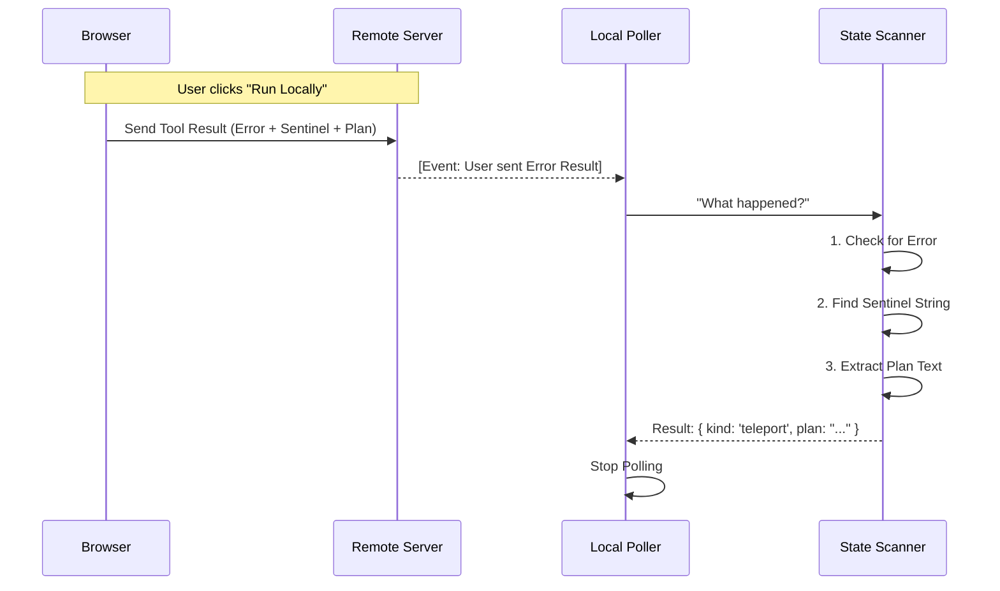

# Chapter 5: Plan Teleportation Protocol

Welcome to the final chapter of the **Ultraplan** tutorial!

In the previous chapter, [Event Stream State Machine](04_event_stream_state_machine.md), we built a logic engine that acts as a scorekeeper, deciding if a plan is approved or rejected based on server events.

But there is one final, powerful feature we need to handle.

Sometimes, the AI generates a perfect plan in the cloud, but you don't want it to run in the cloud. You want to run it on **your** machine—where your local database, private keys, and VPN connections live. We need a way to beam the plan from the server down to your terminal. We call this **Plan Teleportation**.

## The Motivation: The "Trojan Horse"

Here is the challenge: The remote server (CCR) thinks it is in charge. If you click "Approve," it expects to execute the code itself.

If we want to run the code locally, we need to communicate two things simultaneously:
1.  **To the Server:** "Stop! Don't run this."
2.  **To the Local Client:** "Here is the code. You run it."

We solve this by using a **disguise**. We treat the plan as a "Rejection" message to the server, but inside that message, we hide the plan and a secret password.

## The Concept: The Secret Handshake

The mechanism relies on a specific "Sentinel" string (a unique secret code):

`__ULTRAPLAN_TELEPORT_LOCAL__`

Think of this like a secret agent passing a briefcase.
1.  The User clicks **"Run Locally"** in their browser.
2.  The Browser sends a message to the server saying: "Error! Plan Rejected."
3.  **However**, inside the error message text, it pastes the Plan and the **Sentinel String**.
4.  The Local Poller (which is watching everything) sees the error. It spots the Sentinel String.
5.  The Poller realizes: "This isn't a rejection! This is a Teleport!"
6.  It extracts the plan and executes it locally.

## Using the Protocol

From the perspective of our main application, this is handled by the `pollForApprovedExitPlanMode` function we built earlier.

It returns an object containing an `executionTarget`.

### Handling the Result

```typescript
const result = await pollForApprovedExitPlanMode(sessionId, 60000);

if (result.executionTarget === 'local') {
  // Teleportation! Run the plan on this computer.
  console.log("🚀 Teleporting plan to local execution...");
  await executeShellScript(result.plan);
} 
else {
  // Normal approval. The server is already running it.
  console.log("☁️ Plan executing in the cloud...");
}
```

This simple switch allows the user to seamlessly move execution between the cloud and their laptop.

## Internal Implementation: The Logic

How does the system spot this secret message? It happens inside our event processing loop.

Here is the flow of data when a user triggers a teleport:



### Code Walkthrough

Let's look at `ccrSession.ts` to see how we implement this detection logic.

#### 1. Defining the Sentinel
First, we define the magic string. It must be unique enough that no normal user would ever type it by accident.

```typescript
// The secret code that flags a teleportation attempt
export const ULTRAPLAN_TELEPORT_SENTINEL = '__ULTRAPLAN_TELEPORT_LOCAL__'
```

#### 2. The Extraction Logic
We use a helper function called `extractTeleportPlan`. It looks at the text content of the "Error" message.

If the sentinel is missing, it returns `null` (meaning it's just a normal rejection). If found, it slices the string to get the code.

```typescript
function extractTeleportPlan(content: any): string | null {
  const text = contentToText(content) // Helper to get string
  const marker = `${ULTRAPLAN_TELEPORT_SENTINEL}\n`
  
  // Look for the secret handshake
  const idx = text.indexOf(marker)
  
  if (idx === -1) return null // Not a teleport
  
  // Return everything AFTER the marker
  return text.slice(idx + marker.length).trimEnd()
}
```

#### 3. Updating the Scanner
Finally, we update our `ExitPlanModeScanner` (from Chapter 4) to use this logic.

When the scanner sees a tool result that is an error (`is_error === true`), it checks for the teleport marker before deciding it's a rejection.

```typescript
        // Inside the scanner loop...
        if (tr.is_error === true) {
          // Check if this "error" is actually a teleport disguise
          const teleportPlan = extractTeleportPlan(tr.content)

          if (teleportPlan !== null) {
            found = { kind: 'teleport', plan: teleportPlan }
          } else {
            // It's a real rejection
            found = { kind: 'rejected', id }
          }
        }
```

## Summary

In this final chapter, we learned how to perform **Plan Teleportation**.

1.  We use a **Sentinel String** as a secret signal.
2.  We disguise the plan as a "Rejection" so the server releases control.
3.  We intercept the message locally, extract the code, and run it on the user's machine.

### Tutorial Conclusion

Congratulations! You have built the core architecture of **Ultraplan**.

Let's recap what we've built:
1.  **[Context-Aware Keyword Detection](01_context_aware_keyword_detection.md):** We learned to listen for "ultraplan" while ignoring file paths and comments.
2.  **[Remote Session Polling](02_remote_session_polling.md):** We built a resilient courier to fetch updates from the cloud.
3.  **[Session Phase Lifecycle](03_session_phase_lifecycle.md):** We translated raw streams into a simple "Traffic Light" UI (Running, Needs Input, Plan Ready).
4.  **[Event Stream State Machine](04_event_stream_state_machine.md):** We implemented a pure logic engine to track approvals and rejections.
5.  **Plan Teleportation:** We created a protocol to move execution from the cloud to the local machine.

You now understand the fundamental abstractions that make an AI planning agent feel fast, responsive, and magical. Happy coding!

---

Generated by [Code IQ](https://github.com/adityasoni99/Code-IQ)