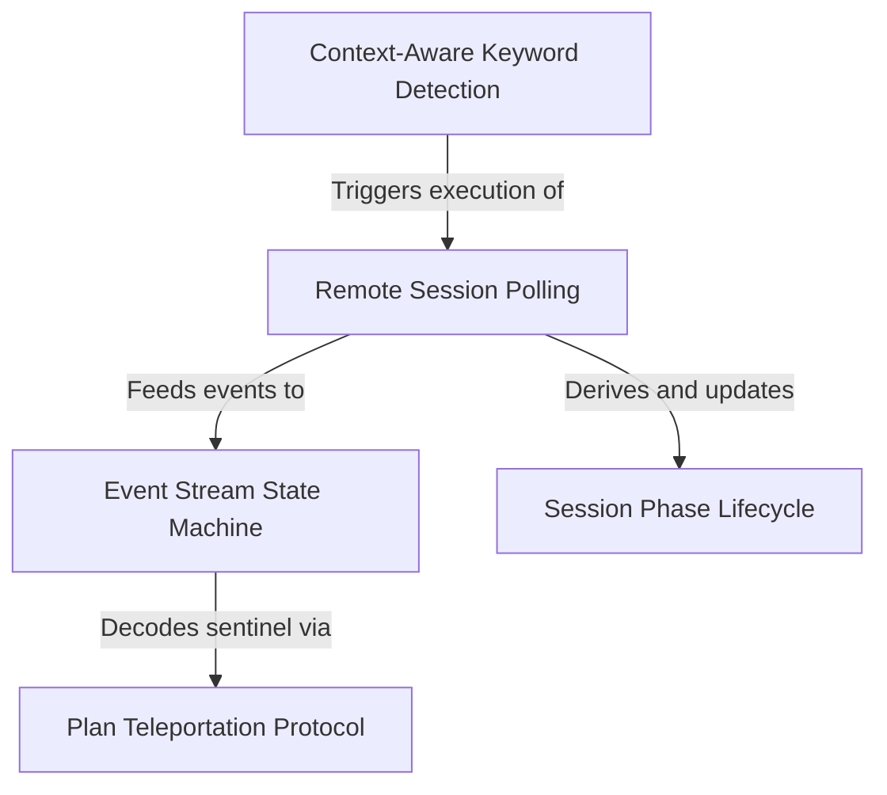

# Tutorial: ultraplan

The **Ultraplan** project implements a smart remote planning assistant that is invoked via **context-aware** keywords, ensuring it only runs when explicitly requested. Once triggered, it manages a **remote planning session** by polling for events and maintaining synchronization through a robust **state machine**. The system translates complex backend states into user-friendly **lifecycle phases** (like "running" or "needs input") and features a unique **teleportation protocol** to securely transfer approved plans from the remote agent back to the local environment for execution.

## Chapters

1. [Context-Aware Keyword Detection](01_context_aware_keyword_detection.md)
2. [Remote Session Polling](02_remote_session_polling.md)
3. [Session Phase Lifecycle](03_session_phase_lifecycle.md)
4. [Event Stream State Machine](04_event_stream_state_machine.md)
5. [Plan Teleportation Protocol](05_plan_teleportation_protocol.md)

---

Generated by [Code IQ](https://github.com/adityasoni99/Code-IQ)